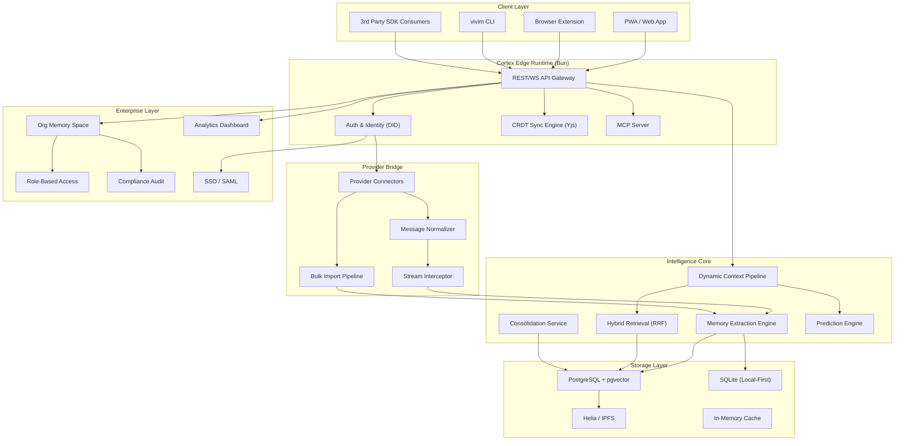
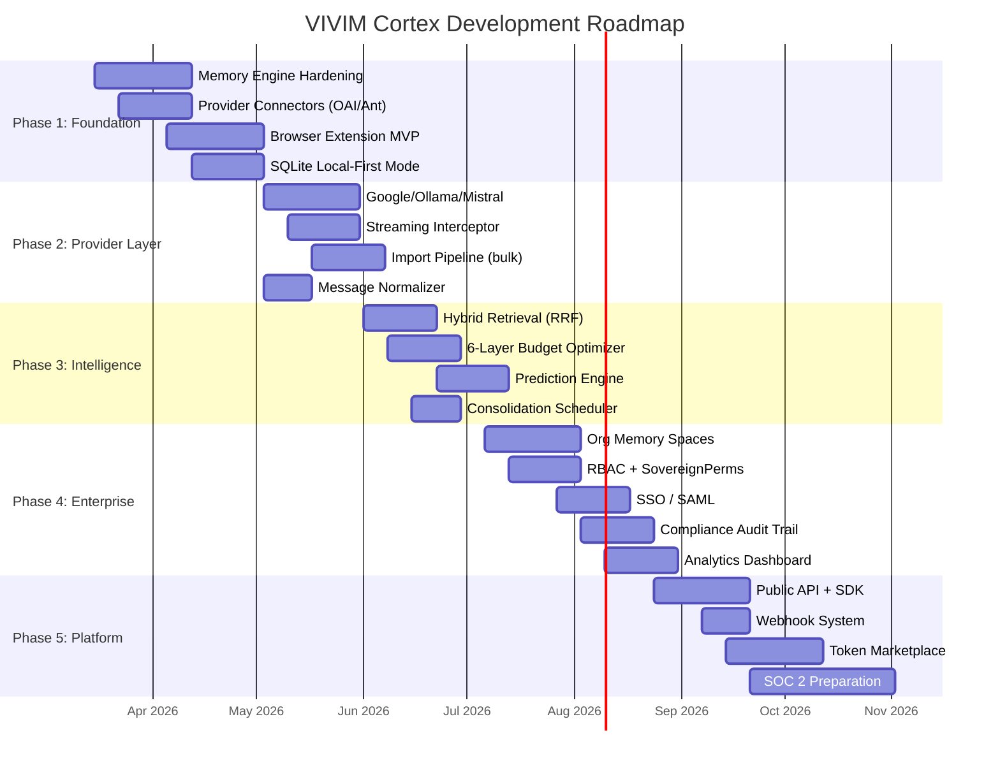

# VIVIM Cortex — Enterprise Development Roadmap

> Full architecture, data models, provider support matrix, and phased engineering plan.

---

## Table of Contents
1. [System Architecture](#1-system-architecture)
2. [Canonical Data Models](#2-canonical-data-models)
3. [Provider Integration Matrix](#3-provider-integration-matrix)
4. [Development Phases](#4-development-phases)
5. [Phase 1: Core Foundation](#5-phase-1-core-foundation-weeks-1-8)
6. [Phase 2: Provider Integration Layer](#6-phase-2-provider-integration-layer-weeks-6-14)
7. [Phase 3: Context Intelligence](#7-phase-3-context-intelligence-engine-weeks-10-18)
8. [Phase 4: Enterprise Features](#8-phase-4-enterprise-features-weeks-16-26)
9. [Phase 5: Platform & API](#9-phase-5-platform--api-weeks-22-32)
10. [Infrastructure & DevOps](#10-infrastructure--devops)

---

## 1. System Architecture

### High-Level Architecture


### Data Flow: Message → Memory → Context
```
┌──────────────────────────────────────────────────────────────────────┐
│                        USER SENDS MESSAGE                           │
│                     (via any connected provider)                    │
└──────────────────────┬───────────────────────────────────────────────┘
                       │
                       ▼
┌──────────────────────────────────────────────────────────────────────┐
│  1. PROVIDER BRIDGE                                                 │
│  ┌─────────────┐  ┌───────────────┐  ┌──────────────────────┐       │
│  │ Interceptor │→ │  Normalizer   │→ │ Canonical Message    │       │
│  │ (per-       │  │ (unify format │  │ { role, content,     │       │
│  │  provider)  │  │  across all   │  │   provider, model,   │       │
│  │             │  │  providers)   │  │   timestamp, threadId│       │
│  └─────────────┘  └───────────────┘  └──────────┬───────────┘       │
└─────────────────────────────────────────────────┼────────────────────┘
                                                  │
                       ┌──────────────────────────┘
                       ▼
┌──────────────────────────────────────────────────────────────────────┐
│  2. EXTRACTION ENGINE                                               │
│  ┌────────────────────────────────────────────────────────────┐      │
│  │ LLM-powered extraction (background job queue)             │      │
│  │ ┌────────────┐ ┌──────────────┐ ┌────────────────────┐    │      │
│  │ │ EPISODIC   │ │ SEMANTIC     │ │ IDENTITY/PREF      │    │      │
│  │ │ memories   │ │ knowledge    │ │ personal facts     │    │      │
│  │ └────────────┘ └──────────────┘ └────────────────────┘    │      │
│  │                                                           │      │
│  │ Embedding Generation → pgvector storage                   │      │
│  │ Confidence scoring → Auto-pin (importance ≥ 0.9)          │      │
│  └────────────────────────────────────────────────────────────┘      │
└──────────────────────────────────────────────────────────────────────┘
                       │
                       ▼
┌──────────────────────────────────────────────────────────────────────┐
│  3. CONTEXT ASSEMBLY (on next user message)                         │
│                                                                     │
│  Token Budget: [========= 12,000 tokens =========]                  │
│                                                                     │
│  L0 Identity Core   [████░░░]  500 tokens                           │
│  L1 Global Prefs    [███░░░░]  300 tokens                           │
│  L2 Topic Profiles  [█████░░]  1,500 tokens                         │
│  L3 Entity Profiles [████░░░]  1,000 tokens                         │
│  L4 Conv Arc        [██████░]  2,000 tokens                         │
│  L5 Memory Recall   [████████] 2,200 tokens  ← FROM EXTRACTED MEM   │
│  L6 Active Messages [████████] 4,500 tokens                         │
│                                                                     │
│  Retrieval: Hybrid (Semantic 60% + Keyword 40% via RRF)             │
│  Compaction: Progressive (Full → Windowed → Compacted → Multi)      │
└──────────────────────────────────────────────────────────────────────┘
```

---

## 2. Canonical Data Models

### 2.1 Memory
```typescript
model Memory {
  id                    String    @id @default(uuid())
  userId                String
  orgId                 String?   // Enterprise: org-level memory

  // Content
  content               String
  summary               String?
  memoryType            MemoryType    // EPISODIC | SEMANTIC | PROCEDURAL | FACTUAL | PREFERENCE | IDENTITY | RELATIONSHIP | GOAL | PROJECT
  category              String
  subcategory           String?
  tags                  String[]

  // Scoring
  importance            Float     @default(0.5)       // 0.0–1.0
  relevance             Float     @default(0.5)       // 0.0–1.0, decays over time
  confidence            Float     @default(0.7)       // Extraction confidence
  accessCount           Int       @default(0)
  lastAccessedAt        DateTime?

  // Provenance
  sourceProvider        String?                        // "openai", "anthropic", etc.
  sourceModel           String?                        // "gpt-4o", "claude-3.5-sonnet"
  sourceConversationIds String[]
  sourceMessageIds      String[]
  sourceAcuIds          String[]

  // Embeddings
  embedding             Float[]
  embeddingModel        String?
  embeddingDimension    Int?

  // Lifecycle
  consolidationStatus   ConsolidationStatus @default(RAW)
  mergedFromIds         String[]            @default([])
  parentMemoryId        String?
  relatedMemoryIds      String[]            @default([])

  // Temporal
  occurredAt            DateTime?
  validFrom             DateTime?
  validUntil            DateTime?

  // State
  isPinned              Boolean   @default(false)
  isActive              Boolean   @default(true)
  isArchived            Boolean   @default(false)
  metadata              Json      @default("{}")

  createdAt             DateTime  @default(now())
  updatedAt             DateTime  @updatedAt

  // Relations
  user                  User      @relation(...)
  org                   Org?      @relation(...)
  children              Memory[]  @relation("MemoryHierarchy")
  parent                Memory?   @relation("MemoryHierarchy", ...)
  relationships         MemoryRelationship[] @relation("SourceRelationships")

  @@index([userId, memoryType, importance(sort: Desc)])
  @@index([userId, category])
  @@index([orgId, memoryType])
  @@map("memories")
}
```

### 2.2 MemoryRelationship
```typescript
model MemoryRelationship {
  id                String    @id @default(uuid())
  userId            String
  sourceMemoryId    String
  targetMemoryId    String
  relationshipType  String    // similar | contradicts | supports | derived_from | related_to | same_topic | follows | precedes
  strength          Float     @default(0.5)
  metadata          Json      @default("{}")
  createdAt         DateTime  @default(now())

  source            Memory    @relation("SourceRelationships", ...)
  target            Memory    @relation("TargetRelationships", ...)

  @@unique([sourceMemoryId, targetMemoryId, relationshipType])
  @@map("memory_relationships")
}
```

### 2.3 ProviderConnection
```typescript
model ProviderConnection {
  id                String    @id @default(uuid())
  userId            String
  provider          String    // "openai" | "anthropic" | "google" | "ollama" | etc.
  connectionType    String    // "api_key" | "oauth" | "import" | "mcp" | "browser_extension"
  status            String    @default("active")

  // Encrypted credentials (AES-256-GCM, key derived from user's DID)
  encryptedConfig   Bytes
  configNonce       Bytes

  // Sync state
  lastSyncAt        DateTime?
  syncCursor        String?
  totalSynced       Int       @default(0)
  errorCount        Int       @default(0)
  lastError         String?

  createdAt         DateTime  @default(now())
  updatedAt         DateTime  @updatedAt

  @@unique([userId, provider])
  @@map("provider_connections")
}
```

### 2.4 ContextBundle (Pre-compiled Context Segments)
```typescript
model ContextBundle {
  id                String    @id @default(uuid())
  userId            String
  bundleType        String    // identity_core | global_prefs | topic | entity | conversation | memory_recall | composite
  compiledPrompt    String
  tokenCount        Int
  version           Int       @default(1)
  isDirty           Boolean   @default(false)
  priority          Int       @default(50)
  relatedMemoryIds  String[]  @default([])
  relatedTopicIds   String[]  @default([])
  relatedEntityIds  String[]  @default([])
  composition       Json      @default("{}")

  compiledAt        DateTime  @default(now())
  expiresAt         DateTime?
  lastUsedAt        DateTime?
  useCount          Int       @default(0)

  @@index([userId, bundleType, isDirty])
  @@map("context_bundles")
}
```

### 2.5 ExtractionJob & AnalyticsJob
```typescript
model MemoryExtractionJob {
  id                String    @id @default(uuid())
  userId            String
  conversationId    String
  provider          String?
  status            String    @default("PENDING")  // PENDING | PROCESSING | COMPLETED | FAILED
  priority          Int       @default(0)
  messageRange      Json?
  extractedMemories Json?
  errorMessage      String?
  startedAt         DateTime?
  completedAt       DateTime?
  createdAt         DateTime  @default(now())

  @@index([status, priority(sort: Desc)])
  @@map("memory_extraction_jobs")
}

model MemoryAnalytics {
  id                    String    @id @default(uuid())
  userId                String    @unique
  totalMemories         Int       @default(0)
  memoriesByType        Json      @default("{}")
  memoriesByCategory    Json      @default("{}")
  memoriesByProvider    Json      @default("{}")  // NEW: per-provider stats
  criticalCount         Int       @default(0)
  highCount             Int       @default(0)
  mediumCount           Int       @default(0)
  lowCount              Int       @default(0)
  avgRelevance          Float     @default(0)
  totalAccesses         Int       @default(0)
  contextHitRate        Float     @default(0)   // NEW: % of assemblies using memories
  consolidatedCount     Int       @default(0)
  mergedCount           Int       @default(0)
  lastConsolidationAt   DateTime?
  lastUpdated           DateTime  @default(now())

  @@map("memory_analytics")
}
```

---

## 3. Provider Integration Matrix

| Provider | Import | Real-Time | Protocol | Auth | Status |
|---|---|---|---|---|---|
| **OpenAI (ChatGPT)** | ✅ JSON export | ✅ API streaming | REST + SSE | API Key | Phase 1 |
| **Anthropic (Claude)** | ✅ JSON export | ✅ API streaming | REST + SSE | API Key | Phase 1 |
| **Google (Gemini)** | ✅ Takeout | ✅ API streaming | REST + SSE | OAuth2 | Phase 2 |
| **Ollama (Local)** | ✅ API history | ✅ API streaming | REST | None | Phase 1 |
| **Mistral** | ⬚ Manual | ✅ API streaming | REST + SSE | API Key | Phase 2 |
| **Groq** | ⬚ Manual | ✅ API streaming | REST + SSE | API Key | Phase 2 |
| **Cohere** | ⬚ Manual | ✅ API streaming | REST + SSE | API Key | Phase 3 |
| **xAI (Grok)** | ⬚ Manual | ✅ API streaming | REST + SSE | API Key | Phase 3 |
| **HuggingFace** | ⬚ Manual | ✅ Inference API | REST | API Token | Phase 3 |
| **Open Router** | ⬚ Manual | ✅ API proxy | REST + SSE | API Key | Phase 2 |
| **LM Studio** | ✅ Local files | ✅ Local API | REST | None | Phase 2 |
| **Any MCP Client** | N/A | ✅ MCP Protocol | Stdio/SSE | N/A | Phase 1 |

### Provider Connector Architecture
```typescript
// Universal Provider Interface
interface IProviderConnector {
  id: string;
  name: string;
  supportedFeatures: ('import' | 'realtime' | 'streaming' | 'history')[];

  // Connection lifecycle
  connect(config: ProviderConfig): Promise<void>;
  disconnect(): Promise<void>;
  healthCheck(): Promise<ProviderHealth>;

  // Import pipeline
  importHistory(options: ImportOptions): AsyncGenerator<NormalizedMessage>;

  // Real-time interception
  interceptStream(stream: ReadableStream): AsyncGenerator<NormalizedMessage>;

  // Normalized message output
  normalizeMessage(raw: unknown): NormalizedMessage;
}

// Canonical message format (all providers normalize to this)
interface NormalizedMessage {
  id: string;
  provider: string;
  model: string;
  conversationId: string;
  role: 'user' | 'assistant' | 'system' | 'tool';
  content: string;
  parts?: MessagePart[];     // Rich content (code, images, etc.)
  toolCalls?: ToolCall[];
  timestamp: Date;
  metadata: Record<string, unknown>;
}
```

---

## 4. Development Phases (Overview)



---

## 5. Phase 1: Core Foundation (Weeks 1–8)

### 5.1 Memory Engine Hardening
**Goal**: Stabilize the existing memory system for production traffic.

| Task | Details | Files |
|---|---|---|
| Schema migration | Finalize Prisma schema with all Phase 1 models | `prisma/schema.prisma` |
| Embedding pipeline | Production embedding service (OpenAI `text-embedding-3-small` + local fallback) | `server/src/context/memory/memory-service.ts` |
| Extraction quality | Fine-tune extraction prompt, add few-shot examples, improve JSON parsing resilience | `memory-extraction-engine.ts` |
| Consolidation scheduler | Cron-based consolidation (hourly relevance decay, daily merge scan) | `memory-consolidation-service.ts` |
| Retrieval hardening | Fix raw SQL in `memory-retrieval-service.ts`, add pgvector index | `memory-retrieval-service.ts` |

**Acceptance Criteria**:
- [ ] Memory extraction produces ≥ 3 memories per 20-message conversation
- [ ] Retrieval latency < 200ms (p95)
- [ ] Consolidation correctly merges memories with > 0.85 similarity

### 5.2 Provider Connectors (OpenAI + Anthropic)
**Goal**: Connect to the two dominant AI providers.

| Task | Details |
|---|---|
| OpenAI connector | API key auth, conversation list, message history, streaming interception |
| Anthropic connector | API key auth, message streaming, conversation reconstruction |
| Normalizer | Unified `NormalizedMessage` output from both providers |
| Import pipeline | Async generator for bulk import with progress tracking |

### 5.3 Browser Extension MVP
**Goal**: Intercept AI conversations from web UIs without API keys.

| Task | Details |
|---|---|
| Chrome Manifest V3 | Content script for `chat.openai.com`, `claude.ai` |
| DOM observer | Detect new messages in provider UIs, extract text |
| Background service | Send normalized messages to local Cortex runtime |
| Popup UI | Connection status, memory count, quick toggle |

### 5.4 SQLite Local-First Mode
**Goal**: Full offline operation with no server dependency.

| Task | Details |
|---|---|
| `@vivim/sdk` SQLite store | Existing `sqlite-store.ts` → production-grade with WAL mode |
| Local embedding | `@xenova/transformers` or `onnxruntime-node` for local vector generation |
| Sync protocol | Yjs CRDT document sync between local SQLite and optional Postgres |

---

## 6. Phase 2: Provider Integration Layer (Weeks 6–14)

### 6.1 Expanded Providers
| Provider | Connector Type | Key Challenge |
|---|---|---|
| Google Gemini | OAuth2 + REST | Google Takeout format parsing |
| Ollama | Local REST API | History reconstruction (Ollama doesn't store) |
| Mistral/Groq | API Key + REST | Standard OpenAI-compatible format |
| Open Router | API Key proxy | Model metadata passthrough |
| LM Studio | Local REST | File-based history import |

### 6.2 Streaming Interceptor
```typescript
// Architecture: intercepts SSE streams and tees them
class StreamInterceptor {
  async intercept(
    providerStream: ReadableStream,
    connector: IProviderConnector
  ): AsyncGenerator<{ chunk: string; extractedMessage?: NormalizedMessage }> {
    // 1. Tee the stream — one copy goes to the user, one to extraction
    // 2. Buffer assistant response chunks until complete
    // 3. On completion, normalize and queue for extraction
    // 4. Zero latency impact on user experience
  }
}
```

### 6.3 Bulk Import Pipeline
```typescript
// Handles thousands of conversations efficiently
class BulkImportPipeline {
  async import(
    userId: string,
    provider: string,
    source: File | ReadableStream | string  // file, stream, or URL
  ): AsyncGenerator<ImportProgress> {
    // 1. Parse provider-specific export format
    // 2. Normalize to NormalizedMessage[]
    // 3. Batch into groups of 50 conversations
    // 4. Queue extraction jobs (background, priority-sorted)
    // 5. Yield progress updates for UI
  }
}
```

---

## 7. Phase 3: Context Intelligence Engine (Weeks 10–18)

### 7.1 Enhanced Hybrid Retrieval
- **Semantic search**: pgvector cosine similarity (60% weight)
- **Keyword search**: PostgreSQL full-text search via `tsvector` (40% weight)
- **Fusion**: Reciprocal Rank Fusion (RRF) with k=60
- **Re-ranking**: LLM-based re-ranking for top-20 candidates (optional, latency-sensitive)

### 7.2 6-Layer Token Budget Optimizer
Formalize the existing budget algorithm into a configurable, observable system:

```typescript
interface LayerConfig {
  id: string;
  priority: number;      // 0-100, higher = more important
  minTokens: number;     // Hard floor
  idealTokens: number;   // Target
  maxTokens: number;     // Hard ceiling
  elasticity: number;    // 0-1, willingness to shrink
  source: 'memory' | 'bundle' | 'conversation' | 'computed';
}

// Default layer stack
const DEFAULT_LAYERS: LayerConfig[] = [
  { id: 'identity_core',   priority: 95, minTokens: 200,  idealTokens: 500,  maxTokens: 800,   elasticity: 0.1, source: 'memory' },
  { id: 'global_prefs',    priority: 85, minTokens: 100,  idealTokens: 300,  maxTokens: 500,   elasticity: 0.3, source: 'memory' },
  { id: 'topic_profiles',  priority: 70, minTokens: 0,    idealTokens: 1500, maxTokens: 3000,  elasticity: 0.6, source: 'bundle' },
  { id: 'entity_profiles', priority: 60, minTokens: 0,    idealTokens: 1000, maxTokens: 2000,  elasticity: 0.7, source: 'bundle' },
  { id: 'memory_recall',   priority: 75, minTokens: 200,  idealTokens: 2000, maxTokens: 4000,  elasticity: 0.4, source: 'memory' },
  { id: 'conv_arc',        priority: 50, minTokens: 100,  idealTokens: 2000, maxTokens: 3000,  elasticity: 0.5, source: 'conversation' },
  { id: 'active_messages', priority: 90, minTokens: 1000, idealTokens: 4000, maxTokens: 8000,  elasticity: 0.2, source: 'conversation' },
];
```

### 7.3 Prediction Engine
Pre-compute likely context needs based on user behavior patterns:
- Time-of-day patterns (work topics during business hours)
- Navigation patterns (what conversation follows which)
- Topic momentum (recently discussed topics are likely to recur)

### 7.4 Consolidation Scheduler
```
┌────────────────────── Hourly ──────────────────────┐
│  • Relevance decay (30-day half-life)              │
│  • Update access-weighted scores                   │
└────────────────────────────────────────────────────┘

┌────────────────────── Daily ───────────────────────┐
│  • Merge similar memories (similarity > 0.85)      │
│  • Archive low-relevance (< 0.2) + low-importance  │
│  • Clean up expired memories (validUntil < now)    │
│  • Update analytics rollups                        │
└────────────────────────────────────────────────────┘

┌────────────────────── Weekly ──────────────────────┐
│  • Deep consolidation (LLM-powered merge)          │
│  • Knowledge graph relationship inference          │
│  • Re-embed memories with updated models           │
└────────────────────────────────────────────────────┘
```

---

## 8. Phase 4: Enterprise Features (Weeks 16–26)

### 8.1 Organizational Memory Spaces
```typescript
model OrgMemorySpace {
  id              String    @id @default(uuid())
  orgId           String
  name            String
  description     String?
  visibility      String    @default("members")  // "members" | "public" | "restricted"
  maxMemories     Int       @default(100000)
  createdBy       String
  createdAt       DateTime  @default(now())

  @@map("org_memory_spaces")
}

// Org members contribute memories to shared spaces
// SovereignPermissionsNode governs who can read/write/admin each space
```

### 8.2 Role-Based Access Control
Leverages the existing `SovereignPermissionsNode` from the SDK:
- **Owner**: Full control over all memories and spaces
- **Admin**: Manage members, configure settings, view audit logs
- **Member**: Read shared memories, contribute new memories
- **Viewer**: Read-only access to shared spaces
- **Agent**: Delegated access with time-limited session keys

### 8.3 SSO & Compliance
| Feature | Implementation |
|---|---|
| SAML 2.0 | `passport-saml` integration |
| OIDC | Google Workspace, Microsoft Entra ID |
| Audit Trail | Immutable log of all memory operations (create, read, update, delete, share) |
| Data Residency | Per-org configuration for storage region |
| Retention Policies | Auto-archive/delete after configurable periods |
| Export/Portability | Full memory export in open JSON-LD format |

### 8.4 Analytics Dashboard
| Metric | Source |
|---|---|
| Memory growth over time | `MemoryAnalytics.totalMemories` |
| Extraction quality (confidence dist.) | `Memory.confidence` histogram |
| Context hit rate | `MemoryAnalytics.contextHitRate` |
| Provider usage breakdown | `MemoryAnalytics.memoriesByProvider` |
| Top memory categories | `MemoryAnalytics.memoriesByCategory` |
| Consolidation health | `ConsolidationService.getConsolidationStats()` |
| Token budget utilization | `ContextBundle.tokenCount` aggregated |

---

## 9. Phase 5: Platform & API (Weeks 22–32)

### 9.1 Public REST API
```
POST   /v1/memories                    Create memory
GET    /v1/memories                    Search memories
GET    /v1/memories/:id                Get memory
PATCH  /v1/memories/:id                Update memory
DELETE /v1/memories/:id                Delete memory

POST   /v1/context/assemble            Assemble context for a prompt
POST   /v1/extract                     Extract memories from text
POST   /v1/import/:provider            Import from provider

GET    /v1/providers                   List connected providers
POST   /v1/providers/:id/connect       Connect a provider
DELETE /v1/providers/:id               Disconnect provider

GET    /v1/analytics                   Get memory analytics
GET    /v1/analytics/health            Health check

# Enterprise
POST   /v1/org/:orgId/spaces           Create shared space
GET    /v1/org/:orgId/memories          Search org memories
POST   /v1/org/:orgId/members          Manage members
```

### 9.2 SDK Distribution
```bash
# Install
bun add @vivim/cortex

# Usage
import { CortexClient } from '@vivim/cortex';

const cortex = new CortexClient({ apiKey: 'ctx_...' });

// Create memory
await cortex.memories.create({
  content: 'User prefers TypeScript over JavaScript',
  memoryType: 'PREFERENCE',
  importance: 0.8,
});

// Assemble context for a prompt
const context = await cortex.context.assemble({
  message: 'Help me refactor this code',
  maxTokens: 8000,
});

// Import from provider
const job = await cortex.import.fromProvider('openai', {
  apiKey: 'sk-...',
  since: '2024-01-01',
});
```

### 9.3 Webhook System
```typescript
// Events that trigger webhooks
type WebhookEvent =
  | 'memory.created'
  | 'memory.updated'
  | 'memory.deleted'
  | 'memory.merged'
  | 'extraction.completed'
  | 'provider.connected'
  | 'provider.disconnected'
  | 'context.assembled'
  | 'consolidation.completed';
```

---

## 10. Infrastructure & DevOps

### Technology Stack
| Layer | Technology | Why |
|---|---|---|
| **Runtime** | Bun | 3x faster than Node.js, native SQLite, native TS |
| **API Framework** | Hono (on Bun) | Lightweight, fast, middleware-compatible |
| **Database** | PostgreSQL 16 + pgvector | Production-grade, vector search, JSONB |
| **Local DB** | SQLite (via Bun native) | Zero-config local-first |
| **ORM** | Prisma | Type-safe, migration management |
| **Embeddings** | OpenAI `text-embedding-3-small` + Xenova local fallback | Cost-effective, 1536 dimensions |
| **CRDT Sync** | Yjs | Battle-tested, P2P capable |
| **Queue** | BullMQ (Redis) or Bun-native worker threads | Background extraction/consolidation |
| **Auth** | DID (Ed25519) + session tokens | Sovereign-first |
| **Deployment** | Docker → Fly.io / Railway / Self-hosted | Edge-deployable |
| **CI/CD** | GitHub Actions | Standard, free for open source |
| **Monitoring** | OpenTelemetry → Grafana | Observability |

### Deployment Topologies
```
┌─────────────────────────────────────────┐
│  TOPOLOGY A: Full Local (Free Tier)     │
│                                         │
│  [Browser Ext] → [Bun Runtime]          │
│                  ├── SQLite              │
│                  ├── Local Embeddings    │
│                  └── Extraction Worker   │
└─────────────────────────────────────────┘

┌─────────────────────────────────────────┐
│  TOPOLOGY B: Cloud Sync (Pro Tier)      │
│                                         │
│  [Browser Ext] → [Bun Runtime (local)]  │
│                  ├── SQLite (primary)    │
│                  ├── Yjs CRDT Sync ──────┤
│                                         │
│  [Cloud Relay] ← Yjs Sync ─────────────┤
│  ├── PostgreSQL + pgvector              │
│  ├── Redis (job queue)                  │
│  └── Extraction Workers (scaled)        │
└─────────────────────────────────────────┘

┌─────────────────────────────────────────┐
│  TOPOLOGY C: Enterprise (Self-Hosted)   │
│                                         │
│  [VPC / On-Prem Kubernetes]             │
│  ├── API Gateway (Hono on Bun)          │
│  ├── PostgreSQL HA Cluster              │
│  ├── Redis Sentinel                     │
│  ├── Worker Pool (extraction/consol.)   │
│  ├── SAML/OIDC Proxy                    │
│  └── Audit Log Storage (immutable)      │
└─────────────────────────────────────────┘
```

---

*Document Version: 1.0 — March 2026*
*Based on production codebase: `server/src/context/memory/`, `sdk/src/`, `server/src/context/`*
