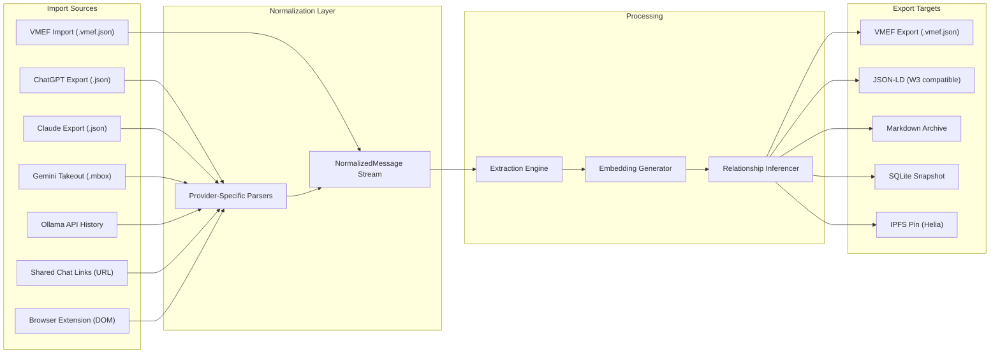

# VIVIM Cortex — Enhanced Roadmap: Core Pillars Deep-Dive

> Supplement to the Enterprise Development Roadmap.
> Covers: Sovereignty · Portability · Multi-Provider · Context Intelligence IP · Security

---

## Pillar 1: Sovereign Architecture

### 1.1 Design Philosophy
**"The user IS the database."** No central server ever stores, processes, or has access to raw user data. Every memory, context bundle, and credential is cryptographically owned by the user's `did:key` identity.

### 1.2 Sovereignty Stack

```
┌─────────────────────────────────────────────────────────┐
│  LAYER 5: Application (PWA / Extension / CLI)           │
│  ─ All data decrypted only inside user's runtime        │
├─────────────────────────────────────────────────────────┤
│  LAYER 4: Sovereign Permissions Engine                  │
│  ─ 22 action types, 7 trust levels, 11 policy templates │
│  ─ Granular delegation chains with depth limits         │
│  ─ Condition-based rules (time, geo, device, auth)      │
├─────────────────────────────────────────────────────────┤
│  LAYER 3: Encrypted CRDT Sync (Yjs)                    │
│  ─ End-to-end encrypted document sync                   │
│  ─ No relay can read content — only encrypted blobs     │
├─────────────────────────────────────────────────────────┤
│  LAYER 2: Zero-Knowledge Memory Vault                   │
│  ─ Envelope encryption (AES-256-GCM per-memory)         │
│  ─ Key encrypted with user's Ed25519 DID key            │
│  ─ Vector embeddings computed locally or via TEE         │
├─────────────────────────────────────────────────────────┤
│  LAYER 1: Cryptographic Identity (did:key)              │
│  ─ Ed25519 keypair generation (@noble/ed25519)          │
│  ─ No email, no password, no central identity provider  │
│  ─ Hardware-backed key storage (WebAuthn/FIDO2)         │
├─────────────────────────────────────────────────────────┤
│  LAYER 0: L0 Core Storage (Chain of Trust)              │
│  ─ Merkle-rooted document integrity                     │
│  ─ Genesis → Bootstrap → Primary → Secondary trust      │
│  ─ Self-signed entries with verifiable CIDs              │
└─────────────────────────────────────────────────────────┘
```

### 1.3 Zero-Knowledge Memory Vault

```typescript
// Every memory is individually encrypted before storage
interface EncryptedMemory {
  id: string;
  ownerDid: string;

  // Encrypted payload (AES-256-GCM)
  ciphertext: Uint8Array;
  nonce: Uint8Array;         // 12-byte random IV
  tag: Uint8Array;           // 16-byte auth tag

  // Key wrapping (ECDH + HKDF)
  wrappedKey: Uint8Array;    // DEK encrypted with user's public key
  ephemeralPublicKey: string; // For ECDH key agreement

  // Searchable metadata (non-sensitive, unencrypted)
  memoryType: MemoryType;
  importance: number;
  createdAt: Date;

  // Encrypted embedding (for the Pro/Enterprise tiers)
  encryptedEmbedding?: Uint8Array;

  // Proof of ownership
  ownershipProof: string;    // Ed25519 signature over id + ciphertext hash
}
```

**Key Design Decisions**:
- **Envelope encryption**: Each memory gets a unique Data Encryption Key (DEK). The DEK is wrapped with the user's public key. This means even if the database is breached, data is unreadable without the user's private key.
- **Local embedding**: In Free/Pro tiers, embeddings are computed on-device using `@xenova/transformers` (ONNX). In Enterprise tier, embeddings can be computed in a Trusted Execution Environment (TEE).
- **Selective disclosure**: Users can share specific memories with specific agents/people without exposing their entire vault.

### 1.4 Key Management

| Tier | Key Storage | Recovery |
|---|---|---|
| Free | Browser `crypto.subtle` | Mnemonic seed phrase (BIP-39) |
| Pro | WebAuthn/FIDO2 hardware key | Social recovery (3-of-5 guardians) |
| Team | Hardware security key required | Admin recovery + guardian |
| Enterprise | HSM / Azure Key Vault / AWS KMS | Organizational key escrow + guardian |

### 1.5 Sovereign Permissions (Existing: 917 lines)
Already implemented in `sovereign-permissions-node.ts`:
- **22 action types**: `read`, `write`, `share`, `fork`, `remix`, `derive`, `monetize`, `export`, `archive`, etc.
- **7 trust levels**: `NONE` → `ACQUAINTANCE` → `FRIEND` → `TRUSTED` → `CIRCLE` → `FAMILY` → `SELF`
- **11 policy templates**: `PRIVATE`, `RESTRICTED`, `SOCIAL`, `NETWORK`, `PUBLIC_READ`, `PUBLIC_ATTRIBUTED`, `PUBLIC_FORKABLE`, `OPEN`, `COMMERCIAL`, `AI_COLLABORATIVE`, `AI_FORK_ONLY`
- **Delegation chains**: Cryptographically signed, depth-limited, revocable
- **Condition types**: `trust_level`, `relationship`, `time_window`, `geo_location`, `device_trust`, `auth_factor`

---

## Pillar 2: Portability

### 2.1 Open Export Format (VMEF)
**VIVIM Memory Exchange Format** — an open-standard JSON-LD format for memory portability.

```jsonc
{
  "@context": "https://vivim.io/schemas/vmef/v1",
  "@type": "MemoryExport",
  "exportedAt": "2026-03-01T14:00:00Z",
  "exportedBy": "did:key:z6Mk...",
  "version": "1.0.0",
  "statistics": {
    "totalMemories": 4521,
    "totalRelationships": 12850,
    "providers": ["openai", "anthropic", "ollama"],
    "dateRange": { "from": "2024-06-15", "to": "2026-03-01" }
  },
  "memories": [
    {
      "@type": "Memory",
      "id": "mem_abc123",
      "content": "User is a full-stack TypeScript developer focused on P2P systems",
      "memoryType": "IDENTITY",
      "category": "role",
      "importance": 0.95,
      "provenance": {
        "provider": "anthropic",
        "model": "claude-3.5-sonnet",
        "conversationId": "conv_xyz",
        "extractedAt": "2026-01-15T10:30:00Z",
        "confidence": 0.92
      },
      "embedding": { "model": "text-embedding-3-small", "dimensions": 1536, "vector": "base64:..." },
      "relationships": [
        { "target": "mem_def456", "type": "supports", "strength": 0.87 }
      ]
    }
    // ...
  ]
}
```

### 2.2 Import/Export Pipeline



### 2.3 Migration Protocol
When a user switches from another memory product or wants to move between Cortex instances:

1. **Export**: Generate signed VMEF bundle with all memories, relationships, embeddings
2. **Transfer**: P2P transfer (Helia/IPFS), USB/file, or encrypted cloud relay
3. **Verify**: Recipient verifies the `did:key` signature on the bundle
4. **Import**: Memories are decrypted with the user's key and stored locally
5. **Re-embed**: Optionally re-generate embeddings with the target instance's model
6. **Reconcile**: Dedup against existing memories using similarity matching

### 2.4 Identity Continuity
Your `did:key` identity works across all providers and instances:
- Same DID on laptop, phone, work machine
- Memories from ChatGPT + Claude + Ollama all under one identity
- Export your DID to a new device via QR code or seed phrase
- Revoke access from old devices without losing memories

---

## Pillar 3: Multi-Provider AI Model Support

### 3.1 Universal Provider Connector

```typescript
// Every provider implements this interface
interface IProviderConnector {
  readonly providerId: string;
  readonly displayName: string;
  readonly icon: string;
  readonly capabilities: ProviderCapability[];

  // Lifecycle
  connect(config: ProviderAuthConfig): Promise<ConnectionResult>;
  disconnect(): Promise<void>;
  healthCheck(): Promise<ProviderHealth>;

  // Conversation management
  listConversations(opts?: ListOptions): AsyncGenerator<ConversationMeta>;
  getConversation(id: string): Promise<NormalizedConversation>;

  // Message streaming (real-time interception)
  interceptRequest(request: ChatRequest): Promise<InterceptedStream>;

  // Bulk import
  importHistory(source: ImportSource): AsyncGenerator<ImportProgress>;

  // Model information
  listModels(): Promise<ModelInfo[]>;
  getModelCapabilities(modelId: string): Promise<ModelCapabilities>;
}

interface ProviderCapability {
  type: 'import' | 'realtime' | 'streaming' | 'history' | 'tool_use' | 'vision' | 'code_exec';
  supported: boolean;
  details?: string;
}
```

### 3.2 Provider Connector Implementations

| Provider | Auth | Import | Real-Time | Streaming | Tool Use | Vision |
|---|---|---|---|---|---|---|
| **OpenAI** | API Key | ✅ JSON export | ✅ API proxy | ✅ SSE | ✅ | ✅ |
| **Anthropic** | API Key | ✅ JSON export | ✅ API proxy | ✅ SSE | ✅ | ✅ |
| **Google Gemini** | OAuth2 | ✅ Takeout | ✅ API proxy | ✅ SSE | ✅ | ✅ |
| **Ollama** | None | ✅ API `/api/ps` | ✅ Local API | ✅ SSE | ✅ | ✅ |
| **Mistral** | API Key | ⬚ | ✅ API proxy | ✅ SSE | ✅ | ❌ |
| **Groq** | API Key | ⬚ | ✅ API proxy | ✅ SSE | ✅ | ✅ |
| **Open Router** | API Key | ⬚ | ✅ Proxy | ✅ SSE | ✅ | ✅ |
| **xAI (Grok)** | API Key | ⬚ | ✅ API proxy | ✅ SSE | ✅ | ❌ |
| **Cohere** | API Key | ⬚ | ✅ API proxy | ✅ SSE | ✅ | ❌ |
| **HuggingFace** | Token | ⬚ | ✅ Inference API | ✅ SSE | ❌ | ✅ |
| **LM Studio** | None | ✅ Local files | ✅ Local API | ✅ SSE | ✅ | ✅ |
| **Jan** | None | ✅ Local files | ✅ Local API | ✅ SSE | ❌ | ❌ |
| **Azure OpenAI** | Entra ID | ⬚ | ✅ API proxy | ✅ SSE | ✅ | ✅ |
| **AWS Bedrock** | IAM | ⬚ | ✅ SDK | ✅ chunked | ✅ | ✅ |
| **MCP Client** | N/A | N/A | ✅ Protocol | ✅ Stdio | ✅ | N/A |

### 3.3 Model-Aware Context Tuning
Different models have different context windows and strengths. The context pipeline auto-adjusts:

```typescript
const MODEL_PROFILES: Record<string, ModelProfile> = {
  'gpt-4o':           { maxCtx: 128000, sweetSpot: 16000, strengths: ['reasoning', 'code'],  costPer1kIn: 0.0025 },
  'gpt-4o-mini':      { maxCtx: 128000, sweetSpot: 8000,  strengths: ['speed', 'code'],      costPer1kIn: 0.00015 },
  'claude-3.5-sonnet': { maxCtx: 200000, sweetSpot: 24000, strengths: ['reasoning', 'writing'], costPer1kIn: 0.003 },
  'claude-3-haiku':   { maxCtx: 200000, sweetSpot: 8000,  strengths: ['speed'],              costPer1kIn: 0.00025 },
  'gemini-2.0-flash': { maxCtx: 1000000, sweetSpot: 32000, strengths: ['multimodal', 'speed'], costPer1kIn: 0.0001 },
  'mistral-large':    { maxCtx: 128000, sweetSpot: 16000, strengths: ['multilingual'],       costPer1kIn: 0.002 },
  'llama-3.3-70b':    { maxCtx: 128000, sweetSpot: 8000,  strengths: ['open', 'code'],       costPer1kIn: 0.0 },
  'deepseek-r1':      { maxCtx: 128000, sweetSpot: 12000, strengths: ['reasoning', 'math'],  costPer1kIn: 0.0014 },
};

// Context budget auto-scales based on target model
function computeTokenBudget(model: string, userSettings: UserContextSettings): number {
  const profile = MODEL_PROFILES[model];
  return Math.min(
    userSettings.maxTokenBudget,
    profile?.sweetSpot ?? 12000
  );
}
```

### 3.4 Provider Health Monitoring
```typescript
interface ProviderHealth {
  status: 'healthy' | 'degraded' | 'down';
  latency: number;            // ms
  lastSuccessAt: Date;
  errorRate: number;           // 0-1 over last hour
  quotaRemaining?: number;     // API quota
  activeConnections: number;
  capabilities: ProviderCapability[];
}
```

---

## Pillar 4: Dynamic Context Intelligence (Proprietary IP)

### 4.1 Algorithm Overview
The **VIVIM Context Assembly Algorithm (VCAA)** is the proprietary core IP. It solves a constrained optimization problem: *given a finite token budget, maximize the relevance of injected context while maintaining coherent conversation flow*.

### 4.2 VCAA: Token Budget Solver

```
INPUT:
  - tokenBudget: total available tokens (e.g., 12,000)
  - layers[]: array of LayerConfig with {priority, minTokens, idealTokens, maxTokens, elasticity}
  - availableContent: map of layerId → compiled content

OUTPUT:
  - allocation[]: map of layerId → allocated tokens
  - assembledContext: final prompt string

ALGORITHM (3-pass):

  PASS 1 — GUARANTEE MINIMUMS:
    totalMin = sum(layer.minTokens for all layers)
    if totalMin > tokenBudget:
      // Catastrophic — not enough space for hard floors
      // Drop lowest-priority layers until minimums fit
      sort layers by priority DESC
      while totalMin > tokenBudget:
        drop lowest-priority layer
        recalculate totalMin

    remaining = tokenBudget - totalMin
    allocation[layer] = layer.minTokens for each layer

  PASS 2 — DISTRIBUTE IDEAL:
    // Distribute remaining tokens proportional to
    // (idealTokens - minTokens) * priority
    candidates = layers where idealTokens > minTokens
    sort candidates by priority DESC

    for each candidate:
      want = min(candidate.idealTokens - allocation[candidate], remaining)
      allocation[candidate] += want
      remaining -= want

  PASS 3 — ELASTIC OVERFLOW:
    // If tokens remain, expand elastic layers up to maxTokens
    candidates = layers where allocation < maxTokens AND elasticity > 0
    sort by elasticity DESC (most willing to expand first)

    for each candidate:
      expandable = min(candidate.maxTokens - allocation[candidate], remaining)
      elasticExpand = expandable * candidate.elasticity
      allocation[candidate] += elasticExpand
      remaining -= elasticExpand

  ASSEMBLE:
    for each layer in priority order:
      content = compile(availableContent[layer.id], allocation[layer])
      assembledContext += content
```

### 4.3 Progressive Conversation Compaction (4-Tier)

```
TIER 1 — FULL (< 30% budget used)
  All messages verbatim. No compression.

TIER 2 — WINDOWED (30-60% budget)
  Keep last N messages verbatim.
  Summarize older messages into "Previously discussed:" block.

TIER 3 — COMPACTED (60-85% budget)
  Keep last 5 messages verbatim.
  Summarize older messages with LLM (cached in DB).
  Remove low-importance messages (greetings, acknowledgments).

TIER 4 — MULTI-LEVEL (> 85% budget)
  Divide history into temporal zones:
  ┌────────────────────────────────────────────┐
  │ ANCIENT (>48h)   → 1-sentence summary     │
  │ OLDER (24-48h)   → 3-sentence summary     │
  │ MIDDLE (4-24h)   → Bullet-point summary   │
  │ RECENT (<4h)     → Last 3 messages verbatim│
  └────────────────────────────────────────────┘
  All summaries cached by conversationId + message range hash.
```

### 4.4 Hybrid Retrieval: Reciprocal Rank Fusion (RRF)

```
GIVEN:
  - query: user's current message
  - S: semantic search results (pgvector cosine similarity)
  - K: keyword search results (PostgreSQL full-text / LIKE)

FUSION:
  for each result r:
    RRF_score(r) = Σ [ 1 / (k + rank_i(r)) ]
    where:
      k = 60 (smoothing constant)
      rank_i(r) = position of r in result list i

  WEIGHTED_score(r) = (0.6 × semantic_similarity(r)) + (0.4 × keyword_match_rate(r))

  FINAL_score(r) = α × RRF_score(r) + (1-α) × WEIGHTED_score(r)
  where α = 0.5

BOOST FACTORS:
  - Pinned memories: score × 1.5
  - High importance (≥ 0.8): score × 1.2
  - Recent access (< 7 days): score × 1.1
  - Same conversation source: score × 1.15
```

### 4.5 Prediction Engine

```typescript
interface PredictionEngine {
  // Pre-warm context bundles based on predicted user needs
  predictNextContext(userId: string): Promise<PredictedBundle[]>;

  // Signals used for prediction:
  signals: {
    temporalPatterns: {        // "User discusses work projects 9am-5pm"
      hourOfDay: number;
      dayOfWeek: number;
      topicDistribution: Map<string, number>;
    };
    topicMomentum: {           // "User has been discussing TypeScript for 3 sessions"
      topic: string;
      sessionCount: number;
      recencyScore: number;
    };
    conversationChaining: {    // "After discussing X, user typically asks about Y"
      antecedent: string;
      consequent: string;
      probability: number;
    };
    providerSwitching: {       // "User switches to Claude for writing tasks"
      fromProvider: string;
      toProvider: string;
      taskType: string;
    };
  };
}
```

---

## Pillar 5: Security Roadmap

### 5.1 Threat Model

| Threat | Vector | Impact | Mitigation |
|---|---|---|---|
| **Memory Exfiltration** | Compromised server/relay | Critical | Zero-knowledge vault — server never sees plaintext |
| **Identity Theft** | Stolen private key | Critical | Hardware-backed keys (FIDO2), social recovery |
| **Provider API Key Leak** | Database breach | High | Envelope encryption — keys wrapped with user's DID |
| **CRDT Tampering** | Man-in-the-middle | High | Signed CRDT updates, merkle verification |
| **Replay Attacks** | Network interception | Medium | Timestamps + nonces on all signed payloads |
| **Context Poisoning** | Malicious memory injection | High | Provenance tracking, confidence thresholds, user approval |
| **Extraction Prompt Injection** | Adversarial conversation | Medium | Input sanitization, extraction confidence gating |
| **Privilege Escalation** | Forged delegation chain | High | Cryptographic signature verification at every link |
| **Side-Channel (Timing)** | Embedding similarity queries | Low | Constant-time comparison for sensitive lookups |
| **Supply Chain** | Compromised dependency | Critical | Lockfile pinning, `bun audit`, SBOM generation |

### 5.2 Encryption Architecture

```
┌─────────────────────────────────────────────────────────┐
│                  AT REST                                │
│                                                         │
│  Memory Content    → AES-256-GCM (per-memory DEK)       │
│  Data Encryption   → DEK wrapped with ECDH(user pubkey) │
│  Provider API Keys → AES-256-GCM (key from DID seed)    │
│  SQLite Database   → SQLCipher (full-db encryption)     │
│  CRDT Documents    → AES-256-GCM (per-document key)     │
│  Backup Bundles    → ChaCha20-Poly1305 (passphrase-KDF) │
├─────────────────────────────────────────────────────────┤
│                  IN TRANSIT                              │
│                                                         │
│  API Calls         → TLS 1.3 (minimum)                  │
│  P2P Sync          → Noise Protocol (libp2p)            │
│  WebSocket Sync    → WSS + per-message encryption       │
│  Webhook Payloads  → HMAC-SHA256 signature verification │
├─────────────────────────────────────────────────────────┤
│                  IN COMPUTE                              │
│                                                         │
│  Embedding Gen     → Local ONNX or TEE enclave          │
│  LLM Extraction    → Provider API (TLS) — plaintext     │
│                      exposure limited to extraction prompt│
│  Context Assembly  → In-memory only, never persisted     │
│                      assembled as plaintext               │
└─────────────────────────────────────────────────────────┘
```

### 5.3 Security Engineering Milestones

| Phase | Milestone | Timeline | Details |
|---|---|---|---|
| **P1** | Envelope encryption for memories | Wk 3-5 | AES-256-GCM per-memory, ECDH key wrapping |
| **P1** | Provider credential encryption | Wk 4-6 | Encrypted storage for API keys |
| **P1** | Ed25519 signature on all mutations | Wk 5-7 | Every create/update/delete is signed |
| **P2** | Hardware key support (WebAuthn) | Wk 8-10 | FIDO2 integration for key storage |
| **P2** | SQLCipher for local SQLite | Wk 9-11 | Full-database encryption at rest |
| **P2** | CRDT encryption layer | Wk 10-12 | Per-document encryption for Yjs sync |
| **P3** | Social recovery protocol | Wk 14-16 | 3-of-5 Shamir's Secret Sharing |
| **P3** | Audit log immutability | Wk 15-17 | Append-only, merkle-chained audit entries |
| **P3** | Input sanitization (extraction) | Wk 16-17 | Prompt injection defense |
| **P4** | SOC 2 Type I preparation | Wk 18-22 | Policies, controls documentation |
| **P4** | GDPR/CCPA compliance toolkit | Wk 20-24 | Data subject requests, right to erasure |
| **P4** | Penetration testing (external) | Wk 22 | Third-party security audit |
| **P5** | SOC 2 Type II certification | Wk 26-40 | 6-month observation period |
| **P5** | Bug bounty program | Wk 28+ | HackerOne / Intigriti partnership |
| **P5** | TEE embedding computation | Wk 30+ | Azure Confidential Computing / AWS Nitro |

### 5.4 Supply Chain Security

```yaml
# Security controls for the build pipeline
supply_chain:
  dependencies:
    - lockfile: bun.lockb (always committed)
    - audit: "bun audit" on every CI run
    - sbom: CycloneDX SBOM generated per release
    - pinning: exact versions only (no ^/~)

  build:
    - reproducible: deterministic builds via bun
    - signing: release artifacts signed with Ed25519
    - attestation: SLSA Level 3 provenance

  runtime:
    - csp: strict Content-Security-Policy headers
    - sandbox: browser extension runs in isolated world
    - permissions: minimal OS permissions (no filesystem except data dir)
```

### 5.5 Incident Response

```
SEVERITY 1 (Data Breach):
  0-15 min  → Automated detection (anomaly in access patterns)
  15-30 min → Security team notified, credentials rotated
  30-60 min → Affected users notified via in-app + email
  1-4 hr    → Root cause analysis, patch deployed
  4-24 hr   → Post-mortem published

SEVERITY 2 (Vulnerability Disclosed):
  0-1 hr    → Triage and impact assessment
  1-24 hr   → Patch development
  24-48 hr  → Patch deployed + advisory published

SEVERITY 3 (Dependency CVE):
  0-24 hr   → Assessment of applicability
  24-72 hr  → Upgrade or mitigate
  72+ hr    → Monitor for exploitation
```

---

*Document Version: 1.0 — March 2026*
*Supplement to: cortex_enterprise_roadmap.md*
