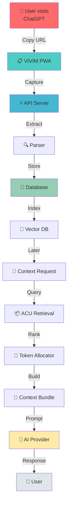
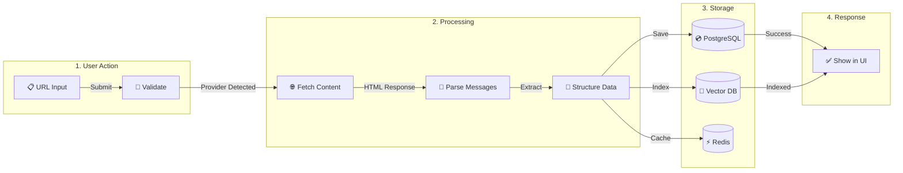
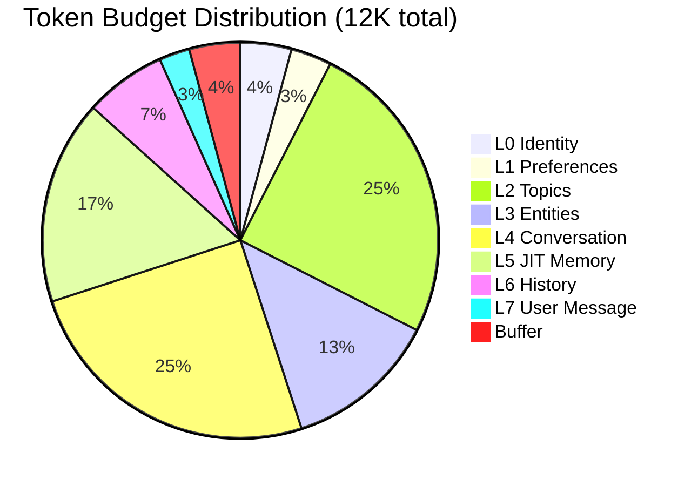
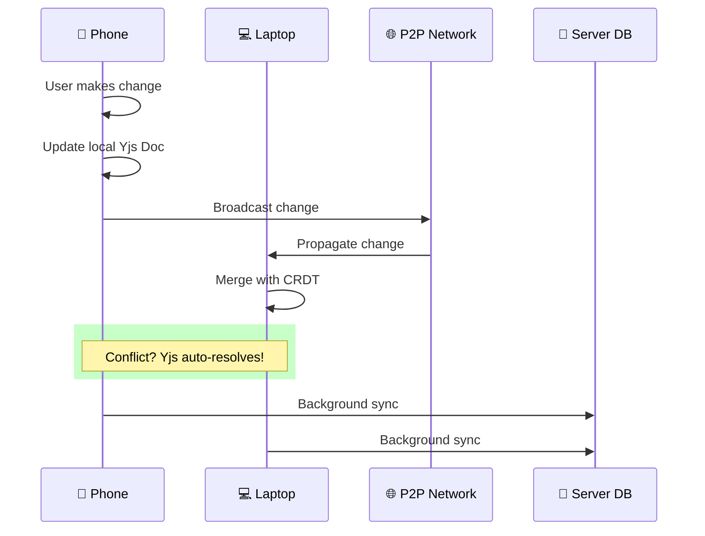
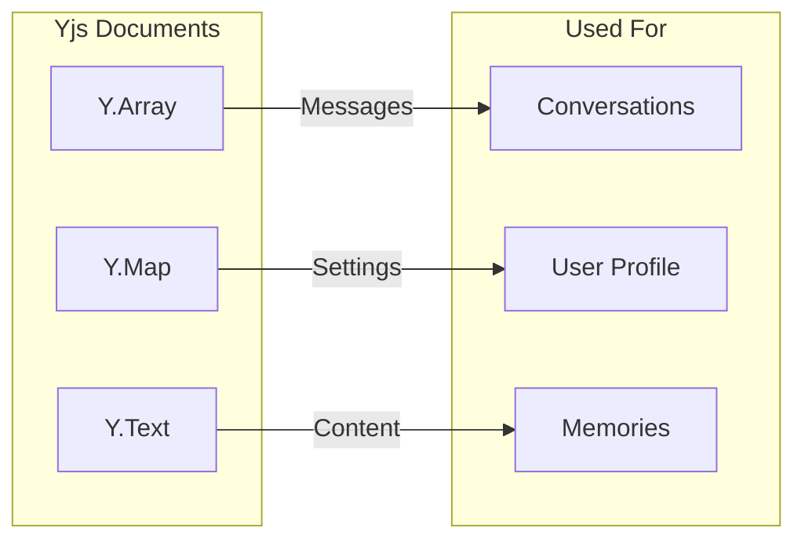
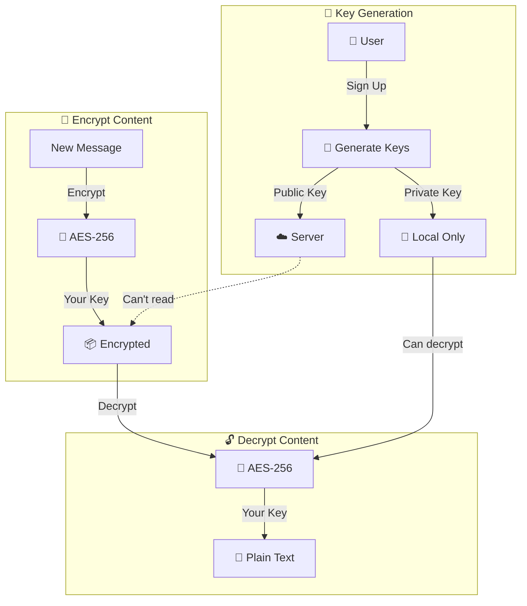
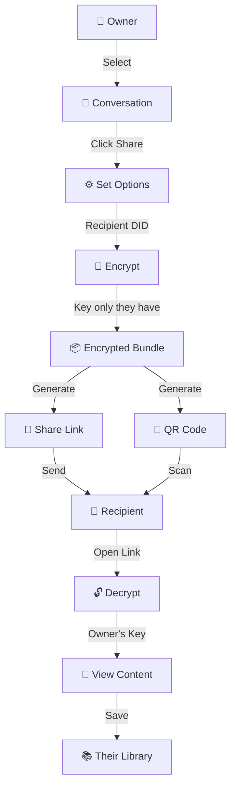
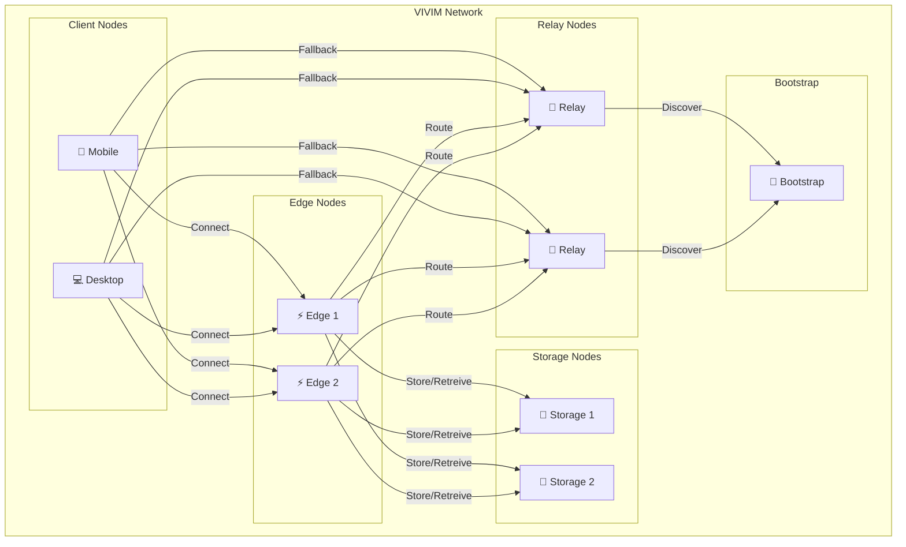
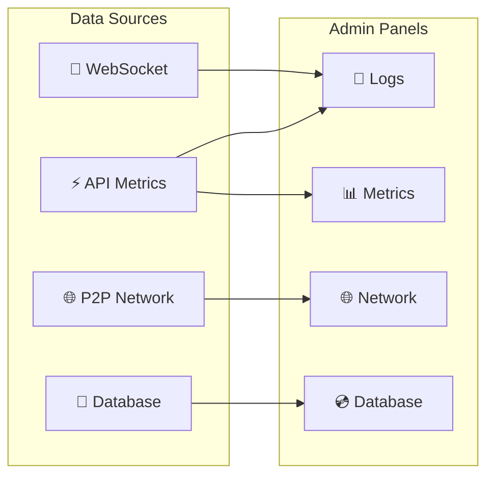

# 🎬 Visual Guides

Visual explanations of VIVIM's key processes and connections.

---

## 🔄 How Data Flows Through VIVIM

### Complete User Journey



---

## 📥 Capture Process



---

## 🧠 Context Building Process

### The 8-Layer Pipeline

```mermaid
flowchart TB
    subgraph "User Message"
        UM[💬 "Help me with<br/>my React code"]
    end
    
    subgraph "L0: Identity Core"
        I0[👤 Your role,<br/>experience]
    end
    subgraph "L1: Preferences"
        I1[⚙️ Communication<br/>style]
    end
    subgraph "L2: Topic Context"
        I2[📚 Current topic<br/>profile]
    end
    subgraph "L3: Entity"
        I3[👥 Projects,<br/>people]
    end
    subgraph "L4: Conversation"
        I4[💭 This conversation<br/>summary]
    end
    subgraph "L5: JIT Memory"
        I5[⚡ On-demand<br/>retrieval]
    end
    subgraph "L6: History"
        I6[📜 Recent<br/>messages]
    end
    
    UM --> I0 & I1 & I2 & I3 & I4 & I5 & I6
    
    allLayers[All Layers] -->|Combine| bundle[📦 Context Bundle]
    
    I0 & I1 & I2 & I3 & I4 & I5 & I6 --> allLayers
```

### Token Allocation



---

## 🔄 Sync Process (P2P)

### How Devices Stay in Sync



### CRDT Data Types



---

## 🔐 Encryption Flow

### End-to-End Encryption



---

## 📤 Sharing Process



---

## 🌐 Network Topology

### Node Types in VIVIM



---

## 📊 Monitoring & Telemetry

### Admin Panel Architecture



---

## 🔗 Related Guides

| Guide | Description |
|-------|-------------|
| [Architecture Overview](/docs/architecture/overview) | Full system architecture |
| [Context Engine](/docs/architecture/context) | Deep dive into context pipeline |
| [Network Overview](/docs/network/overview) | P2P networking details |
| [Database Schema](/docs/database/schema) | Data models |
| [Sync Architecture](/docs/architecture/sync) | Synchronization details |
