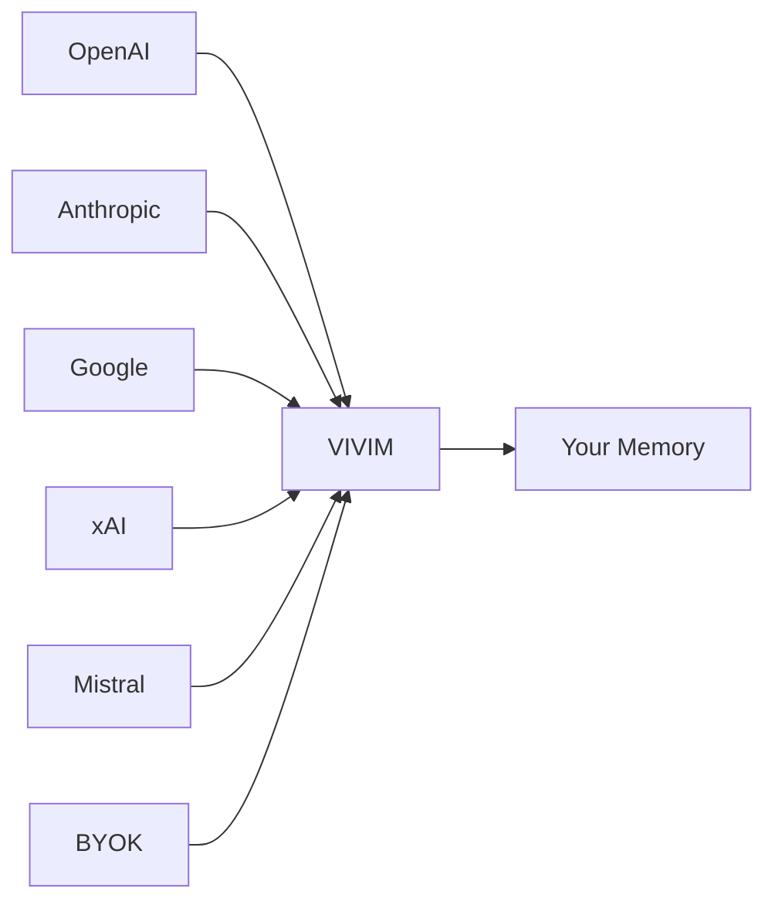
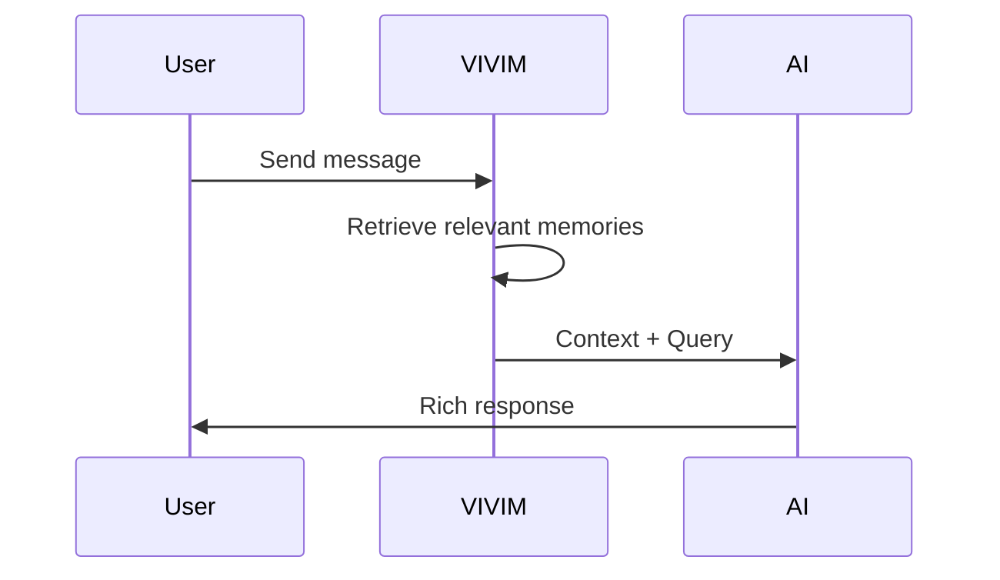
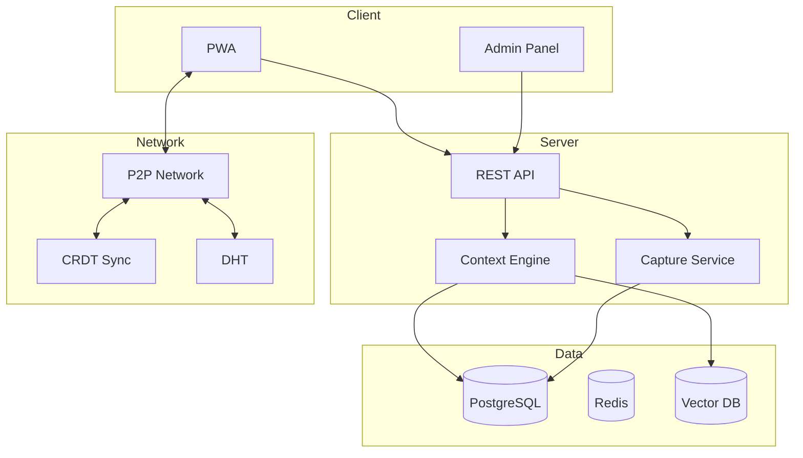

# VIVIM

## Your Personal AI Memory Platform

**Capture. Remember. Connect.**

VIVIM is a decentralized platform that captures your AI conversations, indexes them, and retrieves the exact context you need—when you need it.

---

## 🚀 Open Source

VIVIM is fully open source! We believe in transparency and community-driven development.

| Repository | Description |
|------------|-------------|
| [**Main Application**](https://github.com/owenservera/vivim-app) | Full-stack application with PWA frontend, API server, and P2P networking |
| [**SDK**](https://github.com/vivim/vivim-sdk) | Open-source E2E self-contained toolkit for decentralized applications |

### GitHub Links

- **Main Repo**: [github.com/owenservera/vivim-app](https://github.com/owenservera/vivim-app)
- **SDK Repo**: [github.com/vivim/vivim-sdk](https://github.com/vivim/vivim-sdk)
- **Issues**: [Report bugs or request features](https://github.com/owenservera/vivim-app/issues)
- **Discussions**: [Join the conversation](https://github.com/owenservera/vivim-app/discussions)

---

## 📦 VIVIM SDK

The **VIVIM SDK** is a completely new, powerful toolkit for building decentralized, AI-native applications. It features a modular node-based architecture where anyone can create, extend, and share components.

### SDK Architecture

```
┌─────────────────────────────────────────────────────────────────────────────┐
│                        VIVIM SDK ECOSYSTEM                                   │
│                                                                              │
│                         ┌─────────────────┐                                  │
│                         │   CORE SDK      │                                  │
│                         │   (@vivim/sdk)  │                                  │
│                         └────────┬────────┘                                  │
│                                  │                                           │
│          ┌───────────────────────┼───────────────────────┐                   │
│          │                       │                       │                   │
│          ▼                       ▼                       ▼                   │
│   ┌──────────────┐       ┌──────────────┐       ┌──────────────┐            │
│   │  API NODES   │       │  SDK NODES   │       │ NETWORK NODES│            │
│   │              │       │              │       │              │            │
│   │ • Identity   │       │ • React Kit  │       │ • Bootstrap  │            │
│   │ • Storage    │       │ • Vue Kit    │       │ • Relay      │            │
│   │ • AI Chat    │       │ • Svelte Kit │       │ • Indexer    │            │
│   │ • Social     │       │ • Flutter    │       │ • Anchor     │            │
│   │ • Memory     │       │ • React Nat. │       │              │            │
│   └──────┬───────┘       └──────┬───────┘       └──────┬───────┘            │
│          │                      │                      │                     │
│          └──────────────────────┴──────────────────────┘                     │
│                                 │                                            │
│                                 ▼                                            │
│                    ┌────────────────────────┐                                │
│                    │    NETWORK GRAPH       │                                │
│                    │    (P2P Mesh)          │                                │
│                    └────────────────────────┘                                │
└─────────────────────────────────────────────────────────────────────────────┘
```

### SDK Quick Start

```bash
# Install the SDK
npm install @vivim/sdk
# or
bun add @vivim/sdk
```

```typescript
import { VivimSDK } from '@vivim/sdk/core';

const sdk = new VivimSDK({
  identity: { autoCreate: true },
  network: { bootstrapNodes: ['https://bootstrap.vivim.live'] },
  storage: { defaultLocation: 'local', encryption: true },
});

await sdk.initialize();
```

### SDK Documentation

- [**SDK Overview**](../sdk/overview) - Introduction to the VIVIM SDK
- [**Core SDK**](../sdk/core/overview) - Core types and utilities
- [**API Nodes**](../sdk/api-nodes/overview) - Identity, Storage, AI Chat, Social, Memory
- [**SDK Nodes**](../sdk/sdk-nodes/overview) - React, Vue, Svelte, Flutter adapters
- [**Network**](../sdk/network/overview) - P2P networking infrastructure
- [**Guides**](../sdk/guides/getting-started) - Step-by-step tutorials
- [**Examples**](../sdk/examples/basic) - Runnable code examples

---

## The Problem

| Problem | Description |
|---------|-------------|
| 🔒 **Locked Away** | AI providers store your conversations. You can't access them, search them, or use them to teach future AI about you. |
| 🌊 **Ephemeral** | Chat histories disappear. Context windows are limited. Your knowledge evaporates when the conversation ends. |
| 🌍 **Siloed** | Your AI interactions exist in isolated silos—one for ChatGPT, another for Claude, another for Gemini. No connection between them. |

---

## The VIVIM Solution

### 🦾 Universal Capture
Capture conversations from **any AI provider**—ChatGPT, Claude, Gemini, Grok, Mistral, or your own API keys.



### 🧠 Dynamic Context
Every conversation is indexed, tagged, and ranked. When you chat with AI, VIVIM retrieves the **exact context you need**.



---

## Core Features

| Feature | Description |
|---------|-------------|
| 🔐 **End-to-End Encrypted** | Your memories are encrypted. Only you can decrypt them. Zero-knowledge architecture. |
| 🌐 **P2P Decentralized** | No central server stores your data. Sync directly between devices using libp2p. |
| 📱 **Offline-First** | Works without internet. Sync when you're back online. |
| 🏛️ **Federated Social** | Share memories with Circles. Follow others. Build your network. |
| 💾 **Storage V2** | Content-addressed DAG storage with cryptographic verification. |
| 🔑 **BYOK** | Bring Your Own Key. Use your own API keys for maximum privacy and cost control. |
| 📊 **Context Pipeline** | Hyper-optimized streaming context pipelines with budget algorithms. |
| 🛡️ **Capability-Based Access** | Fine-grained permissions for sharing and collaboration. |

---

## Architecture Overview



---

## Tech Stack

| Layer | Technology |
|-------|------------|
| **Frontend** | React, TypeScript, Vite, PWA |
| **Backend** | Express.js, TypeScript |
| **Database** | PostgreSQL, Prisma |
| **Cache** | Redis |
| **Vector** | Embedding-based retrieval |
| **Network** | libp2p, Yjs CRDT |
| **Security** | E2E Encryption, Capability-based ACL |

---

## Quick Links

### SDK Documentation (NEW!)
- **[SDK Overview](../sdk/overview)** - Introduction to VIVIM SDK
- **[Getting Started](../sdk/guides/getting-started)** - Quick start guide
- **[Core SDK](../sdk/core/overview)** - Core API reference
- **[API Nodes](../sdk/api-nodes/overview)** - Identity, Storage, AI Chat, etc.
- **[SDK Nodes](../sdk/sdk-nodes/overview)** - React, Vue, Svelte, Flutter
- **[Network](../sdk/network/overview)** - P2P networking
- **[Examples](../sdk/examples/basic)** - Code examples

### Application Documentation
- **[Context Pipeline](/docs/architecture/pipeline)** - Hyper-optimized streaming context
- **[Storage V2](/docs/pwa/storage-v2)** - Content-addressed DAG storage
- **[BYOK](/docs/pwa/byok)** - Bring Your Own Key
- **[Security](/docs/network/security)** - E2E encryption & capabilities
- **[Development Guide](/docs/development/guide)** - Local setup
- **[Deployment](/docs/deployment/guide)** - Production deployment

### GitHub Repositories
- **[Main Application](https://github.com/owenservera/vivim-app)** - Full-stack app
- **[SDK](https://github.com/vivim/vivim-sdk)** - Developer toolkit
