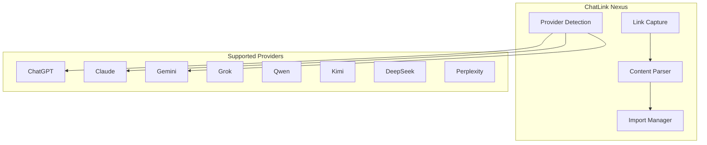
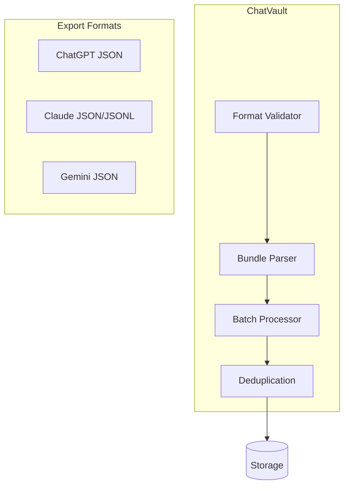

# Additional API Nodes

Documentation for specialized API nodes: ChatLink Nexus and ChatVault Archiver.

## ChatLink Nexus Node

Multi-Provider AI Shared Chat Link Import Node.

### Architecture



### Supported Providers

| Provider | URL Pattern | Export Format |
|----------|-------------|---------------|
| ChatGPT | `chatgpt.com` | Shared link |
| Claude | `claude.ai` | Shared link |
| Gemini | `gemini.google.com` | Shared link |
| Grok | `x.ai/grok` | Shared link |
| Qwen | `qwenlm.com` | Shared link |
| Kimi | `kimi.moonshot.cn` | Shared link |
| DeepSeek | `deepseek.com` | Shared link |
| Perplexity | `perplexity.ai` | Shared link |

### Usage

```typescript
import { ChatLinkNexusNode } from '@vivim/sdk/nodes';

const chatLinkNode = await sdk.loadNode<ChatLinkNexusNode>('chatlink-nexus');

// Import from shared link
const conversation = await chatLinkNode.importFromLink({
  url: 'https://chatgpt.com/share/abc123',
  includeMetadata: true,
  tags: ['important', 'research'],
});

console.log('Imported:', conversation.messageCount, 'messages');
```

### Provider Detection

```typescript
// Auto-detect provider from URL
const detection = chatLinkNode.detectProvider(url);

console.log('Provider:', detection.provider);
console.log('Confidence:', detection.confidence);
```

### Batch Import

```typescript
// Import multiple links
const links = [
  'https://chatgpt.com/share/abc123',
  'https://claude.ai/share/xyz789',
];

const conversations = await chatLinkNode.importFromLinks(links);

console.log('Imported', conversations.length, 'conversations');
```

### Import Status Tracking

```typescript
// Track import progress
const status = chatLinkNode.getImportStatus(importId);

console.log('Status:', status.status);
console.log('Progress:', status.progress, '%');

// List all imports
const imports = chatLinkNode.listImports({ limit: 10 });
```

### Custom Provider Configuration

```typescript
// Add custom provider support
await chatLinkNode.registerProvider({
  provider: 'custom-ai',
  urlPattern: /custom-ai\.com\/chat\/.+/,
  settingsFile: 'custom-ai-singlefile.json',
  chatSelector: '.chat-container',
  messagePattern: {
    user: /<div class="user">(.*?)<\/div>/g,
    assistant: /<div class="assistant">(.*?)<\/div>/g,
  },
});
```

## ChatVault Archiver Node

Multi-Provider AI Chat History Bulk Importer.

### Architecture



### Supported Export Formats

| Format | Provider | File Type |
|--------|----------|-----------|
| `chatgpt-json` | ChatGPT | JSON |
| `claude-json` | Claude | JSON |
| `claude-jsonl` | Claude | JSONL |
| `gemini-json` | Gemini | JSON |
| `grok-json` | Grok | JSON |
| `perplexity-json` | Perplexity | JSON |

### Usage

```typescript
import { ChatVaultArchiverNode } from '@vivim/sdk/nodes';

const vaultNode = await sdk.loadNode<ChatVaultArchiverNode>('chatvault-archiver');

// Import from file
const result = await vaultNode.importFromBundle({
  source: './chatgpt-export.json',
  sourceType: 'file',
  tags: ['archive', 'chatgpt'],
  deduplicate: true,
});

console.log('Imported', result.conversations.length, 'conversations');
```

### Batch Processing

```typescript
// Import multiple bundles
const bundles = [
  './chatgpt-export-1.json',
  './claude-export.json',
  './gemini-export.json',
];

for (const bundle of bundles) {
  const result = await vaultNode.importFromBundle({
    source: bundle,
    sourceType: 'file',
    batchSize: 50,
  });
  
  console.log(`Processed ${result.conversations.length} conversations`);
}
```

### Progress Tracking

```typescript
// Monitor import progress
vaultNode.on('import:progress', (event) => {
  console.log(`Processing: ${event.current}/${event.total} (${event.progress}%)`);
});

vaultNode.on('import:complete', (result) => {
  console.log('Import complete:', result);
});
```

### Deduplication

```typescript
// Enable deduplication
const result = await vaultNode.importFromBundle({
  source: './export.json',
  sourceType: 'file',
  deduplicate: true,
  includeMetadata: true,
});

console.log('New conversations:', result.newCount);
console.log('Skipped duplicates:', result.skippedCount);
```

### Format Detection

```typescript
// Auto-detect export format
const format = await vaultNode.detectFormat('./export.json');

console.log('Detected format:', format.format);
console.log('Provider:', format.provider);
```

### Custom Parser Registration

```typescript
// Register custom parser for new format
await vaultNode.registerParser({
  format: 'custom-json',
  provider: 'my-ai-service',
  filePattern: '*.json',
  parser: 'parseCustomExport',
  mimeTypes: ['application/json'],
  description: 'Custom AI service export format',
});
```

## Related

- [Memory Node](./overview#memory-node) - Where imported conversations are stored
- [Content Node](./overview#content-node) - Content management

## Links

- **GitHub Repository**: [github.com/vivim/vivim-sdk](https://github.com/vivim/vivim-sdk)
- **Source Code**: [github.com/vivim/vivim-sdk/tree/main/src/nodes](https://github.com/vivim/vivim-sdk/tree/main/src/nodes)
