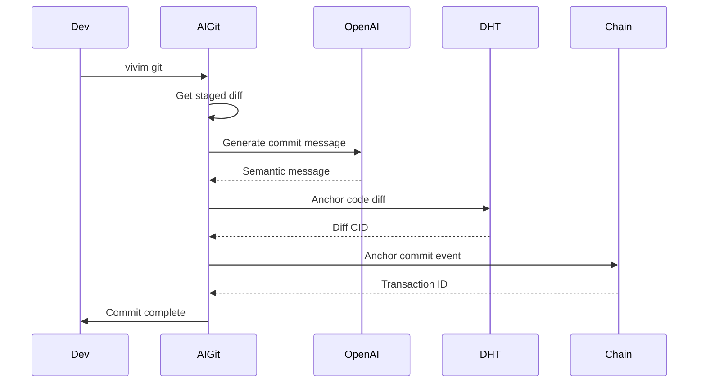
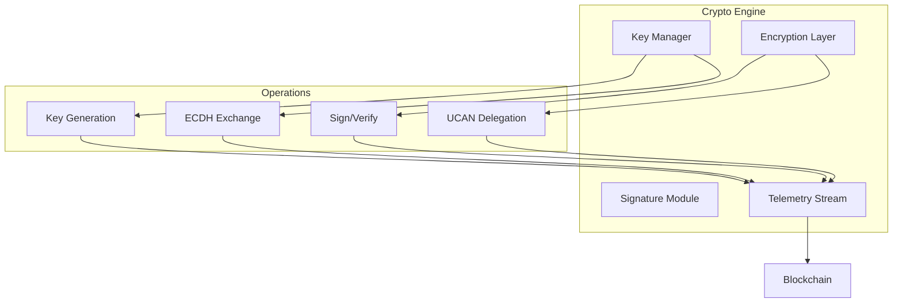

# Additional Applications

Documentation for specialized SDK applications.

## AI Git Integration

AI-augmented Git operations with semantic commit generation and blockchain anchoring.

### Architecture



### Installation

```bash
bun add @vivim/sdk
```

### Usage

```bash
# Stage changes
git add .

# Generate semantic commit with AI
vivim git

# Dry run (preview commit message)
vivim git --dry-run

# Use custom model
vivim git --model gpt-4o

# Skip interactive prompt
vivim git --no-prompt
```

### Programmatic Usage

```typescript
import { AIGitIntegration } from '@vivim/sdk/apps/ai-git';
import { VivimChainClient, DistributedContentClient } from '@vivim/network-engine';

// Initialize clients
const chainClient = new VivimChainClient(config);
const contentClient = new DistributedContentClient(chainClient);

// Create AI Git integration
const aiGit = new AIGitIntegration({
  chainClient,
  contentClient,
  providerApiKey: process.env.OPENAI_API_KEY,
  model: 'gpt-4o',
});

// Gather session context
const context = await aiGit.gatherLocalSessionContext(process.cwd());

// Prepare and anchor commit
const result = await aiGit.prepareAndAnchorCommit(context);

console.log('Commit CID:', result.cid);
console.log('Transaction:', result.transactionId);
```

### Commit Message Generation

```typescript
// Generate commit message from diff
const diff = await aiGit.getStagedDiff();

const message = await aiGit.generateCommitMessage(diff, sessionContext);

console.log('Generated message:', message);
// Output: "feat(core): optimize state transitions..."
```

### Blockchain Anchoring

```typescript
// Anchor code to DHT
const diffContent = await contentClient.createContent({
  type: ContentType.ARTICLE,
  text: diff,
  visibility: 'public',
  tags: ['git-diff', 'code-commit'],
});

// Anchor commit event to blockchain
await chainClient.broadcastEvent({
  type: 'code:commit',
  payload: {
    diffCid: diffContent.cid,
    message: commitMessage,
    timestamp: Date.now(),
  },
  scope: EventScope.Public,
});
```

### Configuration

```typescript
interface AIGitConfig {
  chainClient: VivimChainClient;
  contentClient: DistributedContentClient;
  providerApiKey?: string;  // OpenAI API key
  model?: string;            // Default: gpt-4o
}
```

## Crypto Engine

Centralized cryptographic protocol graph with blockchain telemetry streaming.

### Architecture



### Usage

```typescript
import { CryptoEngineApp } from '@vivim/sdk/apps/crypto-engine';

const cryptoEngine = new CryptoEngineApp({
  chainClient,
});

await cryptoEngine.start();

// Encrypt content
const encrypted = await cryptoEngine.e2eEncryptContent(
  plaintext,
  recipientPublicKey
);

// Decrypt content
const decrypted = await cryptoEngine.e2eDecryptContent(
  encrypted,
  localPrivateKey
);
```

### Key Management

```typescript
import { KeyManager } from '@vivim/network-engine';

const keyManager = new KeyManager();

// Generate keypair
const keys = await keyManager.generateKey();

// Get keys by type
const identityKeys = keyManager.getKeysByType('identity');
const encryptionKeys = keyManager.getKeysByType('encryption');

// Export keys
const exported = await keyManager.exportKey(keyId, password);

// Import keys
await keyManager.importKey(encryptedKey, password);
```

### End-to-End Encryption

```typescript
// Encrypt for recipient
const encrypted = await cryptoEngine.e2eEncryptContent(
  'Secret message',
  recipientPublicKey
);

// Decrypt received content
const decrypted = await cryptoEngine.e2eDecryptContent(
  encrypted,
  localPrivateKey
);
```

### Telemetry Streaming

```typescript
// Crypto operations are automatically logged to blockchain
const telemetry = {
  operation: 'encryption',
  algorithms: ['aes-256-gcm', 'secp256k1'],
  status: 'SUCCESS',
  latencyMs: 12.5,
  orchestratorDid: sdk.identity.did,
};

// Stream telemetry (automatic in Crypto Engine)
await cryptoEngine.streamTelemetry(telemetry);
```

### Signature Operations

```typescript
// Sign data
const signature = await cryptoEngine.signData(data, privateKey);

// Verify signature
const valid = await cryptoEngine.verifySignature(data, signature, publicKey);

console.log('Signature valid:', valid);
```

### UCAN Delegation

```typescript
// Create UCAN delegation
const delegation = await cryptoEngine.createUCANDelegation({
  issuer: sdk.identity.did,
  audience: targetDid,
  capabilities: ['storage:write', 'memory:read'],
  expiration: Date.now() + 3600000, // 1 hour
});

// Verify UCAN
const valid = await cryptoEngine.verifyUCAN(delegation);
```

## Tool Engine

Tool integration layer for extending AI capabilities.

### Usage

```typescript
import { ToolEngineApp } from '@vivim/sdk/apps/tool-engine';

const toolEngine = new ToolEngineApp({
  chainClient,
});

await toolEngine.start();

// Register custom tool
await toolEngine.registerTool({
  name: 'web_search',
  description: 'Search the web for information',
  parameters: {
    query: { type: 'string', required: true },
    limit: { type: 'number', default: 10 },
  },
  handler: async (params) => {
    const results = await searchWeb(params.query);
    return { results };
  },
});

// Execute tool
const result = await toolEngine.executeTool('web_search', {
  query: 'VIVIM SDK',
  limit: 5,
});
```

### Built-in Tools

```typescript
// Available built-in tools
const tools = await toolEngine.listTools();

// Tools include:
// - web_search: Web search
// - code_execution: Run code snippets
// - file_read: Read files
// - file_write: Write files
// - api_call: Make HTTP requests
```

## Roadmap Engine

Project roadmap management with milestone tracking.

### Usage

```typescript
import { RoadmapEngineApp } from '@vivim/sdk/apps/roadmap-engine';

const roadmap = new RoadmapEngineApp({
  chainClient,
  contentClient,
});

await roadmap.start();

// Create milestone
const milestone = await roadmap.createMilestone({
  title: 'v1.0 Release',
  description: 'Initial public release',
  targetDate: '2026-06-01',
  status: 'in_progress',
});

// Add task to milestone
await roadmap.addTask(milestone.id, {
  title: 'Complete documentation',
  assignee: sdk.identity.did,
  priority: 'high',
  status: 'todo',
});

// Update task status
await roadmap.updateTaskStatus(taskId, 'in_progress');

// Get roadmap progress
const progress = await roadmap.getProgress();
console.log('Completion:', progress.percentage, '%');
```

## Public Dashboard

Analytics dashboard for public metrics visualization.

### Usage

```typescript
import { PublicDashboardApp } from '@vivim/sdk/apps/public-dashboard';

const dashboard = new PublicDashboardApp({
  chainClient,
});

await dashboard.start();

// Get metrics
const metrics = await dashboard.getMetrics({
  period: '7d',
  categories: ['operations', 'storage', 'network'],
});

// Generate report
const report = await dashboard.generateReport({
  format: 'markdown',
  includeCharts: true,
});
```

### Metrics Collection

```typescript
// Track custom metrics
await dashboard.trackMetric({
  name: 'api_calls',
  value: 100,
  timestamp: Date.now(),
  tags: ['production', 'v1'],
});

// Query metrics
const data = await dashboard.queryMetrics({
  name: 'api_calls',
  from: Date.now() - 86400000, // 24h
  aggregation: 'sum',
});
```

## Related

- [ACU Processor](./overview#acu-processor) - Content processing
- [CLI](../cli/overview) - Command-line tools

## Links

- **GitHub Repository**: [github.com/vivim/vivim-sdk](https://github.com/vivim/vivim-sdk)
- **Apps Source**: [github.com/vivim/vivim-sdk/tree/main/src/apps](https://github.com/vivim/vivim-sdk/tree/main/src/apps)
