# SDK Architecture & Data Flow

Comprehensive architectural diagrams and data flow documentation for the VIVIM SDK.

## System Architecture Overview

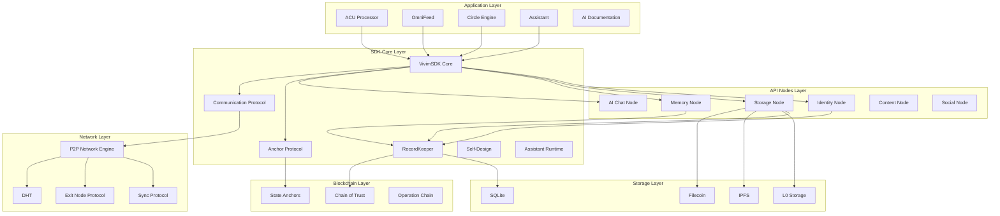

## SDK Initialization Flow

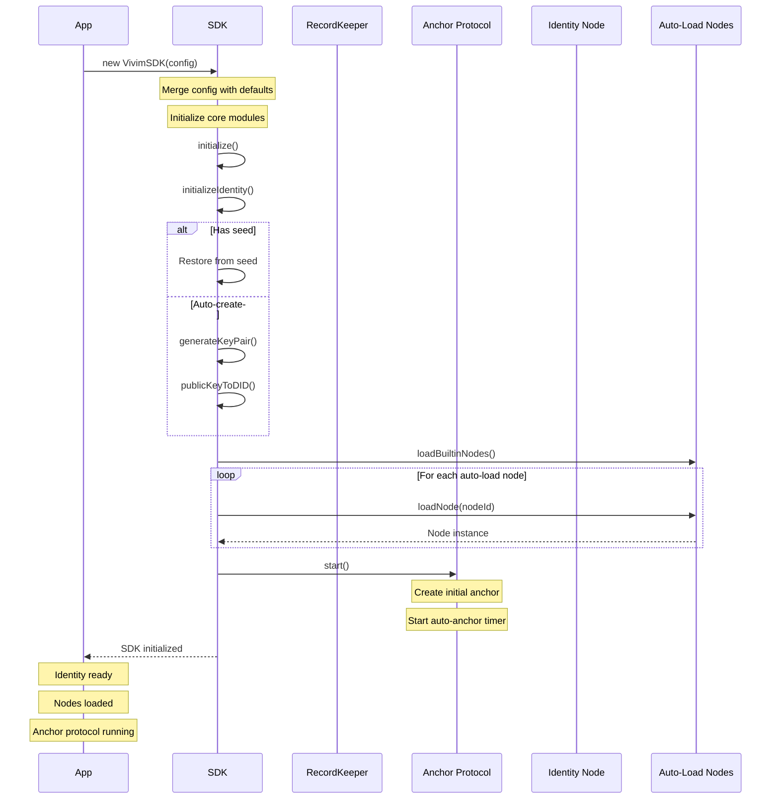

## Chain of Trust Architecture

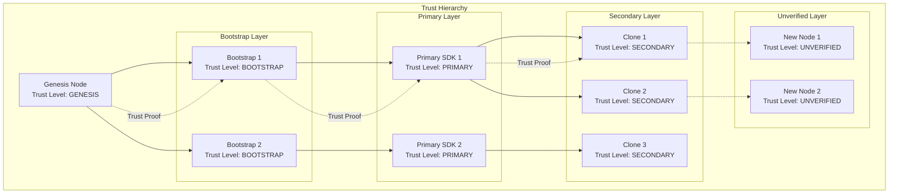

## RecordKeeper Data Flow

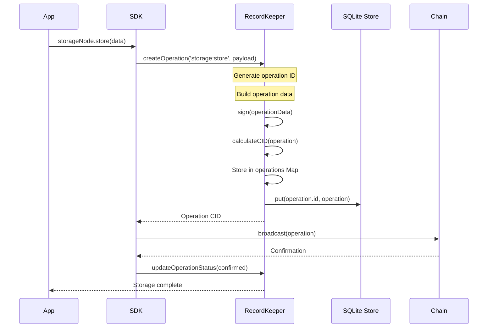

## Anchor Protocol State Flow

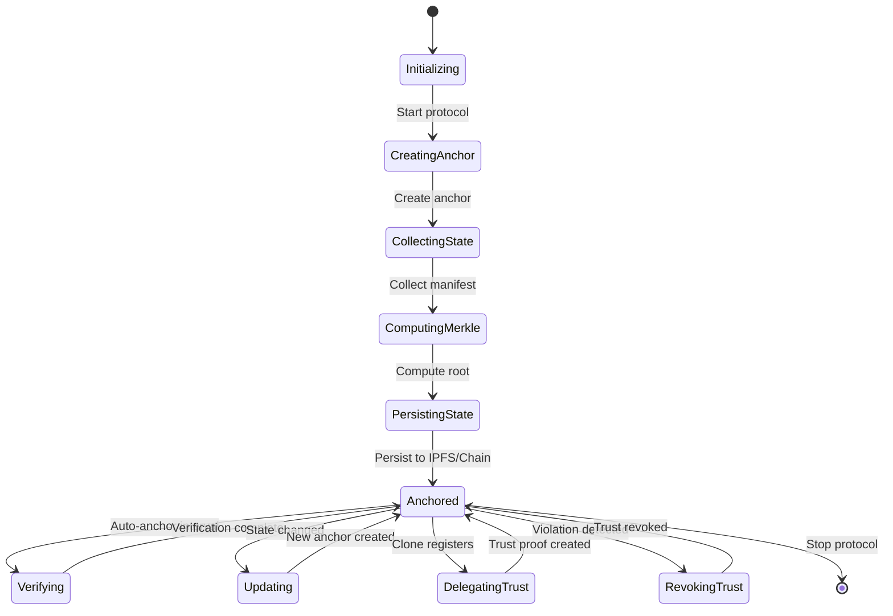

## Storage Node Architecture

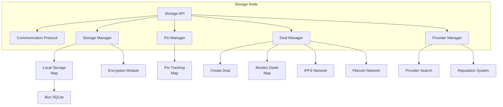

## Storage Operation Flow

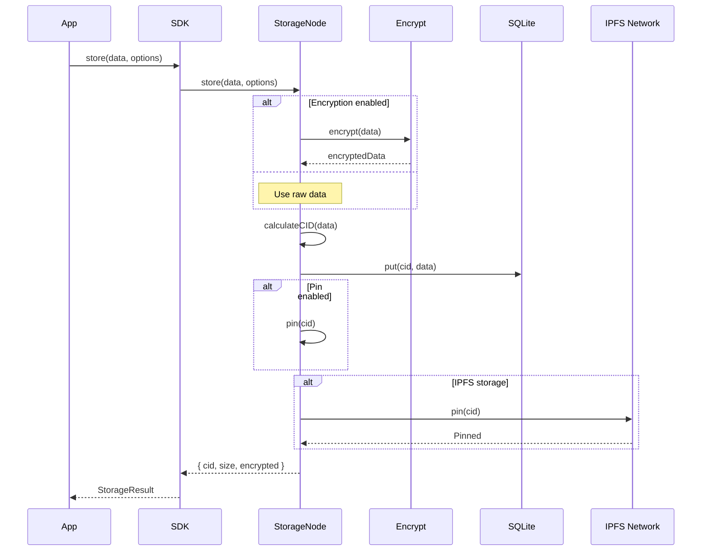

## Memory Node Architecture

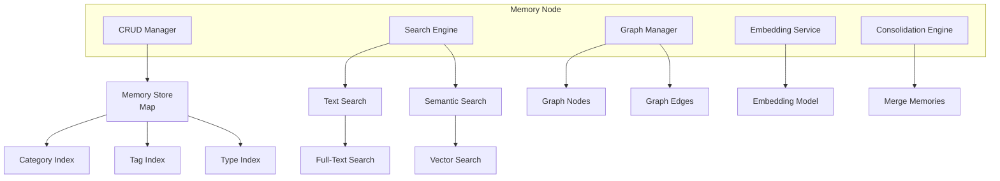

## Memory Creation Flow

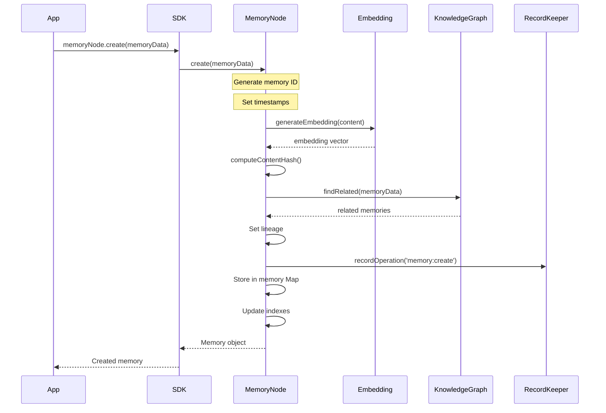

## Communication Protocol Flow

```mermaid
graph TB
    subgraph "Sender Node"
        S_APP[Application]
        S_CP[Communication Protocol]
        S_ENC[Encrypt]
        S_SIGN[Sign]
    end
    
    subgraph "Network"
        QUEUE[Message Queue]
        TOPIC[GossipSub Topic]
    end
    
    subgraph "Receiver Node"
        R_CP[Communication Protocol]
        R_VER[Verify]
        R_DEC[Decrypt]
        R_APP[Application]
    end
    
    S_APP --> S_CP: sendMessage(type, payload)
    S_CP --> S_CP: Create envelope
    S_CP --> S_SIGN: Sign envelope
    S_SIGN --> S_CP: Signed envelope
    
    alt Encryption enabled
        S_CP --> S_ENC: Encrypt
        S_ENC --> S_CP: Encrypted envelope
    end
    
    S_CP --> QUEUE: Enqueue message
    QUEUE --> TOPIC: Publish to topic
    TOPIC --> R_CP: Deliver message
    
    R_CP --> R_VER: Verify signature
    R_VER --> R_CP: Verified
    
    alt Encrypted
        R_CP --> R_DEC: Decrypt
        R_DEC --> R_CP: Decrypted envelope
    end
    
    R_CP --> R_APP: processMessage(envelope)
    R_APP --> R_CP: Response
    R_CP --> S_CP: Reply
```

## Node Lifecycle

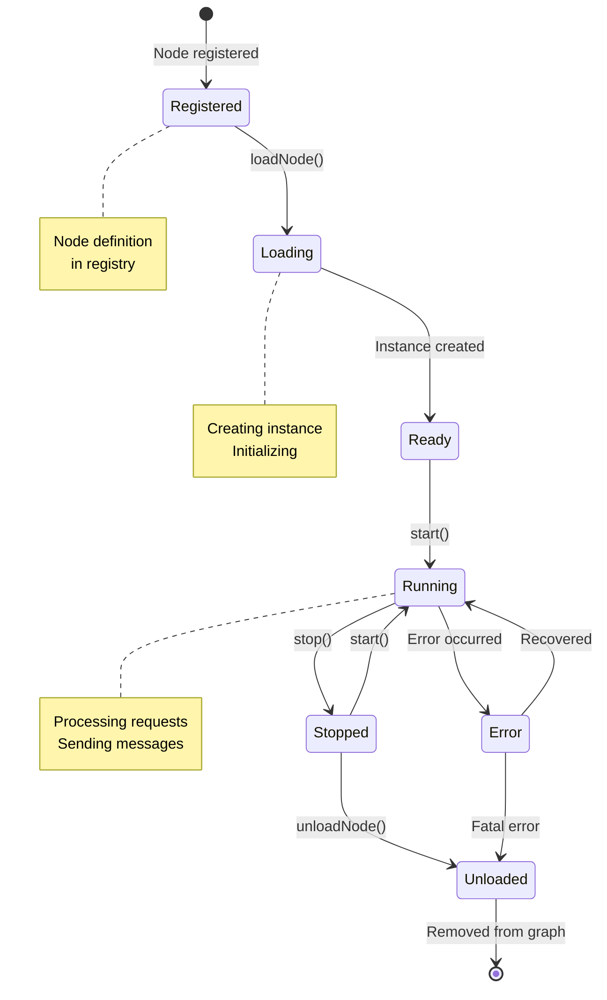

## Self-Design Evolution Flow

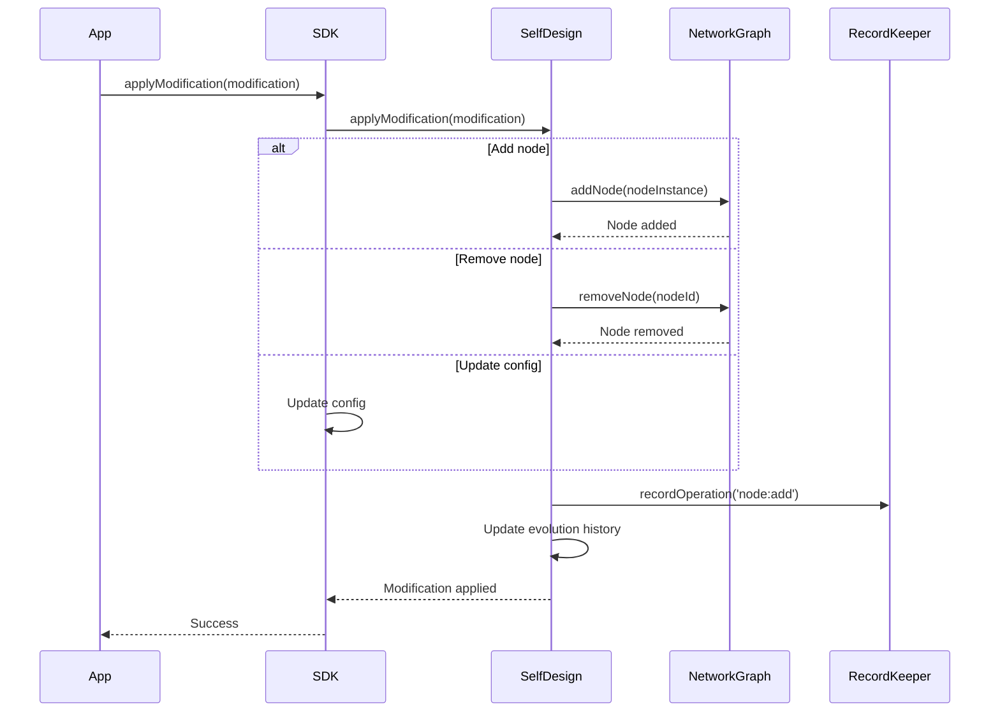

## Complete Application Data Flow

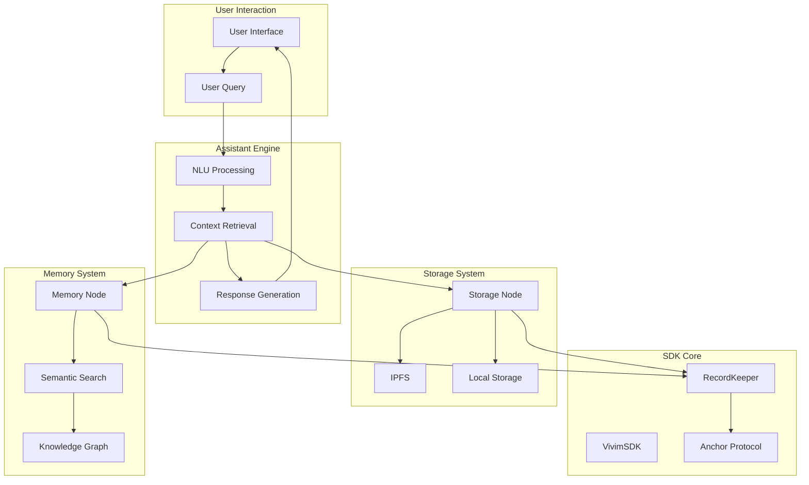

## Related

- [Core SDK](./core/overview) - SDK fundamentals
- [API Nodes](./api-nodes/overview) - Node implementations
- [Network Protocols](./network/protocols) - P2P protocols

## Links

- **GitHub Repository**: [github.com/vivim/vivim-sdk](https://github.com/vivim/vivim-sdk)
- **Architecture Source**: Based on source code analysis
