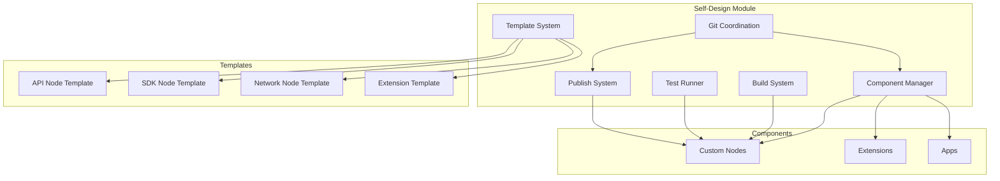
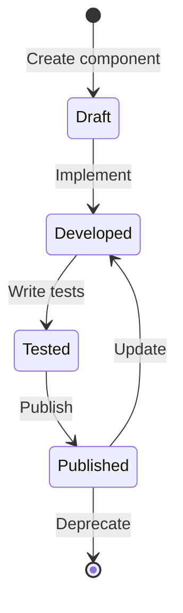
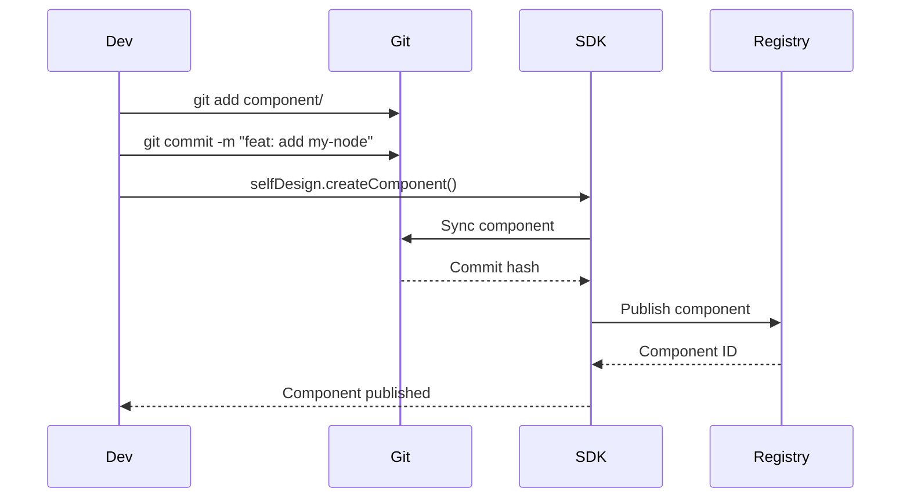
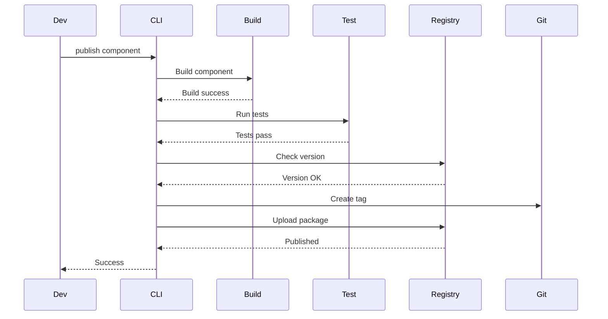

# Self-Design Module

The Self-Design Module enables the VIVIM SDK to extend and modify itself through code using Git as the coordination point.

## Architecture Overview



## Quick Start

### Create Your First Component

```bash
# Create new API node from template
vivim component create my-node api-node \
  --description "My custom API node" \
  --author "MyOrg"

# This creates:
# - src/nodes/my-node.ts
# - src/nodes/my-node.test.ts
# - package.json
# - README.md
# - tsconfig.json
```

### Build and Test

```bash
# Build component
vivim component build @myorg/node-my-node

# Run tests
vivim component test @myorg/node-my-node

# Run with coverage
vivim component test @myorg/node-my-node --coverage
```

### Publish to Registry

```bash
# Publish new version
vivim component publish @myorg/node-my-node -v minor

# Dry run first
vivim component publish @myorg/node-my-node -v minor --dry-run
```

## Component Templates

### API Node Template

Creates a new API node for core functionality.

```typescript
// Generated structure
my-node/
├── src/
│   └── my-node.ts          # Node implementation
├── test/
│   └── my-node.test.ts     # Tests
├── package.json
└── README.md
```

#### Template Features

- ✅ Pre-configured TypeScript
- ✅ Vitest setup
- ✅ ESLint configuration
- ✅ Node structure boilerplate
- ✅ Capability definitions
- ✅ Method implementations
- ✅ Event definitions

#### Example Usage

```typescript
import { VivimSDK } from '@vivim/sdk';

const sdk = new VivimSDK();
await sdk.initialize();

// Load your custom node
const myNode = await sdk.loadNode('my-node');

// Use node methods
await myNode.customOperation(data);
```

### SDK Node Template

Creates framework-specific adapter (React, Vue, etc.).

```bash
vivim component create my-react-node sdk-node \
  --description "React adapter for my node"
```

### Extension Template

Creates extension for existing nodes.

```bash
vivim component create my-extension extension \
  --description "Adds caching to storage node"
```

## Component Lifecycle



### Status Types

| Status | Description |
|--------|-------------|
| `draft` | Component created, not implemented |
| `developed` | Implementation complete |
| `tested` | Tests passing |
| `published` | Published to registry |

## Git Coordination

### Configuration

```typescript
import { SelfDesignModule } from '@vivim/sdk';

const selfDesign = sdk.getSelfDesign();

// Configure Git coordination
await selfDesign.configureGit({
  repoUrl: 'https://github.com/myorg/vivim-components',
  branch: 'main',
  basePath: './components',
  autoSync: true,
  syncInterval: 60000, // 1 minute
});
```

### Workflow



## Build System

### Build Configuration

```typescript
// vivim.config.ts
export default {
  build: {
    target: 'node18',
    format: 'esm',
    dts: true, // Generate TypeScript declarations
    minify: false,
    sourcemap: true,
  },
};
```

### Build Output

```bash
vivim component build @myorg/node-my-node

# Output:
# ✅ Build completed in 1.2s
# 📦 Output: dist/
#    - index.js
#    - index.d.ts
#    - index.js.map
```

## Testing

### Test Structure

```typescript
// my-node.test.ts
import { describe, it, expect, beforeEach } from 'vitest';
import { MyNode } from './my-node';
import { VivimSDK } from '@vivim/sdk';

describe('MyNode', () => {
  let sdk: VivimSDK;
  let node: MyNode;
  
  beforeEach(async () => {
    sdk = new VivimSDK();
    await sdk.initialize();
    node = await sdk.loadNode('my-node');
  });
  
  it('should perform custom operation', async () => {
    const result = await node.customOperation({ test: 'data' });
    expect(result).toBeDefined();
    expect(result.success).toBe(true);
  });
  
  it('should emit events', async () => {
    const eventPromise = new Promise((resolve) => {
      node.on('operation:complete', resolve);
    });
    
    await node.customOperation({ test: 'data' });
    
    const event = await eventPromise;
    expect(event).toBeDefined();
  });
});
```

### Run Tests

```bash
# Run all tests
vivim component test @myorg/node-my-node

# Run specific test file
vivim component test @myorg/node-my-node --testPathPattern=custom

# With coverage
vivim component test @myorg/node-my-node --coverage

# Watch mode
vivim component test @myorg/node-my-node --watch
```

## Publishing

### Version Management

```bash
# Patch version (1.0.0 -> 1.0.1)
vivim component publish @myorg/node-my-node -v patch

# Minor version (1.0.0 -> 1.1.0)
vivim component publish @myorg/node-my-node -v minor

# Major version (1.0.0 -> 2.0.0)
vivim component publish @myorg/node-my-node -v major

# Specific version
vivim component publish @myorg/node-my-node --version 2.0.0
```

### Publish Configuration

```typescript
// In component package.json
{
  "name": "@myorg/node-my-node",
  "version": "1.0.0",
  "publishConfig": {
    "registry": "https://registry.vivim.net",
    "access": "public"
  },
  "repository": {
    "type": "git",
    "url": "https://github.com/myorg/vivim-components"
  }
}
```

### Publish Process



## Component Management

### List Components

```bash
# List all components
vivim component list

# Filter by type
vivim component list --type api-node

# Filter by status
vivim component list --status published

# List with details
vivim component list --verbose
```

### Component Info

```bash
vivim component info @myorg/node-my-node

# Output:
# 📦 @myorg/node-my-node@1.0.0
# 📝 Description: My custom API node
# 👤 Author: MyOrg
# 📊 Status: published
# 📁 Path: ./components/my-node
# 🔗 Repository: github.com/myorg/vivim-components
# 📦 Dependencies: @vivim/sdk, zod
# ⚡ Capabilities: custom-operation, data-process
```

### Update Component

```bash
# Update from template
vivim component update @myorg/node-my-node --template

# Update dependencies
vivim component update @myorg/node-my-node --deps

# Update all
vivim component update @myorg/node-my-node --all
```

## Advanced Features

### Custom Templates

Create your own templates.

```typescript
import { SelfDesignModule } from '@vivim/sdk';

const selfDesign = sdk.getSelfDesign();

// Register custom template
selfDesign.registerTemplate({
  type: 'custom',
  name: 'microservice',
  description: 'Microservice template',
  files: [
    {
      path: 'src/index.ts',
      content: `// Microservice implementation`,
    },
    {
      path: 'Dockerfile',
      content: `FROM node:18\n...`,
    },
  ],
  dependencies: ['@vivim/sdk', 'express'],
});
```

### Component Dependencies

```typescript
// Define dependencies in component
const component = await selfDesign.createComponent('my-node', 'api-node', {
  dependencies: {
    nodes: ['storage-node', 'identity-node'],
    packages: ['zod', 'debug'],
  },
});
```

### Capability Discovery

```typescript
// Get all available capabilities
const capabilities = selfDesign.listCapabilities();

// Find nodes with specific capability
const nodes = await sdk.getGraph().getNodesByCapability('storage:store');
```

## Complete Example

### Building a Complete Component

```typescript
// 1. Create component
const selfDesign = sdk.getSelfDesign();

const component = await selfDesign.createComponent(
  'sentiment-node',
  'api-node',
  {
    description: 'Analyzes sentiment of text',
    author: 'MyOrg',
    capabilities: ['sentiment:analyze', 'sentiment:batch'],
  }
);

// 2. Implement node
// Edit src/sentiment-node.ts

// 3. Build
const buildResult = await selfDesign.buildComponent(component.id);

if (!buildResult.success) {
  console.error('Build failed:', buildResult.errors);
  process.exit(1);
}

// 4. Test
const testResult = await selfDesign.testComponent(component.id);

if (!testResult.success) {
  console.error('Tests failed:', testResult.errors);
  process.exit(1);
}

// 5. Publish
const publishResult = await selfDesign.publishComponent(
  component.id,
  'minor'
);

console.log('Published:', publishResult);
```

## Troubleshooting

### Build Fails

```bash
# Check TypeScript errors
vivim component build @myorg/node-my-node --verbose

# Clean and rebuild
vivim component clean @myorg/node-my-node
vivim component build @myorg/node-my-node
```

### Tests Fail

```bash
# Run with verbose output
vivim component test @myorg/node-my-node --verbose

# Run specific test
vivim component test @myorg/node-my-node --testNamePattern="should analyze sentiment"
```

### Publish Fails

```bash
# Check version conflict
vivim component info @myorg/node-my-node

# Force publish (use carefully)
vivim component publish @myorg/node-my-node -v minor --force
```

## Related

- [CLI Reference](../cli/overview) - Command reference
- [Extension System](../extension/overview) - Extend nodes
- [API Nodes](../api-nodes/overview) - Node implementations

## Links

- **GitHub Repository**: [github.com/vivim/vivim-sdk](https://github.com/vivim/vivim-sdk)
- **Source Code**: [github.com/vivim/vivim-sdk/tree/main/src/core/self-design.ts](https://github.com/vivim/vivim-sdk/tree/main/src/core/self-design.ts)
