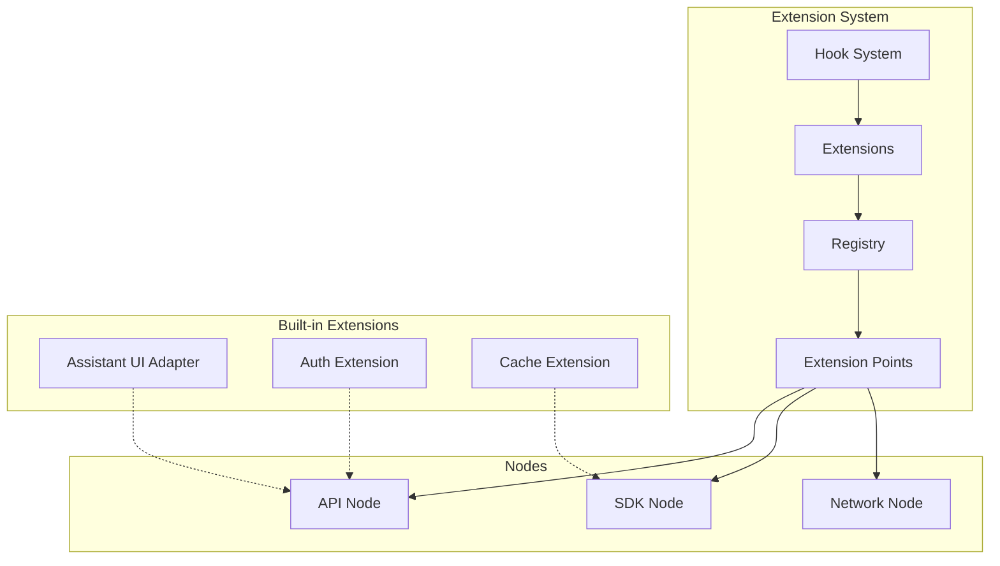

# Extension System

The VIVIM SDK Extension System allows you to extend and customize nodes with additional functionality without modifying the core implementation.

## Architecture Overview



## Core Concepts

### Extension Points

Extension points are predefined hooks in nodes where extensions can attach functionality.

```typescript
interface ExtensionPoint {
  id: string;
  nodeId: string;
  type: 'method' | 'event' | 'property' | 'lifecycle';
  target: string;
  description: string;
}
```

### Extension Definition

```typescript
interface Extension {
  id: string;
  name: string;
  version: string;
  description?: string;
  
  // Extension point we're extending
  extends: string;
  
  // Priority (lower = higher priority)
  priority?: number;
  
  // Implementation
  implementation: Record<string, unknown>;
  
  // Dependencies
  dependencies?: {
    nodes?: string[];
    packages?: string[];
  };
}
```

## Getting Started

### Installation

```bash
# Install extension system
bun add @vivim/sdk
```

### Creating Your First Extension

#### Step 1: Define Extension

```typescript
import { Extension } from '@vivim/sdk/extension';

const myExtension: Extension = {
  id: 'myorg/logging-extension',
  name: 'Logging Extension',
  version: '1.0.0',
  description: 'Adds detailed logging to storage operations',
  
  // Extend the storage node's store method
  extends: 'storage-node:method:store',
  
  priority: 10,
  
  implementation: {
    before: async (originalStore, data, options) => {
      console.log('Before store:', { data, options });
      return { data, options };
    },
    
    after: async (result, originalStore, data, options) => {
      console.log('After store:', { result });
      return result;
    },
  },
  
  dependencies: {
    nodes: ['storage-node'],
  },
};
```

#### Step 2: Register Extension

```typescript
import { ExtensionSystem } from '@vivim/sdk/extension';

const extensionSystem = new ExtensionSystem();

// Register extension point (done by node)
extensionSystem.registerExtensionPoint('storage-node', {
  id: 'storage-node:method:store',
  nodeId: 'storage-node',
  type: 'method',
  target: 'store',
  description: 'Store data operation',
});

// Register extension
extensionSystem.registerExtension(myExtension);
```

#### Step 3: Use Extended Node

```typescript
import { VivimSDK } from '@vivim/sdk';

const sdk = new VivimSDK();
await sdk.initialize();

// Load extended node
const storageNode = await sdk.loadNode('storage');

// Extension automatically wraps store method
await storageNode.store({ key: 'test', value: 'data' });
// Logs: "Before store: ..." and "After store: ..."
```

## Extension Types

### Method Extensions

Wrap or replace node methods.

```typescript
const methodExtension: Extension = {
  id: 'myorg/method-ext',
  extends: 'storage-node:method:store',
  implementation: {
    // Run before original method
    before: async (originalMethod, ...args) => {
      // Modify args, validate, log, etc.
      return args;
    },
    
    // Replace original method entirely
    override: async (originalMethod, ...args) => {
      // Custom implementation
      return result;
    },
    
    // Run after original method
    after: async (result, originalMethod, ...args) => {
      // Modify result, log, cache, etc.
      return result;
    },
  },
};
```

### Event Extensions

Listen to or modify node events.

```typescript
const eventExtension: Extension = {
  id: 'myorg/event-ext',
  extends: 'storage-node:event:stored',
  implementation: {
    handler: async (event) => {
      console.log('Data stored:', event.payload);
      // Send notification, update cache, etc.
    },
  },
};
```

### Property Extensions

Add or modify node properties.

```typescript
const propertyExtension: Extension = {
  id: 'myorg/property-ext',
  extends: 'storage-node:property:stats',
  implementation: {
    get: (node) => ({
      totalStores: node.storeCount,
      totalRetrieves: node.retrieveCount,
    }),
  },
};
```

### Lifecycle Extensions

Hook into node lifecycle events.

```typescript
const lifecycleExtension: Extension = {
  id: 'myorg/lifecycle-ext',
  extends: 'storage-node:lifecycle:init',
  implementation: {
    handler: async (node) => {
      // Initialize extension state
      node.extensionState = { initialized: true };
    },
  },
};
```

## Built-in Extensions

### Assistant UI Adapter

Adapts assistant responses for UI frameworks.

```typescript
import { AssistantUIAdapter } from '@vivim/sdk/extension';

const adapter = new AssistantUIAdapter({
  framework: 'react', // or 'vue', 'svelte'
  theme: 'dark',
});

// Use with assistant
const assistant = sdk.getAssistant();
const uiResponse = await adapter.formatResponse(
  await assistant.processQuery(query)
);
```

### Cache Extension

Adds caching layer to storage operations.

```typescript
import { CacheExtension } from '@vivim/sdk/extension';

const cacheExt = new CacheExtension({
  storage: 'memory', // or 'redis', 'sqlite'
  ttl: 3600, // 1 hour
  maxSize: 1000, // items
});

extensionSystem.registerExtension(cacheExt);
```

### Auth Extension

Adds authentication/authorization to node operations.

```typescript
import { AuthExtension } from '@vivim/sdk/extension';

const authExt = new AuthExtension({
  provider: 'did', // or 'jwt', 'api-key'
  rules: [
    {
      method: 'store',
      require: ['storage:write'],
    },
    {
      method: 'retrieve',
      require: ['storage:read'],
    },
  ],
});

extensionSystem.registerExtension(authExt);
```

## Extension Marketplace

### Publishing Extensions

```bash
# Build extension
vivim extension build myorg/logging-extension

# Test extension
vivim extension test myorg/logging-extension

# Publish to registry
vivim extension publish myorg/logging-extension -v minor
```

### Discovering Extensions

```bash
# Search extensions
vivim extension search logging

# List popular extensions
vivim extension list --popular

# Get extension info
vivim extension info @myorg/logging-extension
```

### Installing Extensions

```bash
# Install from registry
vivim extension install @myorg/logging-extension

# Install from GitHub
vivim extension install github:myorg/logging-extension

# Install local extension
vivim extension install ./path/to/extension
```

## Advanced Patterns

### Extension Composition

Combine multiple extensions.

```typescript
import { composeExtensions } from '@vivim/sdk/extension';

const composed = composeExtensions([
  loggingExtension,
  cacheExtension,
  authExtension,
]);

extensionSystem.registerExtension(composed);
```

### Conditional Extensions

Enable extensions based on conditions.

```typescript
const conditionalExt: Extension = {
  id: 'myorg/conditional',
  extends: 'storage-node:method:store',
  condition: (node, context) => {
    // Only enable in production
    return process.env.NODE_ENV === 'production';
  },
  implementation: { /* ... */ },
};
```

### Async Extensions

Handle async operations.

```typescript
const asyncExt: Extension = {
  id: 'myorg/async',
  extends: 'storage-node:method:store',
  implementation: {
    before: async (originalMethod, ...args) => {
      // Async validation
      await validateData(args[0]);
      
      // Async preprocessing
      args[0] = await preprocess(args[0]);
      
      return args;
    },
  },
};
```

## Testing Extensions

### Unit Tests

```typescript
import { describe, it, expect } from 'vitest';
import { myExtension } from './my-extension';

describe('Logging Extension', () => {
  it('should log before store', async () => {
    const consoleSpy = vi.spyOn(console, 'log');
    
    await myExtension.implementation.before(
      () => {},
      { key: 'test' },
      {}
    );
    
    expect(consoleSpy).toHaveBeenCalledWith(
      expect.stringContaining('Before store')
    );
  });
});
```

### Integration Tests

```typescript
import { VivimSDK } from '@vivim/sdk';
import { myExtension } from './my-extension';

describe('Extension Integration', () => {
  it('should extend storage node', async () => {
    const sdk = new VivimSDK();
    await sdk.initialize();
    
    // Register extension
    sdk.getExtensionSystem().registerExtension(myExtension);
    
    const storageNode = await sdk.loadNode('storage');
    const result = await storageNode.store({ key: 'test' });
    
    expect(result).toBeDefined();
  });
});
```

## Best Practices

### 1. Single Responsibility

Each extension should do one thing well.

```typescript
// ❌ Bad: Does too much
const badExtension = {
  extends: 'storage-node',
  implementation: {
    // Logging, caching, auth, metrics...
  },
};

// ✅ Good: Focused
const loggingExtension = { /* just logging */ };
const cacheExtension = { /* just caching */ };
const authExtension = { /* just auth */ };
```

### 2. Non-Breaking

Extensions should not break existing functionality.

```typescript
// ✅ Good: Preserves original behavior
const goodExtension = {
  implementation: {
    after: async (result, originalMethod, ...args) => {
      // Add functionality without changing result
      await logResult(result);
      return result; // Return original
    },
  },
};
```

### 3. Error Handling

Handle errors gracefully.

```typescript
const safeExtension = {
  implementation: {
    before: async (originalMethod, ...args) => {
      try {
        return await validateAndTransform(args);
      } catch (error) {
        console.error('Extension error:', error);
        return args; // Pass through on error
      }
    },
  },
};
```

### 4. Performance

Minimize overhead.

```typescript
const performantExtension = {
  implementation: {
    before: async (originalMethod, ...args) => {
      // Cache expensive operations
      if (cachedResult) return cachedResult;
      
      // Use efficient data structures
      const processed = new Map();
      
      return processed;
    },
  },
};
```

## Complete Example

### Building a Metrics Extension

```typescript
import { Extension } from '@vivim/sdk/extension';

interface Metrics {
  calls: number;
  errors: number;
  avgLatency: number;
  latencies: number[];
}

export const metricsExtension: Extension = {
  id: 'myorg/metrics-extension',
  name: 'Metrics Extension',
  version: '1.0.0',
  description: 'Collects metrics for node operations',
  extends: 'storage-node:method:*', // All methods
  priority: 5,
  
  implementation: {
    before: async (originalMethod, methodName, ...args) => {
      const startTime = Date.now();
      
      return {
        startTime,
        methodName,
        args,
      };
    },
    
    after: async (result, originalMethod, context: any) => {
      const latency = Date.now() - context.startTime;
      
      // Update metrics
      const metrics = getMetrics(context.methodName);
      metrics.calls++;
      metrics.latencies.push(latency);
      metrics.avgLatency = 
        metrics.latencies.reduce((a, b) => a + b, 0) / metrics.latencies.length;
      
      // Export to monitoring system
      await exportMetrics(context.methodName, metrics);
      
      return result;
    },
    
    onError: async (error, originalMethod, context: any) => {
      const metrics = getMetrics(context.methodName);
      metrics.errors++;
      
      await reportError(context.methodName, error);
      
      throw error;
    },
  },
  
  dependencies: {
    nodes: ['storage-node'],
  },
};
```

## Related

- [Core SDK](../core/overview) - SDK fundamentals
- [API Nodes](../api-nodes/overview) - Node implementations
- [CLI](../cli/overview) - Extension management commands

## Links

- **GitHub Repository**: [github.com/vivim/vivim-sdk](https://github.com/vivim/vivim-sdk)
- **Extension Source**: [github.com/vivim/vivim-sdk/tree/main/src/extension](https://github.com/vivim/vivim-sdk/tree/main/src/extension)
