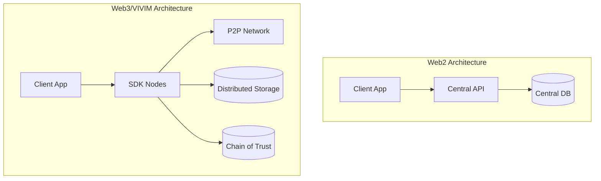

# Migration Guide

Guides for migrating to and between VIVIM SDK versions.

## Migrating from Web2

### Architecture Changes



### Key Differences

| Web2 | Web3/VIVIM |
|------|------------|
| Central database | Distributed storage (IPFS, Filecoin) |
| REST APIs | SDK Nodes |
| User accounts | Decentralized identities (DID) |
| Server auth | Cryptographic signatures |
| SQL queries | Content addressing (CID) |

### Migration Steps

#### 1. Replace Database with Storage Node

```typescript
// Web2: PostgreSQL
// const result = await db.query('SELECT * FROM users WHERE id = ?', [id]);

// VIVIM: Storage Node
const storageNode = await sdk.loadNode('storage');
const userData = await storageNode.retrieve(userCid);
```

#### 2. Replace Auth with Identity

```typescript
// Web2: JWT
// const token = jwt.sign({ userId }, secret);

// VIVIM: DID
const identity = sdk.getIdentity();
const signature = await identity.sign(data);
```

#### 3. Replace API Calls with Nodes

```typescript
// Web2: REST API
// const response = await fetch('/api/users', { method: 'POST', body });

// VIVIM: Content Node
const contentNode = await sdk.loadNode('content');
const user = await contentNode.create({
  type: 'user',
  data: body,
});
```

### Data Migration

#### Export from Web2

```typescript
// Export data from PostgreSQL
const exportData = await db.query('SELECT * FROM users');
const jsonData = JSON.stringify(exportData);

// Calculate CID for migration record
const { calculateCID } = await import('@vivim/sdk/utils');
const migrationCid = await calculateCID(jsonData);
```

#### Import to VIVIM

```typescript
// Import to VIVIM storage
const storageNode = await sdk.loadNode('storage');

for (const record of exportData) {
  await storageNode.store(record, {
    encryption: true,
    pin: true,
  });
}
```

## SDK Version Upgrades

### v0.x to v1.0

#### Breaking Changes

1. **Identity API changed**

```typescript
// v0.x
const identity = await sdk.createIdentity(seed);

// v1.0
const sdk = new VivimSDK({
  identity: { seed, autoCreate: true }
});
await sdk.initialize();
```

2. **Node loading changed**

```typescript
// v0.x
const node = sdk.getNode('storage');

// v1.0
const node = await sdk.loadNode('storage');
```

3. **Storage API changed**

```typescript
// v0.x
const result = await storage.save(key, value);

// v1.0
const result = await storage.store({
  key,
  value,
  encryption: true,
});
```

#### Migration Script

```typescript
import { migrateSDK } from '@vivim/sdk/migration';

await migrateSDK({
  from: '0.x',
  to: '1.0',
  sdk,
  options: {
    preserveIdentity: true,
    migrateData: true,
  },
});
```

## Data Migration Strategies

### Online Migration

```typescript
// Migrate while system is running
const migrator = new DataMigrator({
  source: legacyDB,
  target: storageNode,
  batchSize: 100,
  parallel: 10,
});

await migrator.migrate();
```

### Offline Migration

```typescript
// Export, migrate, import
const exportPath = './export.json';
await legacyDB.export(exportPath);

const importData = await fs.readFile(exportPath);
for (const record of importData) {
  await storageNode.store(record);
}
```

### Incremental Migration

```typescript
// Migrate in phases
const phases = [
  { table: 'users', priority: 'high' },
  { table: 'posts', priority: 'medium' },
  { table: 'logs', priority: 'low' },
];

for (const phase of phases) {
  await migrateTable(phase.table);
  console.log(`Migrated ${phase.table}`);
}
```

## Related

- [Getting Started](./getting-started) - Quick start
- [Core SDK](../core/overview) - SDK fundamentals
