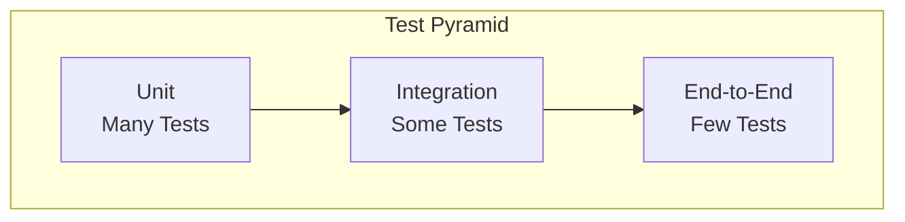

# Testing Guide

Comprehensive guide for testing VIVIM SDK components.

## Testing Philosophy

The VIVIM SDK follows the testing pyramid:



## Unit Testing

### Setup

```bash
bun add -d vitest @vitest/ui
```

### Testing Nodes

```typescript
import { describe, it, expect, beforeEach } from 'vitest';
import { VivimSDK } from '@vivim/sdk';
import { StorageNode } from '@vivim/sdk/nodes';

describe('StorageNode', () => {
  let sdk: VivimSDK;
  let node: StorageNode;
  
  beforeEach(async () => {
    sdk = new VivimSDK({ identity: { autoCreate: true } });
    await sdk.initialize();
    node = await sdk.loadNode('storage');
  });
  
  it('should store and retrieve data', async () => {
    const data = { message: 'Hello, World!' };
    
    const result = await node.store(data);
    expect(result.cid).toBeDefined();
    
    const retrieved = await node.retrieve(result.cid);
    expect(retrieved).toEqual(data);
  });
  
  it('should encrypt data when requested', async () => {
    const data = { secret: 'value' };
    
    const result = await node.store(data, { encryption: true });
    expect(result.encrypted).toBe(true);
  });
});
```

### Testing Core Modules

```typescript
import { describe, it, expect } from 'vitest';
import { OnChainRecordKeeper } from '@vivim/sdk/core';

describe('RecordKeeper', () => {
  it('should create operations', async () => {
    const rk = new OnChainRecordKeeper(sdk);
    
    const operation = await rk.createOperation('node:create', {
      nodeId: 'test-node',
    });
    
    expect(operation.id).toBeDefined();
    expect(operation.type).toBe('node:create');
  });
  
  it('should verify operation chain', async () => {
    const result = await rk.verifyOperationChain(operationId);
    expect(result.valid).toBe(true);
  });
});
```

### Mocking SDK

```typescript
import { MockVivimSDK } from '@vivim/sdk/testing';

const mockSDK = new MockVivimSDK();

mockSDK.mockNode('storage', {
  store: vi.fn().mockResolvedValue({ cid: 'test' }),
  retrieve: vi.fn().mockResolvedValue({ data: 'test' }),
});
```

## Integration Testing

### Testing Node Interactions

```typescript
describe('Node Integration', () => {
  it('should store memory from conversation', async () => {
    const chatNode = await sdk.loadNode('ai-chat');
    const memoryNode = await sdk.loadNode('memory');
    
    // Send message
    const response = await chatNode.send('Hello');
    
    // Extract memory
    const memories = await memoryNode.extractFromConversation(
      response.conversationId
    );
    
    expect(memories.length).toBeGreaterThan(0);
  });
});
```

### Testing Network Protocols

```typescript
describe('Sync Protocol', () => {
  it('should sync between parent and clone', async () => {
    const parentSDK = await createTestSDK();
    const cloneSDK = await createTestSDK();
    
    // Register clone with parent
    await cloneSDK.registerWithParent(parentSDK);
    
    // Update parent state
    await parentSDK.getStorage().store({ key: 'test' });
    
    // Wait for sync
    await waitForSync(cloneSDK);
    
    // Verify clone has update
    const data = await cloneSDK.getStorage().retrieve('test');
    expect(data).toBeDefined();
  });
});
```

## End-to-End Tests

### Full Workflow Test

```typescript
describe('E2E: Content Workflow', () => {
  it('should complete full content lifecycle', async () => {
    // Setup
    const sdk = await createTestSDK();
    const contentNode = await sdk.loadNode('content');
    const memoryNode = await sdk.loadNode('memory');
    
    // Create content
    const content = await contentNode.create({
      type: 'article',
      title: 'Test Article',
      body: 'Content here',
    });
    
    // Memory should be created
    const memories = await memoryNode.search('Test Article');
    expect(memories.length).toBeGreaterThan(0);
    
    // Share content
    await contentNode.share(content.id, {
      visibility: 'public',
    });
    
    // Verify share recorded
    const updated = await contentNode.get(content.id);
    expect(updated.shared).toBe(true);
  });
});
```

## Performance Testing

### Benchmarking

```typescript
import { bench, describe } from 'vitest';

describe('Storage Benchmarks', () => {
  bench('store 1KB data', async () => {
    const data = new Uint8Array(1024);
    await node.store(data);
  });
  
  bench('store 1MB data', async () => {
    const data = new Uint8Array(1024 * 1024);
    await node.store(data);
  });
  
  bench('retrieve by CID', async () => {
    await node.retrieve(testCid);
  });
});
```

### Load Testing

```typescript
import { concurrentTest } from '@vivim/sdk/testing';

describe('Load Tests', () => {
  it('should handle 100 concurrent stores', async () => {
    await concurrentTest(100, async (i) => {
      await node.store({ index: i });
    });
  });
});
```

## Testing Utilities

### Test Helpers

```typescript
import { 
  createTestSDK, 
  mockNode, 
  waitForSync,
  cleanupTest 
} from '@vivim/sdk/testing';

beforeEach(async () => {
  sdk = await createTestSDK();
});

afterEach(async () => {
  await cleanupTest(sdk);
});
```

### Fixtures

```typescript
// test/fixtures/storage.ts
export const storageFixtures = {
  smallData: { key: 'test', value: 'data' },
  largeData: { key: 'large', value: 'x'.repeat(10000) },
  encryptedData: { key: 'secret', value: 'password', encrypt: true },
};

// Usage
import { storageFixtures } from './fixtures/storage';

it('should store large data', async () => {
  await node.store(storageFixtures.largeData);
});
```

## Related

- [Examples](../examples/basic) - Code examples
- [CLI](../cli/overview) - Testing commands
