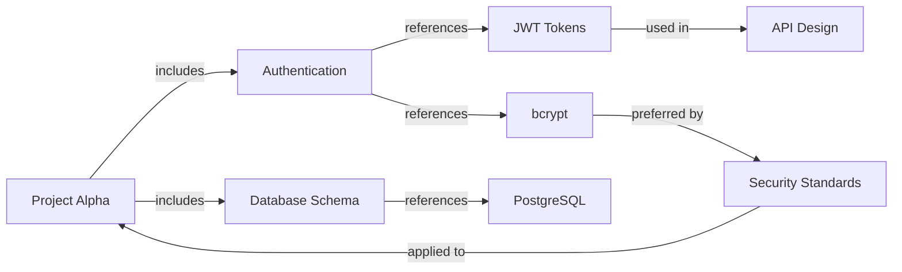

# The Dynamic Intelligence Engine

## Your AI Doesn't Just Remember. It *Understands*.

---

## Beyond Storage. Into Comprehension.

Most apps store your data. VIVIM **understands** it.

While other solutions give you a searchable file cabinet, VIVIM gives you a **living, thinking memory** that evolves with you—extracting meaning, connecting dots, and surfacing insights you'd forgotten existed.

**This isn't a database. It's a second brain.**

---

## The Intelligence Layer

### What Makes It "Dynamic"?

```
┌─────────────────────────────────────────────────────────────────────────┐
│                    VIVIM DYNAMIC INTELLIGENCE                          │
├─────────────────────────────────────────────────────────────────────────┤
│                                                                          │
│  ┌─────────────┐     ┌─────────────┐     ┌─────────────┐                │
│  │   INPUT    │ ──► │   PROCESS   │ ──► │  OUTPUT    │                │
│  │            │     │             │     │            │                │
│  │ Conversations│     │   Extract   │     │  Context   │                │
│  │ Memories   │     │   Connect   │     │  Insights  │                │
│  │ Interactions│     │   Predict   │     │  Answers   │                │
│  └─────────────┘     └─────────────┘     └─────────────┘                │
│                                                                          │
│        ▲                    ▲                    ▲                         │
│        │                    │                    │                         │
│        │      ┌────────────┴────────────┐       │                         │
│        │      │                         │       │                         │
│        │      ▼                         ▼       │                         │
│        │  ┌──────────────┐      ┌──────────────┐                        │
│        │  │  AUTOMATIC  │      │   CONTINUOUS │                        │
│        │  │ EXTRACTION  │      │   LEARNING   │                        │
│        │  └──────────────┘      └──────────────┘                        │
│        │                                                        │
│        └───────────────────────────────────────────────────────────     │
│                         ALWAYS EVOLVING                               │
└─────────────────────────────────────────────────────────────────────────┘
```

---

## Core Capabilities

### 1. Automatic Memory Extraction

**Your conversations become knowledge—automatically.**

VIVIM's AI engine continuously analyzes your AI interactions and extracts:

| Memory Type | What It Captures | Example |
|------------|------------------|---------|
| **Episodic** | Events & experiences | "Meeting with design team about branding" |
| **Semantic** | Facts & knowledge | "Python uses PEP 8 style guidelines" |
| **Procedural** | How-to knowledge | "Use bcrypt with cost factor 12 for passwords" |
| **Factual** | User facts | "John prefers afternoon meetings" |
| **Preference** | Your likes/dislikes | "Prefers dark mode interfaces" |
| **Identity** | Who you are | "Software architect focused on systems" |

### 2. Intelligent Context Assembly

**Every AI conversation starts with perfect context.**

When you talk to any AI, VIVIM assembles the **exact context you need**:

```
┌─────────────────────────────────────────────────────────────────┐
│                  CONTEXT ASSEMBLY ENGINE                          │
├─────────────────────────────────────────────────────────────────┤
│                                                                  │
│  INPUT: "Help me write a database schema"                       │
│                                                                  │
│  ┌──────────────────────────────────────────────────────────┐   │
│  │                    VIVIM CONTEXT                        │   │
│  │  ┌────────────────────────────────────────────────────┐  │   │
│  │  │ Relevant Past Conversations                        │  │   │
│  │  │ "You worked on user auth schema in Project Alpha" │  │   │
│  │  └────────────────────────────────────────────────────┘  │   │
│  │  ┌────────────────────────────────────────────────────┐  │   │
│  │  │ Your Technical Preferences                         │  │   │
│  │  │ "Prefers PostgreSQL, uses Prisma ORM"             │  │   │
│  │  └────────────────────────────────────────────────────┘  │   │
│  │  ┌────────────────────────────────────────────────────┐  │   │
│  │  │ Related Project Context                            │  │   │
│  │  │ "E-commerce platform, Phase 2"                     │  │   │
│  │  └────────────────────────────────────────────────────┘  │   │
│  └──────────────────────────────────────────────────────────┘   │
│                              │                                   │
│                              ▼                                   │
│  ┌──────────────────────────────────────────────────────────┐   │
│  │              ENHANCED AI RESPONSE                       │   │
│  │  "Based on your PostgreSQL preferences and your        │   │
│  │   previous auth schema work, here's a schema that       │   │
│  │   integrates with your existing user tables..."        │   │
│  └──────────────────────────────────────────────────────────┘   │
│                                                                  │
└─────────────────────────────────────────────────────────────────┘
```

### 3. Relationship Mapping

**Memories aren't isolated. They're connected.**

VIVIM builds a **knowledge graph** of your memories:



**The result:** When you ask about one topic, VIVIM surfaces everything connected to it.

### 4. Predictive Context

**VIVIM knows what you need before you ask.**

The engine predicts:

- **Topics** you're likely to discuss
- **Projects** relevant to your query  
- **Preferences** that apply to this context
- **People** involved in related work

---

## The Experience

### Before VIVIM

> **You:** "Write authentication code"  
> **AI:** Here's some generic authentication code...

### With VIVIM

> **You:** "Write authentication code"  
> **VIVIM-Enhanced AI:** *"Based on your previous work using Express.js with Prisma, your preference for bcrypt with cost factor 12, and your security standards document, here's authentication code that integrates with your existing user table..."*

**Same question. Completely different answer. Tailored to *you*.**

---

## Technical Architecture

### Extraction Pipeline

```
Conversation Input
       │
       ▼
┌──────────────────┐
│  Message Parser  │ ──► Split into Atomic Chat Units (ACUs)
└────────┬─────────┘
         │
         ▼
┌──────────────────┐
│  AI Extraction   │ ──► LLM analyzes each ACU
└────────┬─────────┘         - Extract entities
         │                   - Identify memory type
         ▼                   - Score importance
┌──────────────────┐
│  Memory Builder │ ──► Create structured memory
└────────┬─────────┘         - Generate embeddings
         │                   - Build relationships
         ▼
┌──────────────────┐
│   Knowledge      │ ──► Add to knowledge graph
│      Graph       │     Connect relationships
└────────┬─────────┘     Update relevance scores
         │
         ▼
┌──────────────────┐
│   Ready for      │ ──► Context assembly
│    Retrieval     │     Semantic search
└──────────────────┘     Predictive delivery
```

### Intelligence Scoring

Every memory gets scored on multiple dimensions:

| Score | Range | What It Means |
|-------|-------|---------------|
| **Importance** | 0.0 - 1.0 | How critical is this? |
| **Relevance** | 0.0 - 1.0 | How applicable right now? |
| **Uniqueness** | 0.0 - 1.0 | How rare is this knowledge? |
| **Confidence** | 0.0 - 1.0 | How certain is extraction? |

---

## Real Impact

### Developer Productivity

> *"VIVIM remembered that I had already solved the CORS issue in my previous project. When I asked about it again, it not only found the solution but showed me exactly where I implemented it."* — **Senior Developer**

### Research

> *"I was researching machine learning for my thesis. VIVIM connected insights from three different AI tools across six months—insights I had no idea were related."* — **PhD Student**

### Business

> *"Our team now has institutional memory that doesn't leave when someone does. VIVIM captured decisions, code patterns, and preferences from every project."* — **Engineering Lead**

---

## Always-On. Always Learning.

### Configure Your Intelligence

Tailor the engine to your needs:

```
┌─────────────────────────────────────────────┐
│           INTELLIGENCE CONTROLS             │
├─────────────────────────────────────────────┤
│                                              │
│  Extraction Sensitivity                      │
│  [━━━━━━━━━━━○────────────] Medium          │
│                                              │
│  Memory Types to Extract                    │
│  ☑ Episodic  ☑ Semantic  ☑ Procedural        │
│  ☑ Factual  ☑ Preference  ☐ Identity      │
│                                              │
│  Context Budget                             │
│  ○ Concise (4K tokens)                      │
│  ● Balanced (12K tokens)                     │
│  ○ Comprehensive (32K tokens)               │
│                                              │
│  Prediction                                 │
│  ☑ Enable predictive context                │
│  ☑ Suggest related memories                 │
│  ☐ Auto-activate relevant personas         │
│                                              │
└─────────────────────────────────────────────┘
```

---

## The Future of AI Memory

**We're not building a storage system. We're building a thinking layer.**

The Dynamic Intelligence Engine is:

- ✅ **Always learning** — Continuously improves from your interactions
- ✅ **Privacy-first** — All processing happens locally or with encryption
- ✅ **Portable** — Your intelligence travels with you
- ✅ **Extensible** — SDK allows custom extraction rules

---

## Get Intelligent

### Free
- Basic memory extraction
- 3 providers

### Pro — $15/month
- Advanced extraction
- Full context assembly
- Predictive context
- All providers

### Enterprise
- Custom extraction rules
- Team intelligence sharing
- Compliance controls

---

**Your AI should work smarter, not harder.**

*VIVIM: Your AI, remember everything.*

---

**Keywords:** AI memory, context engineering, intelligent context, memory extraction, knowledge graph, AI context, predictive AI, personal AI assistant
