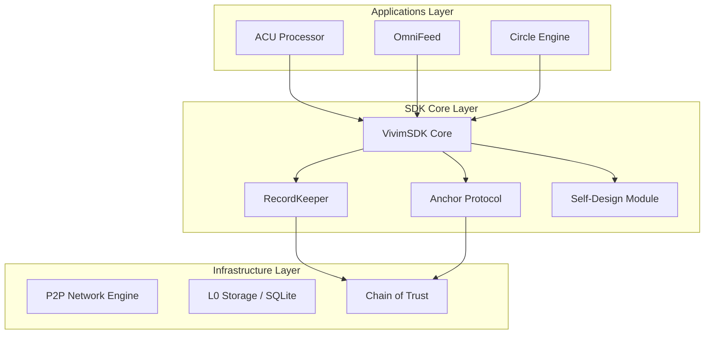

# VIVIM SDK & Developer Features

## Overview

The VIVIM SDK is a powerful, Bun-native toolkit for building decentralized, AI-driven, local-first applications. It's designed for developers who want to build VIVIM-compatible apps or integrate VIVIM's capabilities.

---

## SDK Purpose

> "Open-Source E2E Self-Contained Toolkit for Decentralized Applications"

The SDK provides:
- P2P mesh networking
- Decentralized storage (CRDT-based)
- Self-sovereign identity
- AI agent loops
- Memory systems

---

## Key Features

### 1. P2P Mesh Networking

```typescript
// Built-in support for WebRTC, GossipSub, peer discovery
import { NetworkEngine } from '@vivim/sdk/network';

const network = new NetworkEngine({
  peerId: myDid,
  bootstrappers: ['/ip4/.../p2p/...']
});

network.on('peer:connect', (peer) => {
  console.log('Connected to:', peer.id);
});
```

### 2. Decentralized Storage

```typescript
// Local-first data model using CRDTs
import { CRDTStore } from '@vivim/sdk/storage';

const store = new CRDTStore({
  database: 'sqlite://./data.db',
  encryption: true
});

// Automatic conflict resolution
await store.set('key', { value: 'data' });
const data = await store.get('key');
```

### 3. Identity Management

```typescript
// Self-sovereign identity (SSI) and DID-based authentication
import { IdentityManager } from '@vivim/sdk/identity';

const identity = await IdentityManager.create({
  secretKey: crypto.getRandomValues(new Uint8Array(32))
});

console.log('My DID:', identity.did);
// did:vivim:abc123...
```

### 4. AI Integration

```typescript
// Native support for decentralized AI agent loops and memory systems
import { AIAgent } from '@vivim/sdk/ai';

const agent = new AIAgent({
  provider: 'openai',  // or anthropic, gemini, etc.
  memory: true,        // Use VIVIM memory
  contextWindow: 12000
});

const response = await agent.chat('Remember that React pattern...');
```

### 5. Bun Optimization

```typescript
// Leverages Bun's high-performance runtime
import { BunVivimServer, BunSQLiteStore } from '@vivim/sdk/bun';

const store = new BunSQLiteStore({ dbPath: './vivim.db' });
const server = new BunVivimServer({ port: 8080, sdk });

await server.start();
```

### 6. Extensible Architecture

```typescript
// Modular node-based design
import { VivimSDK } from '@vivim/sdk';

const sdk = new VivimSDK({
  modules: {
    customModule: new CustomModule()
  }
});
```

---

## SDK Architecture

```
┌─────────────────┐
│   CORE SDK      │  (Orchestration & Events)
└────────┬────────┘
         │
  ┌───────┼───────┐
  ▼       ▼       ▼
┌────────┐ ┌────────┐ ┌────────┐
│NETWORK │ │STORAGE │ │IDENTITY│
└────────┘ └────────┘ └────────┘
```

### System Architecture



---

## Installation

```bash
# Bun (recommended)
bun add @vivim/sdk

# npm
npm install @vivim/sdk
```

---

## Quick Usage

```typescript
import { VivimSDK } from '@vivim/sdk';

// Initialize the decentralized core
const sdk = new VivimSDK({
  identity: {
    did: 'my-node-' + Math.random().toString(36).slice(2, 9),
  },
  storage: {
    encryption: true
  },
  nodes: {
    autoLoad: true
  }
});

await sdk.initialize();

// Connect to the P2P Graph
sdk.on('network:connected', (peerId) => {
  console.log(`Connected to new network peer: ${peerId}`);
});
```

---

## API Surface

### Core Classes

| Class | Purpose |
|-------|---------|
| `VivimSDK` | Main SDK entry point |
| `NetworkEngine` | P2P networking |
| `CRDTStore` | Decentralized storage |
| `IdentityManager` | DID management |
| `AIAgent` | AI with memory |
| `ACUProcessor` | ACU operations |
| `CircleEngine` | Social circles |

### Key Methods

```typescript
// Identity
sdk.identity.create();
sdk.identity.sign(data);
sdk.identity.verify(signature, data);

// Storage
sdk.store.get(key);
sdk.store.set(key, value);
sdk.store.delete(key);

// Network
sdk.network.connect(peerId);
sdk.network.broadcast(message);
sdk.network.subscribe(topic);

// AI
sdk.ai.chat(message);
sdk.ai.search(query);
sdk.ai.getContext();

// ACUs
sdk.acus.create(content, type);
sdk.acus.search(query);
sdk.acus.share(acuId, recipients);
```

---

## SDK Apps

### 1. Publishing Agent

```bash
cd sdk/apps/publishing-agent
bun run dev
```

Automated content publishing powered by VIVIM memory.

### 2. Public Dashboard

```bash
cd sdk/apps/public-dashboard
bun run dev
```

Analytics and monitoring dashboard.

---

## Documentation

| Document | Description |
|----------|-------------|
| `AUTONOMOUS_WORKERS.md` | AI worker patterns |
| `CORE_PRIMITIVE_NODE_DESIGN.md` | Node architecture |
| `SOCIAL_TRANSPORT_LAYER.md` | Social features |
| `FEATURE_DECOMPOSITION.md` | Feature breakdown |
| `DEVELOPMENT_ROADMAP.md` | Future plans |
| `BUN_INTEGRATION.md` | Bun-specific features |

---

## Examples

| Example | Description |
|---------|-------------|
| `basic-node` | Minimal node setup |
| `ai-agent` | AI with memory |
| `p2p-chat` | Peer-to-peer messaging |
| `storage` | CRDT storage demo |

---

## Developer Use Cases

### Use Case 1: Build VIVIM-Compatible App

```typescript
// Your app uses VIVIM memory
import { VivimSDK } from '@vivim/sdk';

const app = new VivimSDK({
  storage: { encryption: true }
});

await app.initialize();

// Now your app has:
// - Persistent memory
// - P2P sync
// - DID identity
```

### Use Case 2: Custom AI Agent

```typescript
// Build agent with VIVIM memory
const agent = new AIAgent({
  provider: 'openai',
  memory: true,  // Use VIVIM memory
  contextWindow: 12000
});

// Remembers previous conversations
const response = await agent.chat('What did we discuss about React?');
```

### Use Case 3: P2P Application

```typescript
// Decentralized app with sync
const p2pApp = new VivimSDK({
  network: {
    bootstrappers: knownPeers
  },
  storage: {
    sync: true
  }
});

// Data syncs automatically
await p2pApp.store.set('message', 'Hello');
// Eventually propagates to peers
```

---

## Version & Requirements

- **Version**: 1.0.0
- **Runtime**: Bun >= 1.0.0
- **Node**: >= 20.0.0
- **Language**: TypeScript

---

## Landing Page SDK Section

### Headline

> "Build on VIVIM"

### Body

> "The SDK for developers who want to build AI-native, decentralized applications. P2P networking, CRDT storage, self-sovereign identity."

### Features to Highlight

1. **Easy Integration**: `bun add @vivim/sdk`
2. **Local-First**: Works offline, syncs when online
3. **TypeScript**: Full type safety
4. **Bun-Native**: Ultra-fast performance
5. **Open Source**: MIT licensed
