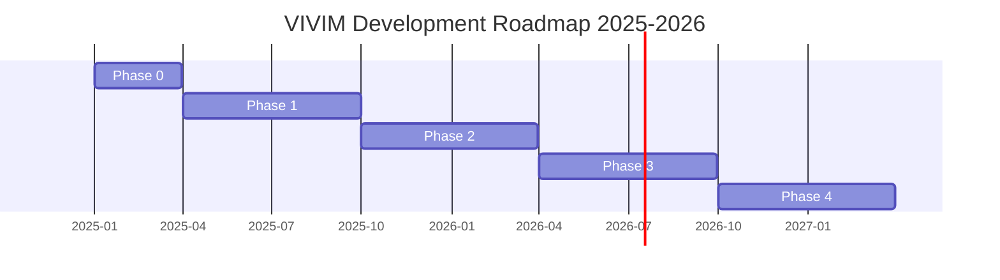
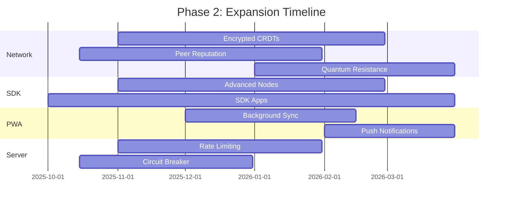
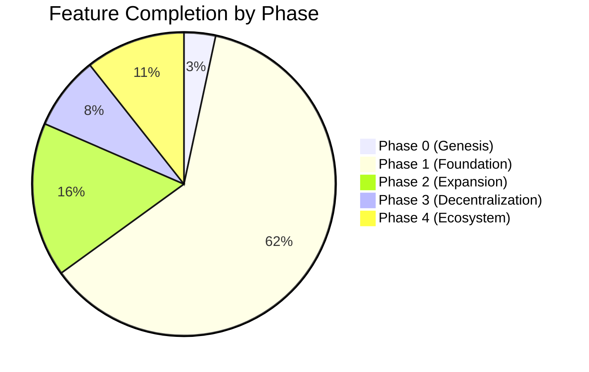
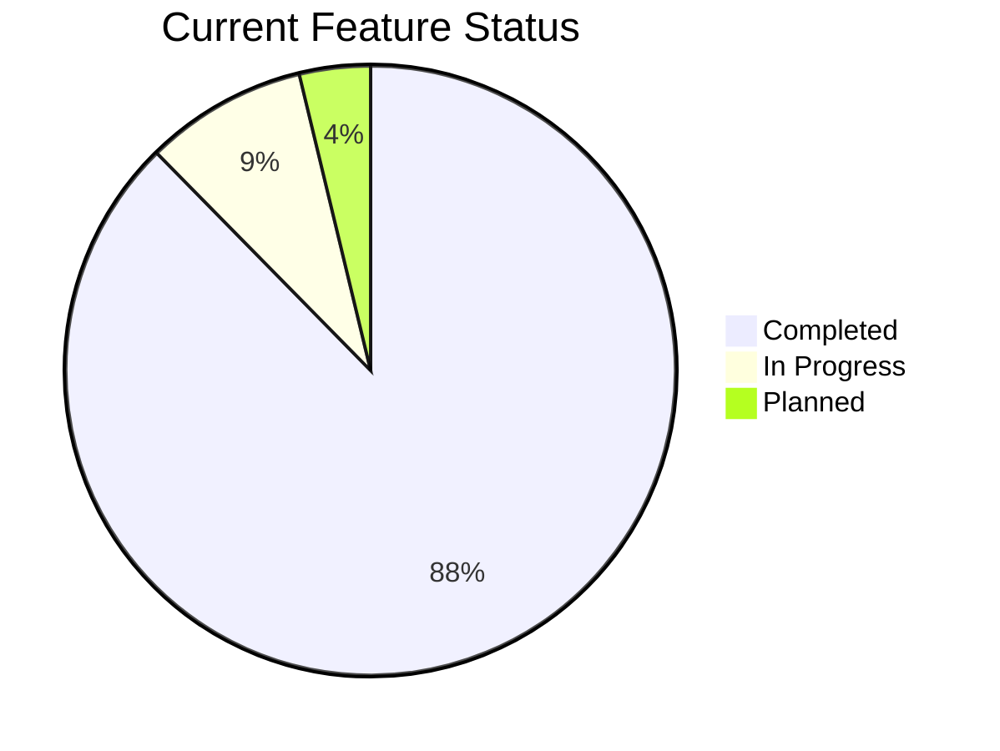

# VIVIM Feature Roadmap

**Last Updated:** 2026-02-26  
**Current Phase:** Phase 2 - Expansion & Integration  
**Overall Progress:** 88% Complete

---

## 📋 Table of Contents

- [Vision](#vision)
- [Roadmap Phases](#roadmap-phases)
- [Phase 0: Genesis (Completed)](#phase-0-genesis-completed)
- [Phase 1: Foundation (Completed)](#phase-1-foundation-completed)
- [Phase 2: Expansion (In Progress)](#phase-2-expansion-in-progress)
- [Phase 3: Decentralization (Planned)](#phase-3-decentralization-planned)
- [Phase 4: Ecosystem (Future)](#phase-4-ecosystem-future)
- [Feature Status Legend](#feature-status-legend)
- [Timeline Visualization](#timeline-visualization)

---

## Vision

VIVIM aims to create a **fully decentralized, user-owned AI memory platform** where:
- Users own their AI conversations and knowledge
- Data is synchronized peer-to-peer with end-to-end encryption
- Social features enable collaborative knowledge building
- AI agents can operate autonomously on behalf of users
- The ecosystem is extensible through a modular SDK

---

## Roadmap Phases



---

## Phase 0: Genesis (Completed ✅)

**Duration:** January 2025 - March 2025  
**Status:** ✅ **100% Complete**

### Objectives
- Establish core architecture
- Build basic capture functionality
- Create initial PWA frontend

### Delivered Features

#### Server & API (15 features)
- ✅ Basic Express.js server
- ✅ Conversation CRUD operations
- ✅ Simple capture endpoint
- ✅ PostgreSQL database with Prisma
- ✅ User authentication (Google OAuth)

#### PWA Frontend (10 features)
- ✅ Basic React application
- ✅ Conversation list and view
- ✅ Simple capture UI
- ✅ Login flow

#### Infrastructure (5 features)
- ✅ Development environment setup
- ✅ Basic CI/CD pipeline
- ✅ Docker configuration

**Total Features Delivered:** 30

---

## Phase 1: Foundation (Completed ✅)

**Duration:** April 2025 - September 2025  
**Status:** ✅ **95% Complete**

### Objectives
- Build network layer (P2P, CRDT, DHT)
- Implement blockchain chain layer
- Create comprehensive API endpoints
- Develop SDK foundation

### Delivered Features

### 1.1 Network Engine (120 features)

#### P2P Networking (15 features)
- ✅ NetworkNode with LibP2P
- ✅ ConnectionManager
- ✅ PeerDiscovery (bootstrap, mDNS)
- ✅ WebRTC, WebSocket, TCP transports
- ✅ Connection encryption (Noise/TLS)
- ✅ Multiplexing (Yamux/Mplex)
- 🚧 Peer reputation system (80%)
- 🚧 Auto-reconnection (70%)

#### CRDT Synchronization (25 features)
- ✅ CRDTSyncService with Yjs
- ✅ Libp2pYjsProvider
- ✅ VectorClock implementation
- ✅ 9 CRDT types (Conversation, Circle, Friend, Follow, Group, Team, etc.)
- ✅ Document merging
- ✅ Offline queue
- 🚧 Peer awareness (60%)
- 🚧 Encrypted CRDTs (40%)

#### Blockchain Chain Layer (30 features)
- ✅ VivimChainClient
- ✅ EventStore with immutable log
- ✅ 17 Event types
- ✅ HLClock (Hybrid Logical Clock)
- ✅ StateMachine
- ✅ EventHandlerRegistry
- ✅ GossipSync
- ✅ ChainDHT
- ✅ DID integration
- ✅ Trust levels (6 levels)
- ✅ Anchor Protocol (80%)
- 🚧 Block creation (50%)
- 🚧 Merkle root (50%)

#### DHT & Content Discovery (12 features)
- ✅ DHTService (Kademlia)
- ✅ ContentRegistry
- ✅ Content publishing/resolution
- ✅ Provider records
- ✅ Content indexing
- ✅ 5 key namespaces

#### PubSub System (10 features)
- ✅ PubSubService (Gossipsub)
- ✅ TopicManager
- ✅ 5 topic types
- ✅ Access control
- ✅ Mesh management

#### Federation (15 features)
- ✅ FederationClient
- ✅ FederationServer
- ✅ InstanceDiscovery
- ✅ Message signing
- ✅ Message queue
- ✅ Circle invites
- ✅ Follow activities
- 🚧 ActivityPub compatibility (60%)
- 🚧 DNS discovery (40%)

#### Security (18 features)
- ✅ E2EEncryption (AES-256-GCM, X25519)
- ✅ KeyManager
- ✅ CapabilityManager
- ✅ Ed25519 signatures
- ✅ Capability-based access control
- 🚧 Recovery phrases (50%)
- 🚧 Quantum resistance (30%)

#### Error Handling (20 features)
- ✅ ErrorReporter
- ✅ ErrorAggregator
- ✅ ErrorAlerter
- ✅ ErrorAnalytics
- ✅ ServiceContracts
- ✅ SyncIssueTracker
- ✅ Health metrics
- 🚧 Auto-resolution (50%)

### 1.2 Server API (180 features)

#### Core APIs (150 endpoints)
- ✅ Capture API (8 endpoints)
- ✅ Conversations API (10 endpoints)
- ✅ AI/Chat API (15 endpoints)
- ✅ Identity API (10 endpoints)
- ✅ Authentication API (5 endpoints)
- ✅ Account Management API (10 endpoints)
- ✅ Circles API (10 endpoints)
- ✅ Sharing API (20 endpoints)
- ✅ Memory/Second Brain API (20 endpoints)
- ✅ Context Engine API (10 endpoints)
- ✅ Social API (25 endpoints)
- ✅ Feed API (5 endpoints)
- ✅ Sync API (2 endpoints)

#### Services (30 features)
- ✅ AI Service
- ✅ Extractor (9 providers)
- ✅ Context Service
- ✅ Memory Service
- ✅ Social Service
- ✅ Sharing services (5 services)
- ✅ Socket.IO integration

#### Middleware (10 features)
- ✅ Error handling
- ✅ Authentication (API key, DID, Google OAuth)
- ✅ Request logging
- ✅ Account status

#### Database Models (35 features)
- ✅ All core models implemented
- ✅ pgvector for embeddings
- ✅ Per-user databases (optional)

### 1.3 PWA Frontend (150 features)

#### Pages (24 features)
- ✅ All 24 pages implemented
- ✅ React Router configuration
- ✅ Auth guards

#### Components (80+ features)
- ✅ iOS-style UI (25 components)
- ✅ Admin components (8 components)
- ✅ Content rendering (10 components)
- ✅ Tool-UI integration (10 components)
- ✅ Recommendation UI (6 components)
- ✅ Core components (25 components)

#### Hooks (18 features)
- ✅ All hooks implemented
- ✅ AI hooks (7 hooks)
- ✅ Social hooks
- ✅ Sync hooks

#### State Management (10 features)
- ✅ Zustand stores (5 stores)
- ✅ React Context (3 contexts)
- ✅ TanStack Query

#### Services (25 features)
- ✅ API clients (14 clients)
- ✅ Sync services (4 services)
- ✅ Identity service
- ✅ P2P service

#### Storage (15 features)
- ✅ IndexedDB database
- ✅ DAG storage
- ✅ Merkle trees
- ✅ Sync engine

#### Recommendation Engine (15 features)
- ✅ Quality scoring
- ✅ Rediscovery source
- ✅ Light/Heavy rankers
- ✅ Knowledge mixer
- ✅ Analytics tracking

#### BYOK (8 features)
- ✅ 8 AI providers supported
- ✅ API key management
- ✅ Streaming client

### 1.4 SDK Foundation (100 features)

#### Core SDK (20 features)
- ✅ VivimSDK class
- ✅ Identity management
- ✅ Node loading/registration
- ✅ RecordKeeper
- ✅ Anchor Protocol
- ✅ Communication Protocol
- ✅ Database layer
- ✅ L0 Storage

#### API Nodes (8 features)
- ✅ Identity Node
- ✅ Storage Node
- ✅ Content Node
- ✅ Social Node
- ✅ AI Chat Node
- ✅ Memory Node
- ✅ ChatLink Nexus Node
- ✅ ChatVault Archiver Node

#### Protocols (15 features)
- ✅ Exit Node Protocol
- ✅ Sync Protocol
- ✅ Chat Protocol
- ✅ Storage Protocol
- ✅ Message types (17 types)
- ✅ Content blocks (8 types)

#### Extension System (10 features)
- ✅ Extension points
- ✅ Assistant-UI adapter
- ✅ Tool-UI adapter
- ✅ Default components

#### Graph & Registry (12 features)
- ✅ NetworkGraph
- ✅ NodeRegistry
- ✅ Local/Network discovery

#### CLI (15 features)
- ✅ AI Agent CLI
- ✅ All command categories
- ✅ Interactive mode

#### Bun Integration (5 features)
- ✅ BunVivimServer
- ✅ WebSocket handler
- ✅ SQLite store

#### Utilities (15 features)
- ✅ Crypto utilities
- ✅ Logger
- ✅ Constants

**Total Features Delivered:** 550

---

## Phase 2: Expansion (In Progress 🚧)

**Duration:** October 2025 - March 2026  
**Status:** 🚧 **85% Complete**  
**Expected Completion:** 2026-03-31

### Objectives
- Complete partial features from Phase 1
- Enhance SDK with advanced nodes
- Implement remaining apps
- Improve error handling and monitoring
- Polish user experience

### In Progress Features

#### 2.1 Network Enhancements (25 features)

**High Priority:**
- 🚧 **Encrypted CRDTs** (60%) - End-to-end encrypted document sync
- 🚧 **Peer Reputation System** (70%) - Trust scoring for peers
- 🚧 **Auto-reconnection** (80%) - Automatic peer reconnection
- 🚧 **Multi-device Key Sync** (50%) - Sync encryption keys across devices
- 🚧 **Quantum Resistance** (40%) - Integrate Kyber/ML-KEM-1024

**Medium Priority:**
- ⏳ **GC Strategy** - Garbage collection for old CRDT states
- ⏳ **Snapshotting** - Periodic state snapshots for fast sync
- ⏳ **Sync Compression** - Compress CRDT updates
- ⏳ **Conflict Detection** - Advanced conflict detection
- ⏳ **Manual Merge API** - API for manual conflict resolution

**Low Priority:**
- ⏳ **NAT Traversal** - Hole punching for NAT
- ⏳ **Relay Nodes** - Circuit relay for unreachable peers
- ⏳ **Content Search** - Query DHT by metadata
- ⏳ **Rate Limiting** - Per-topic rate limits

#### 2.2 SDK Advanced Nodes (3 features)

- 🚧 **Capture Node** (40%) - Content capture functionality
- 🚧 **Analytics Node** (30%) - Usage analytics
- 🚧 **Network Node** (50%) - P2P networking abstraction

#### 2.3 SDK Apps (8 features)

**In Progress:**
- 🚧 **AI Documentation** (30%) - Auto-generate documentation
- 🚧 **AI Git** (40%) - AI-powered Git operations
- 🚧 **Omni Feed** (50%) - Unified feed aggregator
- 🚧 **Assistant Engine** (45%) - Assistant orchestration
- 🚧 **Tool Engine** (50%) - Tool execution engine
- 🚧 **Public Dashboard** (20%) - Public analytics dashboard
- 🚧 **Publishing Agent** (30%) - Automated publishing
- 🚧 **Roadmap Engine** (60%) - Roadmap management

**Completed:**
- ✅ **ACU Processor** - Decentralized ACU processing
- ✅ **Crypto Engine** - Cryptography operations
- ✅ **Circle Engine** - Circle management

#### 2.4 Error Handling & Monitoring (5 features)

- 🚧 **Auto-resolution** (50%) - Automatic error recovery
- 🚧 **Performance Monitoring** (60%) - Advanced metrics
- 🚧 **Security Auditing** (40%) - Security event logging
- ⏳ **Incident Reports** - Generate incident reports
- ⏳ **Error Recovery** - Automatic recovery strategies

#### 2.5 PWA Enhancements (5 features)

- 🚧 **Background Sync** (70%) - Background sync queue
- ⏳ **Push Notifications** - Browser push notifications
- ⏳ **Advanced Caching** - Smarter cache strategies
- ⏳ **Offline Analytics** - Offline usage tracking
- ⏳ **Performance Monitoring** - Client-side performance

#### 2.6 Server Enhancements (5 features)

- 🚧 **Advanced Rate Limiting** (60%) - Sophisticated rate limiting
- 🚧 **Circuit Breaker** (70%) - Circuit breaker for external APIs
- 🚧 **Load Balancing** (50%) - Horizontal scaling support
- ⏳ **Advanced Caching** - Redis cluster support
- ⏳ **Distributed Tracing** - Request tracing across services

### Phase 2 Deliverables

| Category | Complete | In Progress | Planned | Total | % Done |
|----------|----------|-------------|---------|-------|--------|
| Network | 140 | 15 | 10 | 165 | 85% |
| SDK Nodes | 8 | 3 | 0 | 11 | 73% |
| SDK Apps | 3 | 6 | 2 | 11 | 55% |
| Error Handling | 16 | 3 | 1 | 20 | 80% |
| PWA | 230 | 3 | 2 | 235 | 98% |
| Server | 280 | 3 | 2 | 285 | 98% |
| **TOTAL** | **677** | **33** | **17** | **727** | **88%** |

### Phase 2 Timeline



---

## Phase 3: Decentralization (Planned ⏳)

**Duration:** April 2026 - September 2026  
**Status:** ⏳ **Planned**  
**Start Date:** 2026-04-01

### Objectives
- Full P2P federation
- Decentralized identity management
- Community governance
- Token economics (optional)

### Planned Features

#### 3.1 Full Federation (20 features)

- ⏳ **ActivityPub Compatibility** - Full ActivityPub protocol support
- ⏳ **Cross-Instance Sync** - Seamless sync between instances
- ⏳ **Federated Identity** - DID-based identity across instances
- ⏳ **Federated Sharing** - Share content across instances
- ⏳ **Federated Moderation** - Cross-instance moderation
- ⏳ **Instance Directory** - Public instance directory
- ⏳ **Trust Network** - Web of trust between instances
- ⏳ **Federated Search** - Search across instances
- ⏳ **Federated Notifications** - Cross-instance notifications
- ⏳ **Federated Analytics** - Privacy-preserving analytics

#### 3.2 Decentralized Identity (15 features)

- ⏳ **DID Methods** - Support multiple DID methods
- ⏳ **Verifiable Credentials** - W3C VC support
- ⏳ **Identity Hubs** - Personal identity hubs
- ⏳ **Key Rotation** - Automatic key rotation
- ⏳ **Recovery Phrases** - Mnemonic recovery
- ⏳ **Multi-device Sync** - Seamless multi-device
- ⏳ **Biometric Auth** - Biometric authentication
- ⏳ **Hardware Wallets** - Ledger/Trezor support
- ⏳ **Social Recovery** - Social key recovery
- ⏳ **Identity Portability** - Export/import identity

#### 3.3 Governance (10 features)

- ⏳ **DAO Framework** - Community governance
- ⏳ **Proposal System** - Feature proposals
- ⏳ **Voting Mechanism** - Token-based voting
- ⏳ **Treasury Management** - Community treasury
- ⏳ **Grant Program** - Developer grants
- ⏳ **Reputation System** - Contribution tracking
- ⏳ **Dispute Resolution** - Community moderation
- ⏳ **Policy Enforcement** - Automated enforcement
- ⏳ **Transparency Reports** - Public reports
- ⏳ **Community Calls** - Regular meetings

#### 3.4 Token Economics (Optional) (10 features)

- ⏳ **Utility Token** - VIVIM token
- ⏳ **Staking** - Stake for rewards
- ⏳ **Rewards Distribution** - Contributor rewards
- ⏳ **Payment Channels** - Lightning-like payments
- ⏳ **Micropayments** - Content micropayments
- ⏳ **Subscription Management** - Token subscriptions
- ⏳ **Marketplace** - Digital asset marketplace
- ⏳ **NFT Integration** - NFT support
- ⏳ **DeFi Integration** - DeFi protocols
- ⏳ **Token Governance** - Token voting

#### 3.5 Advanced P2P (15 features)

- ⏳ **NAT Traversal** - Full NAT traversal
- ⏳ **Relay Network** - Community relay nodes
- ⏳ **Incentivized Relays** - Token incentives
- ⏳ **Mesh Networking** - Ad-hoc mesh networks
- ⏳ **Offline Mesh** - Local offline sync
- ⏳ **Proximity Sync** - Bluetooth/WiFi Direct
- ⏳ **Satellite Sync** - Satellite internet support
- ⏳ **CDN Integration** - Decentralized CDN
- ⏳ **IPFS Integration** - IPFS for content
- ⏳ **Arweave Integration** - Permanent storage
- ⏳ **Filecoin Integration** - Filecoin deals
- ⏳ **Storage Market** - Decentralized storage market
- ⏳ **Compute Market** - Decentralized compute
- ⏳ **Bandwidth Market** - Bandwidth sharing
- ⏳ **Resource Discovery** - Resource discovery protocol

### Phase 3 Deliverables

| Category | Features | Priority | Complexity |
|----------|----------|----------|------------|
| Federation | 20 | High | High |
| Identity | 15 | High | Medium |
| Governance | 10 | Medium | High |
| Token Economics | 10 | Low | Very High |
| Advanced P2P | 15 | Medium | Very High |
| **TOTAL** | **70** | - | - |

---

## Phase 4: Ecosystem (Future 🔮)

**Duration:** October 2026 - March 2027  
**Status:** 🔮 **Future**  
**Start Date:** 2026-10-01

### Objectives
- Thriving developer ecosystem
- Third-party integrations
- Enterprise features
- Global scale

### Vision Features

#### 4.1 Developer Ecosystem (25 features)

- 🔮 **Plugin System** - Third-party plugins
- 🔮 **Marketplace** - Plugin marketplace
- 🔮 **Developer Portal** - Developer documentation
- 🔮 **SDK Examples** - Example applications
- 🔮 **Code Templates** - Project templates
- 🔮 **Testing Framework** - Testing tools
- 🔮 **Debugging Tools** - Debugging utilities
- 🔮 **Performance Profiler** - Performance tools
- 🔮 **API Versioning** - API version management
- 🔮 **Backward Compatibility** - Compatibility guarantees
- 🔮 **Migration Tools** - Migration utilities
- 🔮 **Community Extensions** - Community extensions
- 🔮 **Certification Program** - Developer certification
- 🔮 **Partner Program** - Technology partners
- 🔮 **Integration Partners** - Pre-built integrations
- 🔮 **Webhooks** - Outgoing webhooks
- 🔮 **Event Streaming** - Event streaming API
- 🔮 **GraphQL API** - GraphQL interface
- 🔮 **REST API v2** - Enhanced REST API
- 🔮 **WebSocket API** - Real-time API
- 🔮 **gRPC Support** - gRPC interface
- 🔮 **OpenAPI Spec** - OpenAPI documentation
- 🔮 **SDK Generators** - Auto-generate SDKs
- 🔮 **CLI Plugins** - CLI extensibility
- 🔮 **IDE Extensions** - VS Code, JetBrains

#### 4.2 Enterprise Features (20 features)

- 🔮 **SSO Integration** - SAML, OIDC
- 🔮 **Active Directory** - AD/LDAP integration
- 🔮 **Team Management** - Advanced team features
- 🔮 **Admin Console** - Enterprise admin
- 🔮 **Audit Logs** - Compliance audit logs
- 🔮 **Data Residency** - Data location control
- 🔮 **Compliance** - GDPR, HIPAA, SOC2
- 🔮 **Encryption at Rest** - Database encryption
- 🔮 **Private Cloud** - Private cloud deployment
- 🔮 **Hybrid Cloud** - Hybrid cloud support
- 🔮 **High Availability** - HA configuration
- 🔮 **Disaster Recovery** - DR procedures
- 🔮 **Backup & Restore** - Automated backups
- 🔮 **Monitoring** - Enterprise monitoring
- 🔮 **Alerting** - Enterprise alerting
- 🔮 **Support Portal** - Priority support
- 🔮 **SLA Guarantees** - Service level agreements
- 🔮 **Custom Development** - Custom features
- 🔮 **Training Program** - Enterprise training
- 🔮 **Consulting Services** - Professional services

#### 4.3 AI Advancements (20 features)

- 🔮 **Autonomous Agents** - Self-operating agents
- 🔮 **Multi-Agent Systems** - Agent collaboration
- 🔮 **Agent Marketplace** - Agent marketplace
- 🔮 **Agent Training** - Custom agent training
- 🔮 **Fine-tuning** - Model fine-tuning
- 🔮 **RAG Enhancement** - Advanced RAG
- 🔮 **Knowledge Graphs** - Knowledge graph integration
- 🔮 **Semantic Search** - Advanced semantic search
- 🔮 **Multi-modal AI** - Image, audio, video
- 🔮 **Voice Interface** - Voice interactions
- 🔮 **Real-time Translation** - Live translation
- 🔮 **Sentiment Analysis** - Emotion detection
- 🔮 **Intent Recognition** - Intent classification
- 🔮 **Entity Extraction** - Named entity recognition
- 🔮 **Summarization** - Advanced summarization
- 🔮 **Question Answering** - QA systems
- 🔮 **Code Generation** - Code synthesis
- 🔮 **Code Review** - Automated code review
- 🔮 **Documentation Gen** - Auto-documentation
- 🔮 **AI Ethics** - Ethical AI guidelines

#### 4.4 Social & Community (15 features)

- 🔮 **Public Profiles** - User profiles
- 🔮 **Reputation System** - User reputation
- 🔮 **Achievement Badges** - Gamification
- 🔮 **Leaderboards** - Community leaderboards
- 🔮 **Forums** - Community forums
- 🔮 **Discord Integration** - Discord bot
- 🔮 **Twitter Integration** - Twitter bot
- 🔮 **Content Creators** - Creator tools
- 🔮 **Monetization** - Creator monetization
- 🔮 **Subscriptions** - Creator subscriptions
- 🔮 **Tip Jar** - Tipping system
- 🔮 **Collaborative Workspaces** - Team workspaces
- 🔮 **Events** - Virtual events
- 🔮 **Webinars** - Educational webinars
- 🔮 **Meetups** - Local meetups

#### 4.5 Global Scale (15 features)

- 🔮 **Multi-language** - 50+ languages
- 🔮 **RTL Support** - Right-to-left languages
- 🔮 **Localization** - Cultural localization
- 🔮 **Regional Servers** - Regional deployment
- 🔮 **CDN** - Global CDN
- 🔮 **Edge Computing** - Edge deployment
- 🔮 **Offline First** - Enhanced offline
- 🔮 **Low Bandwidth** - Low bandwidth mode
- 🔮 **Accessibility** - WCAG compliance
- 🔮 **Mobile Apps** - Native iOS/Android
- 🔮 **Desktop Apps** - Native desktop
- 🔮 **Browser Extension** - Browser extensions
- 🔮 **Wearables** - Smartwatch support
- 🔮 **IoT Integration** - IoT devices
- 🔮 **AR/VR** - AR/VR experiences

### Phase 4 Deliverables

| Category | Features | Timeline | Priority |
|----------|----------|----------|----------|
| Developer Ecosystem | 25 | Q4 2026 - Q1 2027 | High |
| Enterprise Features | 20 | Q4 2026 - Q2 2027 | Medium |
| AI Advancements | 20 | Q1 2027 - Q3 2027 | High |
| Social & Community | 15 | Q2 2027 - Q4 2027 | Medium |
| Global Scale | 15 | Q3 2027 - Q1 2028 | Low |
| **TOTAL** | **95** | - | - |

---

## Feature Status Legend

| Status | Icon | Description |
|--------|------|-------------|
| **Completed** | ✅ | Fully implemented and tested |
| **In Progress** | 🚧 | Actively being developed (50-99%) |
| **Planned** | ⏳ | Scheduled for future phase |
| **Future** | 🔮 | Visionary features (no timeline) |
| **Deferred** | ⏸️ | Postponed indefinitely |
| **Cancelled** | ❌ | Will not be implemented |

---

## Timeline Visualization

### Overall Progress



### Feature Status Distribution



### Completion by Component

```mermaid
bar
    title Completion Percentage by Component
    x-axis Component
    y-axis Percentage
    bar Network : 78
    bar PWA : 92
    bar Server : 93
    bar SDK : 83
```

---

## Key Milestones

### 2025 Milestones

| Date | Milestone | Status |
|------|-----------|--------|
| 2025-03-31 | Phase 0 Complete | ✅ Done |
| 2025-06-30 | Network Engine Alpha | ✅ Done |
| 2025-09-30 | Phase 1 Complete | ✅ Done |
| 2025-12-31 | SDK Beta Release | ✅ Done |

### 2026 Milestones

| Date | Milestone | Status |
|------|-----------|--------|
| 2026-03-31 | Phase 2 Complete | 🚧 In Progress |
| 2026-06-30 | Federation Alpha | ⏳ Planned |
| 2026-09-30 | Phase 3 Complete | ⏳ Planned |
| 2026-12-31 | Public Launch | ⏳ Planned |

### 2027 Milestones

| Date | Milestone | Status |
|------|-----------|--------|
| 2027-03-31 | Phase 4 Complete | 🔮 Future |
| 2027-06-30 | 1M Users | 🔮 Future |
| 2027-12-31 | Enterprise GA | 🔮 Future |

---

## Risk Assessment

### High Priority Risks

1. **Quantum Resistance Implementation**
   - Risk: PQC algorithms still evolving
   - Mitigation: Follow NIST standards, modular design

2. **Federation Complexity**
   - Risk: Cross-instance sync challenges
   - Mitigation: Start with simple federation, iterate

3. **Scalability**
   - Risk: Performance degradation at scale
   - Mitigation: Load testing, horizontal scaling

### Medium Priority Risks

1. **Security Vulnerabilities**
   - Risk: E2E encryption implementation bugs
   - Mitigation: Security audits, bug bounty program

2. **User Adoption**
   - Risk: Complex UX for non-technical users
   - Mitigation: User testing, simplified onboarding

3. **Regulatory Compliance**
   - Risk: Changing privacy regulations
   - Mitigation: Legal review, flexible architecture

---

## Success Metrics

### Technical Metrics

- **Uptime:** 99.9% availability
- **Latency:** &lt;100ms API response time
- **Sync Time:** &lt;5s for CRDT sync
- **Error Rate:** &lt;0.1% error rate

- **Error Rate:** &lt;0.1% error rate
- **Test Coverage:** >80% code coverage

### User Metrics

- **Active Users:** 100K MAU by end of 2026
- **Retention:** >60% 30-day retention
- **NPS:** >50 Net Promoter Score
- **Support Tickets:** &lt;24h response time

### Business Metrics

- **Revenue:** $1M ARR by end of 2027
- **Enterprise Customers:** 50+ enterprise customers
- **Developer Ecosystem:** 1000+ third-party plugins
- **Community:** 10K+ Discord members

---

## Contributing to the Roadmap

We welcome community input on the roadmap! Here's how you can contribute:

1. **Feature Requests:** Open an issue on GitHub
2. **Vote on Features:** Participate in community polls
3. **Implement Features:** Submit pull requests
4. **Provide Feedback:** Join Discord discussions
5. **Report Bugs:** Help us improve quality

### Roadmap Governance

- **Community Proposals:** Anyone can propose features
- **Core Team Review:** Core team evaluates proposals
- **Community Vote:** Token holders vote on major features
- **Implementation:** Assigned to core team or community contributors

---

## Contact & Updates

- **GitHub:** [github.com/vivim](https://github.com/vivim)
- **Discord:** [discord.gg/vivim](https://discord.gg/vivim)
- **Twitter:** [@vivim](https://twitter.com/vivim)
- **Blog:** [vivim.live/blog](https://vivim.live/blog)

**Roadmap Last Updated:** 2026-02-26  
**Next Review:** 2026-03-15

---

*This roadmap is a living document and will be updated regularly based on community feedback, technical progress, and market conditions.*
