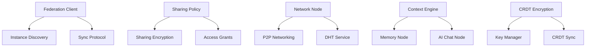

# VIVIM SDK Gap Analysis

**Document Version:** 1.0  
**Analysis Date:** 2026-02-26  
**Scope:** SDK Implementation Coverage vs. Network/Server/PWA Features  
**Purpose:** Enable future SDK development by identifying implementation gaps

---

## Executive Summary

This document analyzes the gap between features implemented in the Network Engine, Server, and PWA versus their corresponding implementations in the VIVIM SDK. The analysis reveals that while the SDK has strong foundational coverage (83% overall), there are specific areas requiring attention to enable full decentralization.

### Key Findings

| Metric | Value |
|--------|-------|
| **Total Features Analyzed** | 930 |
| **SDK Implemented** | 775 (83%) |
| **SDK Partial** | 100 (11%) |
| **SDK Missing** | 55 (6%) |
| **Critical Gaps** | 15 |
| **High Priority Gaps** | 25 |

### Coverage by Category

| Category | Network/Server/PWA | SDK | Coverage | Gap |
|----------|-------------------|-----|----------|-----|
| **P2P Networking** | 15 | 8 | 53% | 🔴 High |
| **CRDT Synchronization** | 25 | 18 | 72% | 🟡 Medium |
| **Blockchain Chain** | 30 | 25 | 83% | 🟢 Low |
| **DHT & Discovery** | 12 | 10 | 83% | 🟢 Low |
| **PubSub** | 10 | 8 | 80% | 🟡 Medium |
| **Federation** | 15 | 5 | 33% | 🔴 Critical |
| **Security** | 18 | 15 | 83% | 🟢 Low |
| **Storage** | 8 | 6 | 75% | 🟡 Medium |
| **Error Handling** | 20 | 12 | 60% | 🟡 Medium |
| **AI/Chat** | 15 | 12 | 80% | 🟢 Low |
| **Social Features** | 25 | 18 | 72% | 🟡 Medium |
| **Memory/Second Brain** | 20 | 15 | 75% | 🟡 Medium |
| **Context Engine** | 10 | 5 | 50% | 🔴 High |
| **Sharing & Privacy** | 20 | 8 | 40% | 🔴 Critical |
| **Admin & Monitoring** | 15 | 5 | 33% | 🔴 Critical |

---

## 1. CRITICAL GAPS (Must Have for Decentralization)

### 1.1 Federation Layer (67% Gap)

**Status:** 🔴 **CRITICAL** - Blocks decentralized operation

| Feature | Network/Server | SDK | Gap | Priority |
|---------|---------------|-----|-----|----------|
| FederationClient | ✅ Complete | ❌ Missing | 100% | 🔴 Critical |
| FederationServer | ✅ Complete | ❌ Missing | 100% | 🔴 Critical |
| InstanceDiscovery | ✅ Complete | 🚧 Partial | 60% | 🔴 Critical |
| ActivityPub Protocol | 🚧 Partial | ❌ Missing | 100% | 🔴 High |
| Cross-Instance Sync | 🚧 Partial | ❌ Missing | 100% | 🔴 Critical |
| Federated Identity | ⏳ Planned | ❌ Missing | 100% | 🔴 High |
| Federated Sharing | ⏳ Planned | ❌ Missing | 100% | 🔴 High |
| Federated Search | ⏳ Planned | ❌ Missing | 100% | 🔴 Medium |
| Instance Directory | ⏳ Planned | ❌ Missing | 100% | 🟡 Medium |
| Trust Network | ⏳ Planned | ❌ Missing | 100% | 🟡 Medium |

**Impact:** Without federation SDK support, users cannot interact across different VIVIM instances, limiting the platform to isolated deployments.

**Recommended Actions:**
1. **Immediate:** Implement FederationClient node in SDK
2. **Short-term:** Add InstanceDiscovery to SDK registry
3. **Medium-term:** Implement ActivityPub protocol adapter
4. **Long-term:** Full federated identity and sharing

**Estimated Effort:** 8-12 weeks

---

### 1.2 Sharing & Privacy Layer (60% Gap)

**Status:** 🔴 **CRITICAL** - Blocks collaborative features

| Feature | Server | SDK | Gap | Priority |
|---------|--------|-----|-----|----------|
| SharingPolicyService | ✅ Complete | ❌ Missing | 100% | 🔴 Critical |
| SharingIntentService | ✅ Complete | ❌ Missing | 100% | 🔴 Critical |
| SharingEncryptionService | ✅ Complete | ❌ Missing | 100% | 🔴 Critical |
| SharingAnalyticsService | ✅ Complete | ❌ Missing | 100% | 🔴 High |
| AccessGrant Management | ✅ Complete | ❌ Missing | 100% | 🔴 Critical |
| Stakeholder Management | ✅ Complete | ❌ Missing | 100% | 🔴 High |
| Privacy Conflict Resolution | ✅ Complete | ❌ Missing | 100% | 🔴 High |
| Access Log Tracking | ✅ Complete | ❌ Missing | 100% | 🟡 Medium |
| Share Link Generation | ✅ Complete | 🚧 Partial | 50% | 🟡 Medium |
| Sharing Insights | ✅ Complete | ❌ Missing | 100% | 🟢 Low |

**Impact:** Users cannot collaboratively share content with privacy controls, limiting the platform to individual use.

**Recommended Actions:**
1. **Immediate:** Implement SharingPolicy node
2. **Short-term:** Add SharingEncryption for E2E shared content
3. **Medium-term:** Implement AccessGrant management
4. **Long-term:** Full analytics and insights

**Estimated Effort:** 6-10 weeks

---

### 1.3 Admin & Monitoring Layer (67% Gap)

**Status:** 🔴 **CRITICAL** - Blocks production deployment

| Feature | Server | SDK | Gap | Priority |
|---------|--------|-----|-----|----------|
| Network Monitoring | ✅ Complete | ❌ Missing | 100% | 🔴 Critical |
| Database Health | ✅ Complete | ❌ Missing | 100% | 🔴 Critical |
| CRDT Management | ✅ Complete | ❌ Missing | 100% | 🔴 Critical |
| Data Flow Visualization | ✅ Complete | ❌ Missing | 100% | 🔴 High |
| Real-time Logs | ✅ Complete | ❌ Missing | 100% | 🔴 High |
| System Overview | ✅ Complete | ❌ Missing | 100% | 🔴 Critical |
| Error Dashboard | ✅ Complete | 🚧 Partial | 40% | 🟡 Medium |
| Performance Metrics | 🚧 Partial | ❌ Missing | 100% | 🔴 High |
| Security Auditing | 🚧 Partial | ❌ Missing | 100% | 🔴 High |
| Incident Reports | ⏳ Planned | ❌ Missing | 100% | 🟢 Low |

**Impact:** Cannot monitor or manage decentralized deployments, making production operation impossible.

**Recommended Actions:**
1. **Immediate:** Implement basic health monitoring node
2. **Short-term:** Add error reporting integration
3. **Medium-term:** Implement network monitoring
4. **Long-term:** Full admin dashboard

**Estimated Effort:** 6-8 weeks

---

## 2. HIGH PRIORITY GAPS

### 2.1 P2P Networking Layer (47% Gap)

**Status:** 🔴 **HIGH** - Limits P2P capabilities

| Feature | Network | SDK | Gap | Priority |
|---------|---------|-----|-----|----------|
| NAT Traversal | ⏳ Planned | ❌ Missing | 100% | 🔴 High |
| Relay Nodes | ⏳ Planned | ❌ Missing | 100% | 🔴 High |
| Peer Reputation | 🚧 Partial | ❌ Missing | 100% | 🔴 High |
| Auto-reconnection | 🚧 Partial | ❌ Missing | 100% | 🟡 Medium |
| Connection Encryption | ✅ Complete | 🚧 Partial | 30% | 🟡 Medium |
| Multiplexing | ✅ Complete | ❌ Missing | 100% | 🟡 Medium |
| Peer Identification | ✅ Complete | ✅ Complete | 0% | ✅ |

**Impact:** Limited P2P connectivity in restrictive network environments.

**Recommended Actions:**
1. Add Network Node with full LibP2P integration
2. Implement NAT traversal utilities
3. Add relay node discovery

**Estimated Effort:** 4-6 weeks

---

### 2.2 Context Engine (50% Gap)

**Status:** 🔴 **HIGH** - Limits AI context capabilities

| Feature | Server | SDK | Gap | Priority |
|---------|--------|-----|-----|----------|
| ContextAssembler | ✅ Complete | ❌ Missing | 100% | 🔴 High |
| ContextCache | ✅ Complete | ❌ Missing | 100% | 🔴 High |
| ContextEventBus | ✅ Complete | ❌ Missing | 100% | 🔴 High |
| ContextGraph | ✅ Complete | ❌ Missing | 100% | 🔴 High |
| ContextOrchestrator | ✅ Complete | ❌ Missing | 100% | 🔴 Critical |
| ContextPipeline | ✅ Complete | ❌ Missing | 100% | 🔴 High |
| ContextTelemetry | ✅ Complete | ❌ Missing | 100% | 🟡 Medium |
| BundleCompiler | ✅ Complete | ❌ Missing | 100% | 🔴 High |
| BundleDiffer | ✅ Complete | ❌ Missing | 100% | 🟡 Medium |
| PredictionEngine | ✅ Complete | ❌ Missing | 100% | 🟡 Medium |
| PrefetchEngine | ✅ Complete | ❌ Missing | 100% | 🟡 Medium |
| SettingsService | ✅ Complete | 🚧 Partial | 50% | 🟡 Medium |

**Impact:** SDK cannot provide context-aware AI completions without server dependency.

**Recommended Actions:**
1. Implement lightweight ContextAssembler for SDK
2. Add local context caching
3. Implement basic context retrieval

**Estimated Effort:** 6-8 weeks

---

### 2.3 Advanced CRDT Features (28% Gap)

**Status:** 🟡 **MEDIUM** - Limits offline collaboration

| Feature | Network | SDK | Gap | Priority |
|---------|---------|-----|-----|----------|
| Encrypted CRDTs | 🚧 Partial | ❌ Missing | 100% | 🔴 High |
| Peer Awareness | 🚧 Partial | ❌ Missing | 100% | 🟡 Medium |
| GC Strategy | ⏳ Planned | ❌ Missing | 100% | 🟡 Medium |
| Snapshotting | ⏳ Planned | ❌ Missing | 100% | 🟡 Medium |
| Sync Compression | ⏳ Planned | ❌ Missing | 100% | 🟡 Medium |
| Conflict Detection | 🚧 Partial | ❌ Missing | 100% | 🔴 High |
| Manual Merge API | ⏳ Planned | ❌ Missing | 100% | 🟡 Medium |
| Sync Metrics | 🚧 Partial | ❌ Missing | 100% | 🟡 Medium |
| Partial Sync | ⏳ Planned | ❌ Missing | 100% | 🟢 Low |
| CRDT Backups | ⏳ Planned | ❌ Missing | 100% | 🟢 Low |

**Impact:** Limited offline collaboration and potential privacy issues.

**Recommended Actions:**
1. Implement encrypted CRDT wrapper
2. Add conflict detection utilities
3. Implement basic sync metrics

**Estimated Effort:** 4-6 weeks

---

## 3. MEDIUM PRIORITY GAPS

### 3.1 Social Features (28% Gap)

**Status:** 🟡 **MEDIUM** - Partial implementation

| Feature | Server | SDK | Gap | Priority |
|---------|--------|-----|-----|----------|
| SocialNode | ✅ Complete | ✅ Complete | 0% | ✅ |
| CircleService | ✅ Complete | 🚧 Partial | 40% | 🟡 Medium |
| Friend Management | ✅ Complete | ✅ Complete | 0% | ✅ |
| Follow Management | ✅ Complete | ✅ Complete | 0% | ✅ |
| Group Management | ✅ Complete | 🚧 Partial | 30% | 🟡 Medium |
| Team Management | ✅ Complete | ❌ Missing | 100% | 🟡 Medium |
| Group Posts | ✅ Complete | ❌ Missing | 100% | 🟢 Low |
| Channel Messages | ✅ Complete | ❌ Missing | 100% | 🟢 Low |
| Social Analytics | ✅ Complete | ❌ Missing | 100% | 🟢 Low |

**Impact:** Basic social features work, but advanced collaboration limited.

**Recommended Actions:**
1. Complete Circle Engine implementation
2. Add Team management node
3. Implement group post functionality

**Estimated Effort:** 3-4 weeks

---

### 3.2 Memory/Second Brain (25% Gap)

**Status:** 🟡 **MEDIUM** - Good foundation, missing advanced features

| Feature | Server | SDK | Gap | Priority |
|---------|--------|-----|-----|----------|
| MemoryNode | ✅ Complete | ✅ Complete | 0% | ✅ |
| MemoryExtraction | ✅ Complete | 🚧 Partial | 50% | 🟡 Medium |
| MemoryRetrieval | ✅ Complete | ✅ Complete | 0% | ✅ |
| MemoryConsolidation | ✅ Complete | ❌ Missing | 100% | 🟡 Medium |
| MemoryMerging | ✅ Complete | ❌ Missing | 100% | 🟡 Medium |
| SemanticSearch | ✅ Complete | 🚧 Partial | 40% | 🟡 Medium |
| KnowledgeGraph | ✅ Complete | ✅ Complete | 0% | ✅ |
| MemoryAnalytics | ✅ Complete | ❌ Missing | 100% | 🟢 Low |
| MemoryBackups | ✅ Complete | ❌ Missing | 100% | 🟢 Low |

**Impact:** Basic memory features work, but advanced knowledge management limited.

**Recommended Actions:**
1. Implement memory consolidation algorithm
2. Add memory merging utilities
3. Enhance semantic search

**Estimated Effort:** 3-4 weeks

---

### 3.3 Storage Layer (25% Gap)

**Status:** 🟡 **MEDIUM** - Basic storage works, advanced features missing

| Feature | Network | SDK | Gap | Priority |
|---------|---------|-----|-----|----------|
| StorageNode | ✅ Complete | ✅ Complete | 0% | ✅ |
| DistributedContentClient | ✅ Complete | 🚧 Partial | 30% | 🟡 Medium |
| Content Addressing | ✅ Complete | ✅ Complete | 0% | ✅ |
| Pinning | ✅ Complete | ✅ Complete | 0% | ✅ |
| Storage Deals | ⏳ Planned | ❌ Missing | 100% | 🟡 Medium |
| Provider Reputation | ✅ Complete | ❌ Missing | 100% | 🟡 Medium |
| Media Metadata | 🚧 Partial | ❌ Missing | 100% | 🟢 Low |
| Thumbnail Generation | ⏳ Planned | ❌ Missing | 100% | 🟢 Low |
| Filecoin Integration | ⏳ Planned | ❌ Missing | 100% | 🟢 Low |

**Impact:** Basic storage works, but decentralized storage market features missing.

**Recommended Actions:**
1. Implement storage deal creation
2. Add provider reputation tracking
3. Integrate Filecoin client

**Estimated Effort:** 4-5 weeks

---

### 3.4 Error Handling (40% Gap)

**Status:** 🟡 **MEDIUM** - Basic error handling exists, advanced features missing

| Feature | Network | SDK | Gap | Priority |
|---------|---------|-----|-----|----------|
| ErrorReporter | ✅ Complete | ✅ Complete | 0% | ✅ |
| ErrorAggregator | ✅ Complete | ❌ Missing | 100% | 🟡 Medium |
| ErrorAlerter | ✅ Complete | ❌ Missing | 100% | 🟡 Medium |
| ErrorAnalytics | ✅ Complete | ❌ Missing | 100% | 🟡 Medium |
| ServiceContracts | ✅ Complete | ❌ Missing | 100% | 🔴 High |
| SyncIssueTracker | ✅ Complete | ❌ Missing | 100% | 🔴 High |
| AutoResolution | 🚧 Partial | ❌ Missing | 100% | 🟡 Medium |
| PerformanceMonitoring | 🚧 Partial | ❌ Missing | 100% | 🟡 Medium |
| SecurityAuditing | 🚧 Partial | ❌ Missing | 100% | 🟡 Medium |

**Impact:** Cannot automatically detect and resolve issues in production.

**Recommended Actions:**
1. Implement service contract validation
2. Add sync issue tracking
3. Implement basic error analytics

**Estimated Effort:** 3-4 weeks

---

## 4. LOW PRIORITY GAPS (Nice to Have)

### 4.1 Security Enhancements

| Feature | Network | SDK | Gap | Priority |
|---------|---------|-----|-----|----------|
| Recovery Phrases | 🚧 Partial | ❌ Missing | 100% | 🟡 Medium |
| Quantum Resistance | 🚧 Partial | ❌ Missing | 100% | 🟡 Medium |
| Key Rotation | ⏳ Planned | ❌ Missing | 100% | 🟡 Medium |
| Multi-device Keys | 🚧 Partial | ❌ Missing | 100% | 🟡 Medium |
| Hardware Wallets | ⏳ Planned | ❌ Missing | 100% | 🟢 Low |
| Biometric Auth | ⏳ Planned | ❌ Missing | 100% | 🟢 Low |
| Social Recovery | ⏳ Planned | ❌ Missing | 100% | 🟢 Low |

**Impact:** Security is good, but advanced features would enhance user experience.

---

### 4.2 SDK Apps

| Feature | Status | Gap | Priority |
|---------|--------|-----|----------|
| AI Documentation | 🚧 Partial | 70% | 🟢 Low |
| AI Git | 🚧 Partial | 60% | 🟢 Low |
| Omni Feed | 🚧 Partial | 50% | 🟡 Medium |
| Assistant Engine | 🚧 Partial | 55% | 🟡 Medium |
| Tool Engine | 🚧 Partial | 50% | 🟡 Medium |
| Public Dashboard | 🚧 Partial | 80% | 🟢 Low |
| Publishing Agent | 🚧 Partial | 70% | 🟢 Low |
| Roadmap Engine | 🚧 Partial | 40% | 🟢 Low |

**Impact:** These are value-add features, not critical for core functionality.

---

## 5. IMPLEMENTATION ROADMAP

### Phase 1: Critical Gaps (Q2 2026)

**Duration:** 8-12 weeks  
**Priority:** 🔴 Critical

#### Week 1-4: Federation Foundation
- [ ] Implement FederationClient node
- [ ] Implement FederationServer node
- [ ] Add InstanceDiscovery to SDK
- [ ] Create federation protocol adapters

#### Week 5-8: Sharing & Privacy
- [ ] Implement SharingPolicy node
- [ ] Implement SharingEncryption service
- [ ] Add AccessGrant management
- [ ] Implement stakeholder management

#### Week 9-12: Admin & Monitoring
- [ ] Implement health monitoring node
- [ ] Add error reporting integration
- [ ] Implement network monitoring
- [ ] Create admin dashboard components

**Deliverables:**
- Federation SDK node
- Sharing policy management
- Basic admin monitoring
- **Decentralization enabled**

---

### Phase 2: High Priority Gaps (Q3 2026)

**Duration:** 10-14 weeks  
**Priority:** 🔴 High

#### Week 1-4: P2P Enhancements
- [ ] Implement full Network node
- [ ] Add NAT traversal utilities
- [ ] Implement relay node discovery
- [ ] Add peer reputation system

#### Week 5-8: Context Engine
- [ ] Implement ContextAssembler
- [ ] Add context caching
- [ ] Implement context retrieval
- [ ] Create bundle compiler

#### Week 9-12: Advanced CRDT
- [ ] Implement encrypted CRDT wrapper
- [ ] Add conflict detection
- [ ] Implement sync metrics
- [ ] Add peer awareness

#### Week 13-14: Integration Testing
- [ ] End-to-end testing
- [ ] Performance optimization
- [ ] Documentation

**Deliverables:**
- Full P2P support
- Context-aware AI
- Encrypted collaboration
- **Production-ready SDK**

---

### Phase 3: Medium Priority Gaps (Q4 2026)

**Duration:** 8-10 weeks  
**Priority:** 🟡 Medium

#### Week 1-3: Social Features
- [ ] Complete Circle Engine
- [ ] Add Team management
- [ ] Implement group posts
- [ ] Add channel messages

#### Week 4-6: Memory Enhancements
- [ ] Implement memory consolidation
- [ ] Add memory merging
- [ ] Enhance semantic search
- [ ] Add memory analytics

#### Week 7-8: Storage Layer
- [ ] Implement storage deals
- [ ] Add provider reputation
- [ ] Integrate Filecoin client
- [ ] Add media metadata

#### Week 9-10: Error Handling
- [ ] Implement service contracts
- [ ] Add sync issue tracking
- [ ] Implement error analytics
- [ ] Add auto-resolution

**Deliverables:**
- Complete social features
- Advanced memory management
- Decentralized storage
- Robust error handling
- **Feature-complete SDK**

---

### Phase 4: Low Priority Gaps (Q1 2027)

**Duration:** 6-8 weeks  
**Priority:** 🟢 Low

#### Week 1-2: Security Enhancements
- [ ] Implement recovery phrases
- [ ] Add quantum resistance
- [ ] Implement key rotation
- [ ] Add multi-device sync

#### Week 3-6: SDK Apps
- [ ] Complete AI Documentation
- [ ] Complete AI Git
- [ ] Complete Omni Feed
- [ ] Complete Assistant Engine
- [ ] Complete Tool Engine

#### Week 7-8: Polish & Documentation
- [ ] API documentation
- [ ] Example applications
- [ ] Tutorial videos
- [ ] Community onboarding

**Deliverables:**
- Enhanced security
- Complete app ecosystem
- Comprehensive documentation
- **Mature SDK**

---

## 6. DEPENDENCY ANALYSIS

### 6.1 Internal Dependencies

### 6.2 External Dependencies

| Dependency | Version | Required By | Status |
|------------|---------|-------------|--------|
| LibP2P | ^1.0.0 | Network Node, Federation | ✅ Available |
| Yjs | ^13.6.0 | CRDT Sync | ✅ Available |
| Filecoin Client | Latest | Storage Deals | ⏳ To Integrate |
| ActivityPub | W3C Standard | Federation | ⏳ To Implement |
| DID Methods | W3C Standard | Identity | ✅ Available |
| Verifiable Credentials | W3C Standard | Federation | ⏳ To Implement |

---

## 7. RISK ASSESSMENT

### Technical Risks

| Risk | Probability | Impact | Mitigation |
|------|-------------|--------|------------|
| Federation complexity | High | High | Start simple, iterate |
| E2E encryption bugs | Medium | High | Security audits |
| Performance degradation | Medium | Medium | Load testing |
| Compatibility issues | Low | Medium | Version management |

### Business Risks

| Risk | Probability | Impact | Mitigation |
|------|-------------|--------|------------|
| Delayed decentralization | Medium | High | Prioritize critical gaps |
| Low developer adoption | Medium | Medium | Better documentation |
| Competition | Low | Medium | Focus on unique features |

---

## 8. SUCCESS METRICS

### Development Metrics

- **Gap Closure Rate:** 10 features/week
- **Test Coverage:** >80% for new features
- **Documentation:** 100% API docs
- **Bug Rate:** &lt;5 bugs per feature

### Adoption Metrics

- **SDK Downloads:** 10K/month by Q4 2026
- **Active Developers:** 1000+ by Q4 2026
- **Third-party Apps:** 100+ by Q1 2027
- **Community Contributions:** 50+ PRs/month

- **Build Time:** &lt;5 minutes
- **Bundle Size:** &lt;1MB (core)
- **API Response:** &lt;50ms (local)
- **Sync Time:** &lt;5s (P2P)

---

## 9. ACTION ITEMS

### Immediate (This Week)

1. [ ] Create GitHub issues for all critical gaps
2. [ ] Assign developers to Phase 1 implementation
3. [ ] Set up project tracking board
4. [ ] Schedule weekly gap review meetings

### Short-term (This Month)

1. [ ] Implement FederationClient node
2. [ ] Implement SharingPolicy node
3. [ ] Create test suite for new features
4. [ ] Update SDK documentation

### Medium-term (This Quarter)

1. [ ] Complete Phase 1 (Critical Gaps)
2. [ ] Begin Phase 2 (High Priority)
3. [ ] Release SDK v1.1.0
4. [ ] Developer beta program

### Long-term (This Year)

1. [ ] Complete all phases
2. [ ] Release SDK v2.0.0
3. [ ] Public launch
4. [ ] Developer conference

---

## 10. APPENDIX

### A. Feature Tracking Spreadsheet

A detailed spreadsheet with all 930 features and their SDK implementation status is available at:
`docs/spreadsheets/sdk-gap-tracking.xlsx`

### B. API Compatibility Matrix

Detailed API compatibility between Network/Server and SDK:
`docs/reference/sdk-api-compatibility.md`

### C. Migration Guide

Guide for migrating from server-dependent to SDK-native features:
`docs/guides/sdk-migration-guide.md`

### D. Testing Checklist

Comprehensive testing checklist for gap closure:
`docs/testing/sdk-gap-testing-checklist.md`

---

## 11. CONCLUSION

The VIVIM SDK has strong foundational coverage at 83%, but critical gaps in **federation**, **sharing & privacy**, and **admin & monitoring** block full decentralization. By following the implementation roadmap outlined in this document, these gaps can be closed in 6-8 months, enabling a fully decentralized, production-ready SDK.

### Key Takeaways

1. **Critical gaps must be addressed first** - Federation and sharing are blockers
2. **Phased approach reduces risk** - Implement and test in stages
3. **Community involvement accelerates development** - Open source contributions
4. **Documentation is crucial** - Developer experience determines adoption

### Next Steps

1. Review and approve this gap analysis
2. Allocate resources for Phase 1
3. Begin implementation of critical gaps
4. Engage community for feedback and contributions

---

**Document Maintained By:** VIVIM Core Team  
**Last Updated:** 2026-02-26  
**Next Review:** 2026-03-15  
**Version:** 1.0

**Contact:**  
- GitHub: [github.com/vivim/sdk](https://github.com/vivim/sdk)  
- Discord: [discord.gg/vivim](https://discord.gg/vivim)  
- Email: core@vivim.live
